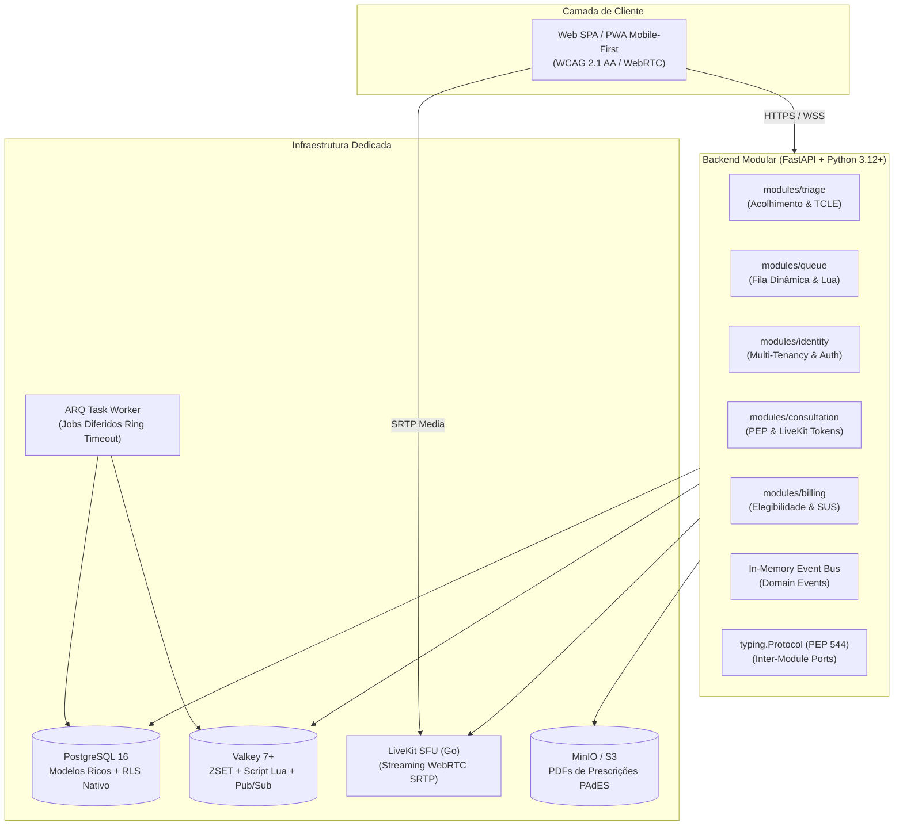

# MediSync Express — Plataforma de Pronto-Atendimento Virtual (PA Digital 24/7)

> **Infraestrutura aberta de pronto-atendimento virtual sob demanda espontânea com motor de fila atômica, teleconsulta WebRTC desacoplada, salvaguarda de deterioração clínica e governança regulatória brasileira.**

---

## 📌 Contexto do Projeto & Isenção de Escopo (Portfolio Disclaimer)

> [!IMPORTANT]
> **Natureza do Projeto:**  
> O **MediSync Express** é um **projeto conceitual de engenharia de software e arquitetura avançada desenvolvido para fins de portfólio técnico**.
>
> **O que este projeto É:**
> * Um estudo de caso aprofundado de engenharia de software moderna, modelagem orientada a domínio (DDD) e padrões de alta concorrência;
> * Um sistema projetado estritamente sobre **marcos regulatórios reais e oficiais da saúde brasileira** (Resoluções CFM nº 2.314/2022 e 1.821/2007, Art. 11 da LGPD, Portaria SVS/MS nº 344/98 e RDC ANVISA nº 20/2011);
> * Uma demonstração prática de padrões arquiteturais sênior em Python: **Hexagonal Pragmático**, contratos via `typing.Protocol` (PEP 544), controle de concorrência atômica com scripts Lua no Valkey, Row-Level Security (RLS) no PostgreSQL, workers assíncronos em corrotinas nativas com ARQ e auditoria estrita de fronteiras modulares com **Tach**.
>
> **O que este projeto NÃO É:**
> * Não é fruto de pesquisa de campo empírica com usuários finais (*user research*), entrevistas com médicos/pacientes reais, validação de mercado em estágio inicial (*market discovery*), testes clínicos com humanos ou um MVP de startup em operação comercial;
> * Não constitui um dispositivo médico homologado pela ANVISA nem deve ser utilizado em ambiente de assistência real a pacientes sem prévia validação clínica, comitê de ética e auditoria de segurança institucional.

---

## 🎯 Visão Geral da Solução

O **MediSync Express** foi concebido para endereçar um dos maiores gargalos dos sistemas de saúde públicos e privados: a sobrecarga de prontos-socorros físicos por queixas de baixa e média complexidade (fichas verdes e azuis).

A plataforma opera sob regime de **demanda espontânea (sem agendamento prévio)** através de uma esteira assistencial contínua:


### 🏛️ Dualidade Operacional Nativa (SUS vs. Saúde Privada)
* **Atenção Pública (SUS)**: Entrada universal via CPF ou Cartão Nacional de Saúde (CNS). A validação de cobertura opera como instrução nula (*no-op*), inserindo o cidadão imediatamente na esteira de atendimento médico com custo de infraestrutura reduzido para municípios.
* **Saúde Suplementar / Particular**: Pacientes ingressam na fila sem paywalls obstrutivos na tela inicial. A validação de elegibilidade de convênio ocorre de forma concorrente em segundo plano enquanto o paciente aguarda; em caso de pendência, ele é alertado com antecedência sem ser expulso de sua posição clínica.

---

## ⚡ Destaques de Arquitetura e Engenharia

A arquitetura do MediSync Express foi desenhada para resolver tensões reais de concorrência, desempenho e segurança da informação:



### 1. Hexagonal Pragmático (Zero "Mapper Hell")
* **Modelos Ricos no SQLAlchemy 2.0**: As entidades persistidas (`Mapped[...]`) não são meras bolsas de dados anêmicas; elas encapsulam as regras clínicas, validações e máquinas de estado (ex.: `atendimento.alocar_para_medico()`).
* **Eliminação de Mappers Duplicados**: Não há classes DTO duplicadas puras para persistência relacional, eliminando o tributo de manutenção de conversores manuais (`to_domain`/`to_orm`).
* **Subtipagem Estrutural com `typing.Protocol` (PEP 544)**: Portas de saída para componentes voláteis (Valkey, LiveKit, certificadoras ICP-Brasil e MinIO/S3) operam via *static duck typing*, sem herança rígida de `abc.ABC`.

### 2. Comunicação Inter-Módulos em Duas Vias
* **Síncrona (Comandos / Consultas)**: Módulos expõem contratos via `typing.Protocol`. Nenhum módulo importa modelos internos ou repositórios de outro.
* **Assíncrona (Notificações de Estado)**: Eventos de domínio desacoplados (ex.: `AtendimentoTriadoEvent`, `ConsultaFinalizadaEvent`) trafegam por um *Event Bus* em memória com despacho concorrente não-bloqueante.

### 3. Concorrência Atômica de Fila em $\le 200\text{ ms}$ (Valkey 7+ & Lua)
* Fila indexada em **Sorted Sets (ZSET)** com pontuação determinística de 64 bits e identificadores em **UUIDv7**:
  $$\text{Score} = (\text{prioridade\_clinica} \times 10^{12}) + \text{timestamp\_entrada\_epoch}$$
* **Desempate Determinístico FIFO via UUIDv7 (RN01)**: Membros com o mesmo score são desempatados nativamente por ordem lexicográfica no Valkey. Como o UUIDv7 embute timestamp de milissegundos em seus primeiros dígitos, a cronologia de entrada é preservada com precisão absoluta.
* Alocação médico-paciente executada em uma única operação indivisível via script Lua (`alocar_chamada.lua`), aplicando travas duplas vinculadas de 45 segundos (`lock:medico` e `lock:atendimento`) com códigos discriminados (`0` para médico ocupado e `-1` para retry de atendimento).

### 4. Resolução Determinística de No-Show (Ring Timeout de 45s no ARQ)
* Eliminação de deadlocks operacionais quando o paciente não atende a chamada médica.
* Agendamento de precisão via tarefas diferidas no ARQ (`_defer_by=timedelta(seconds=45)`), superando a fragilidade e imprecisão de eventos pub/sub de expiração de chaves (`notify-keyspace-events`) do Redis.

### 5. Multi-Tenancy com Defesa em Profundidade no PostgreSQL (RLS)
* Segregação lógica de dados entre municípios e operadoras orientada por `organizacao_id`.
* O tenant ativo é isolado via `ContextVar` assíncrona por requisição e forçado nativamente no motor do PostgreSQL 16 via **Row-Level Security (RLS)** (`SET LOCAL app.current_tenant_id`), impedindo vazamento de dados mesmo em caso de falha de filtro no código de aplicação.

### 6. Isolamento e Governança Modular com Tach
* Controle contínuo de dependências auditado pelo **[Tach](https://github.com/gauge-sh/tach)** (escrito em Rust).
* O comando `tach check` é executado no pipeline de integração contínua (CI), barrando em tempo de compilação qualquer acoplamento indevido ou importação de arquivos privados entre os módulos.

---

## 📂 Estrutura Modular do Código (`src/`)

```plaintext
src/
├── core/                              # Fundações transversais da aplicação
│   ├── config.py                      # Configurações tipadas (Pydantic BaseSettings)
│   ├── database.py                    # Engine assíncrona SQLAlchemy e sessionmaker
│   ├── valkey.py                      # Pool de conexões assíncronas do Valkey
│   ├── event_bus.py                   # In-Memory Event Bus assíncrono para Domain Events
│   └── telemetry.py                   # Instrumentação Prometheus e métricas operacionais
│
└── modules/
    ├── identity/                      # Bounded Context de Identidade, Autenticação e Multi-Tenancy
    │   ├── domain/                    # Modelos ricos: Organizacao, Usuario, Profissional (CRM/UF)
    │   ├── application/               # Autenticação JWT, Argon2id, RBAC e propagação de tenant
    │   └── infrastructure/            # Repositórios SQLAlchemy e políticas Postgres RLS
    │
    ├── triage/                        # Módulo de Acolhimento, Triagem e TCLE Digital
    │   ├── domain/                    # Modelos ricos: Triagem, TCLE, Invariantes (RN01, RN04)
    │   ├── application/               # Casos de uso de acolhimento e emissão de eventos
    │   └── infrastructure/            # Adaptador PostgreSQL e carga de terminologias abertas
    │
    ├── queue/                         # Módulo de Fila Dinâmica e Controle de Admissão
    │   ├── domain/                    # Invariantes de Alocação e Backpressure (RN02, RN05), Ports
    │   ├── application/               # Casos de uso (CallNext, ResolveTimeout)
    │   └── infrastructure/            # Adaptador Valkey (Lua scripts) e agendador ARQ
    │
    ├── consultation/                  # Módulo de Teleconsulta, PEP e Prescrição Digital
    │   ├── domain/                    # Agregado Atendimento, PEP, Invariante do Ato Médico (RN06)
    │   ├── application/               # Casos de uso de evolução clínica e conclusão
    │   └── infrastructure/            # Adaptador LiveKit SFU e Adaptador PyHanko/PSC ICP-Brasil
    │
    └── billing/                       # Módulo de Elegibilidade e Liquidação
        ├── domain/                    # Regras de cobertura e máquina de estados (RN03)
        ├── application/               # Validação assíncrona e contingência assistencial
        └── infrastructure/            # Adaptador SUS (no-op) e adaptadores de operadoras
```

---

## 📚 Documentação Técnica Completa

A governança do repositório é estritamente segregada em três pilares ortogonais fundamentados no referencial metodológico de Engenharia de Requisitos (Vazquez & Simões) e complementada por blueprints técnicos e ADRs:

| Documento | Pilar Metodológico | Conteúdo Central |
| :--- | :--- | :--- |
| **[Business Vision](docs/explanation/business-vision.md)** | *Problem Space* (O Porquê) | Contexto de PA Virtual 24/7, Canvas de Requisitos, Metas SMART, Personas e Matriz de Necessidades de Negócio (NEC-01 a NEC-08). |
| **[Product Specification](docs/explanation/product-specification.md)** | *Solution Space* (O Quê) | Invariantes Formais de Domínio (**RN01 a RN07**), Requisitos Funcionais (**RF-01 a RF-10**) e Matriz de Rastreabilidade Vertical. |
| **[Architecture Overview](docs/explanation/architecture/overview.md)** | *Engineering Foundations* (O Como) | Hexagonal Pragmático, protocolos, Event Bus, diagramas C4 (Contexto e Contêineres) e Matriz FURPS+ / ISO 25010. |
| **[Data Model](docs/explanation/architecture/data-model.md)** | Blueprint Técnico | Diagrama Entidade-Relacionamento (DER), DDL das 10 tabelas relacionais, regras de RLS e snapshots forenses do CFM. |
| **[Concurrency & Queues](docs/explanation/architecture/concurrency-and-queues.md)** | Blueprint Técnico | Script Lua atômico (`alocar_chamada.lua`), fórmula do score do ZSET e resolução determinística de No-Show via ARQ. |
| **[Compliance & Telemedicine](docs/explanation/architecture/compliance-and-telemedicine.md)** | Blueprint Técnico | Topologia LiveKit SFU WebRTC, fluxo de assinatura digital PAdES-LTV com PyHanko e guarda em Object Storage S3/MinIO. |
| **[Architecture Decision Records (ADRs)](docs/adrs/README.md)** | Governança & Trade-offs | Registro formal das 7 decisões estruturais fundamentais ([ADR-001 a ADR-007](docs/adrs/README.md)). |

---

## 🛠️ Stack Tecnológica

| Camada | Tecnologia Adotada | Papel Arquitetural |
| :--- | :--- | :--- |
| **Linguagem & Runtime** | Python 3.12+ | Tipagem moderna (`typing.Protocol`, `TypeIs`), alta performance assíncrona. |
| **Framework Web API** | FastAPI + Granian (Rust) | Runtime ASGI em Rust de altíssima vazão, WebSockets nativos, latência ultra-baixa e OpenAPI. |
| **Persistência Relacional** | PostgreSQL 17 + SQLAlchemy 2.0 Async | Modelos de domínio ricos (`Mapped[...]`), queries assíncronas nativas com `psycopg 3` (`psycopg[binary]`). |
| **Isolamento de Dados** | PostgreSQL Row-Level Security (RLS) | Blindagem multi-tenant no nível do kernel do banco de dados. |
| **Fila em Memória & Locks** | Valkey 8.0 (AOF ativo) | ZSET atômico com scripts Lua para alocação médico-paciente sem condições de corrida. |
| **Task Worker Assíncrono** | ARQ (`arq` sobre `asyncio`) | Tarefas em background e resolução de Ring Timeout de 45 segundos via jobs diferidos. |
| **Mídia em Tempo Real** | LiveKit SFU (Go) | Roteamento de áudio/vídeo WebRTC seguro (SRTP) com latência $\le 150\text{ ms}$. |
| **Assinatura Digital & PDF** | PyHanko + ReportLab | Emissão de receitas e atestados em PDF/A com assinatura PAdES-LTV padrão ICP-Brasil. |
| **Object Storage** | MinIO / AWS S3 | Guarda perene de documentos clínicos assinados com entrega via Presigned URLs. |
| **Qualidade & Fronteiras** | Tach, Ruff, basedpyright (strict), pytest | Verificação estática de tipos, formatação ultrarrápida e auditoria de limites modulares. |

---

### Mudanças de contrato (routers finos)
- Prefixo único `/api/v1` para todo HTTP; WS fora (`/ws/queue/{id}`, `/ws/doctor/{id}`).
- Alias `GET /atendimentos/{id}/prontuario` removido; usar `GET /api/v1/consultations/{id}/prontuario`.
- Tenant ausente → `400 TENANT_INVALIDO`.
- Login sem tenant → `422`.
- Validação pública órfã → `500 DOCUMENTO_INTEGRIDADE` (sem dados fabricados).
- Rate limit por IP: `validate` 30/min, `download` 20/min → `429` + `Retry-After`.
- Novos codes: `EVOLUCAO_NAO_ENCONTRADA` / `DOCUMENTO_CLINICO_NAO_ENCONTRADO` → `404`.

---

## 🚀 Como Executar o Projeto

> [!NOTE]
> **Fase do Projeto**: A modelagem conceitual, governança DDD, arquitetura hexagonal pragmática e blueprints técnicos encontram-se consolidados e aprovados. Os manifestos de tooling (`pyproject.toml`, `docker-compose.yml`, `tach.toml`) e a suíte de testes serão provisionados na Sprint 1 de Engenharia.

### Pré-requisitos
* Python 3.12 ou superior instalado;
* Gerenciador de pacotes [`uv`](https://github.com/astral-sh/uv) (recomendado) ou `pip`;
* Docker e Docker Compose instalados na máquina.

### 1. Clonar o Repositório
```bash
git clone https://github.com/Rafaelp122/medisync.git
cd medisync
```

### 2. Subir a Infraestrutura Auxiliar via Docker
```bash
docker compose up -d postgres valkey minio livekit
```

### 3. Configurar o Ambiente Python
```bash
uv venv
source .venv/bin/activate
uv pip install -e ".[dev]"
```

### 4. Executar Verificações Arquiteturais e de Qualidade
```bash
# 1. Auditoria de fronteiras modulares com Tach
tach check

# 2. Verificação estrita de tipagem estática
basedpyright

# 3. Linter e formatação de código
ruff check .

# 4. Execução da suíte de testes automatizados
pytest
```

---

## ⚖️ Licença

Este projeto é distribuído sob os termos da licença permissiva **MIT / Apache 2.0**. Consulte o arquivo `LICENSE` para mais informações.
