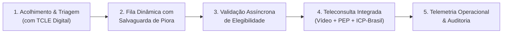
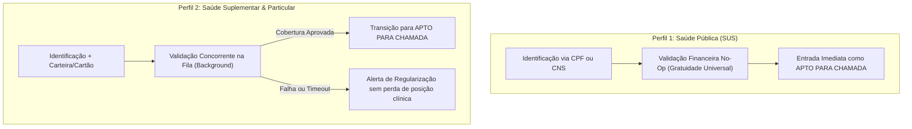

# Modelagem de Negócio e Visão de Produto (Business Vision)

## MediSync Express — Plataforma de Código Aberto para Pronto-Atendimento Virtual (PA Digital 24/7)

| Metadado | Detalhamento |
| :--- | :--- |
| **Referencial Metodológico** | Engenharia de Requisitos — Software Orientado ao Negócio (Vazquez & Simões) |
| **Marco Regulatório & Ético** | Resolução CFM nº 2.314/2022 \| LGPD (Lei Federal nº 13.709/2018 - Art. 11) |
| **Modelo de Licenciamento** | Código Aberto Permissivo (OSI - MIT ou Apache 2.0) |
| **Status do Documento** | Aprovado (Linha de Base de Negócio) |

---

## 1. Contextualização e Justificativa de Negócio

O **MediSync Express** é uma plataforma de código aberto concebida para viabilizar unidades de **Pronto-Atendimento Virtual (PA Digital 24/7)** para demandas de saúde de baixa e média complexidade clínica, operando sob regime de **demanda espontânea** (sem necessidade de agendamento prévio). O objetivo central é conectar pacientes com queixas e sintomas agudos a médicos plantonistas (generalistas ou especialistas em Medicina de Família e Comunidade) em um ambiente digital seguro, resolutivo e auditável.

A solução adota uma modelagem altamente parametrizável, permitindo a adoção tanto por **pequenos municípios e unidades básicas do Sistema Único de Saúde (SUS)** quanto por **cooperativas médicas, instituições de autogestão e operadoras privadas de saúde**.

### 1.1 A Esteira de Atendimento Integral

A experiência do paciente e do corpo clínico organiza-se em uma esteira contínua de entrega de valor assistencial:

> **📌 FLUXO DE VALOR ASSISTENCIAL**  
> Acolhimento & Triagem Estruturada (com TCLE Digital) ➔ Fila Dinâmica com Salvaguarda de Deterioração Clínica ➔ Validação Assíncrona de Elegibilidade (ou Isenção SUS) ➔ Teleconsulta Integrada (Vídeo + PEP + Assinatura ICP-Brasil) ➔ Telemetria Operacional & Auditoria de Atendimento.

---

## 2. Declaração do Problema (Canvas de Requisitos)

A modelagem do problema e dos direcionadores de negócio baseia-se na identificação estruturada de dores do ecossistema de saúde:

* **Problema Oportunizado**: Inexistência de uma infraestrutura aberta, modular, auditável e juridicamente segura para pronto-atendimento virtual que permita a instituições públicas e privadas operar filas dinâmicas em tempo real, mitigando o colapso por *burnout* de equipes médicas e garantindo faturamento/cobertura sem erguer barreiras desumanizadas de entrada aos cidadãos.
* **Partes Afetadas**:
  * **Pacientes**: Sofrem com esperas degradantes em prontos-socorros físicos e falta de transparência sobre sua vez de atendimento.
  * **Médicos Plantonistas**: Enfrentam sobrecarga crônica, filas infinitas sem teto de saturação e fragmentação de ferramentas (vídeo em um app, PEP em outro, receituário externo).
  * **Equipes de Regulação e Faturamento**: Sofrem com glosas cadastrais e custos assistenciais não autorizados previamente.
  * **Administradores e Gestores de Saúde**: Carecem de dados em tempo real sobre tempo de espera, abandono de fila e capacidade assistencial instalada.
* **Impacto Observado**:
  * Superlotação crônica em emergências físicas por queixas de baixa complexidade (fichas verdes/azuis).
  * Exaustão de profissionais de saúde em regimes de plantão não balanceados.
  * Risco de eventos adversos na fila de espera por deterioração clínica silenciosa.
  * Inviabilidade econômica da adoção de telemedicina por municípios e pequenas instituições devido ao custo proibitivo de soluções proprietárias fechadas.
* **Critérios de Sucesso da Solução**:
  * Acolhimento rápido com consentimento formal explícito (TCLE) em menos de 45 segundos.
  * Triagem clínica inteligente com desvio mandatório e imediato de emergências críticas para socorro pré-hospitalar (SAMU 192).
  * Mecanismo ativo de monitoramento de piora clínica para pacientes em fila de espera.
  * Gestão de admissão e saturação de fila (*backpressure*) para proteção da equipe médica.
  * Eliminação de consultas fantasmas e *deadlocks* operacionais com resolução determinística de chamadas sem resposta (*no-show*).
  * Preservação incondicional da soberania do ato médico (sem corte forçado de atendimento por tempo).
  * Aderência estrita às diretrizes universais de acessibilidade digital (WCAG 2.1 Nível AA).

---

## 3. Objetivos de Negócio e Metas SMART (Instância Padrão)

Para orientar a validação do produto no mundo real, definem-se os seguintes objetivos estratégicos fundamentados na metodologia SMART:

* **S (Específico)**: Disponibilizar uma plataforma de código aberto para Pronto-Atendimento Virtual com motor dinâmico de ordenação clínica, liquidação/elegibilidade concorrente não obstrutiva, salvaguardas de deterioração clínica, governança médica e painel de telemetria operacional.
* **M (Mensurável)**:
  * Cumprimento de meta de tempo de espera (SLA): $\ge 95\%$ dos pacientes chamados dentro da janela estipulada para seu nível clínico.
  * Reordenação dinâmica de fila instantânea: $\le 200\text{ ms}$.
  * Índice de glosas cadastrais de convênio: $< 0{,}5\%$.
  * Resolução de chamada sem resposta (*ring timeout*): exatamente 45 segundos para liberação de tela do profissional.
  * Defasagem temporal de telemetria da unidade: $< 5\text{ segundos}$.
* **A (Alcançável)**: Foco delimitado a queixas agudas de atenção primária e urgências de baixa/média complexidade, delegando emergências críticas com risco de vida imediatamente ao socorro pré-hospitalar físico.
* **R (Relevante)**: Conformidade integral com as Resoluções CFM nº 2.314/2022 e 1.821/2007, Lei Geral de Proteção de Dados (LGPD - Art. 11), normas sanitárias de telemedicina e salvaguarda do ato médico.
* **T (Tempestivo)**: Arquitetura desacoplada e orquestração automatizada viabilizando implantação completa de ambiente de homologação em menos de 10 minutos.

---

## 4. Partes Interessadas, Personas e Matriz de Necessidades

### 4.1 Personas do Sistema

#### 1. Juliana Silva (Paciente / Responsável Familiar)
* **Perfil**: 34 anos, mãe de um menino de 4 anos e também usuária própria do PA Digital.
* **Contexto**: Acessa a plataforma pelo celular com conexão móvel (4G), em estado de ansiedade devido a sintomas febris agudos de seu filho ou de si própria.
* **Necessidades Críticas**:
  * Entrada rápida sem preenchimento burocrático excessivo na etapa inicial de triagem ($< 45\text{ s}$).
  * Clareza absoluta de posicionamento na fila e expectativa de tempo para chamada.
  * Termos de consentimento e privacidade transparentes e compreensíveis.
  * Canal imediato de socorro caso perceba piora súbita dos sintomas enquanto aguarda.
  * Possibilidade de ser atendida sem necessidade de instalar aplicativos pesados ou passar por barreiras financeiras agressivas logo no primeiro contato.

#### 2. Dr. Eduardo Rocha (Médico Plantonista)
* **Perfil**: 42 anos, Médico de Família e Comunidade, plantonista com carga horária de 12 horas.
* **Contexto**: Atende múltiplos pacientes em sequência, precisando manter foco clínico e raciocínio diagnóstico sem atritos operacionais de software.
* **Necessidades Críticas**:
  * Espaço de trabalho unificado: chamada de vídeo, acesso à pré-anamnese/triagem, registro de evolução no Prontuário Eletrônico do Paciente (PEP) e emissão de receitas na mesma tela.
  * Proteção absoluta contra sobreposição de atendimentos (*zero overbooking*).
  * Liberação imediata de sua tela caso o paciente chamado não atenda (*no-show*), sem travar seu plantão.
  * Respeito irrestrito ao seu tempo clínico: nenhuma intervenção de software pode desconectar uma consulta em andamento por atingir médias de tempo estimadas.

#### 3. Patrícia Mendes (Gestora de Faturamento e Regulação)
* **Perfil**: 38 anos, administradora hospitalar responsável pela sustentabilidade financeira e auditoria de contas da unidade de saúde.
* **Contexto**: Monitora o ciclo de elegibilidade de convênios e pagamentos particulares para evitar atendimentos não faturáveis e glosas.
* **Necessidades Críticas**:
  * Validação de elegibilidade (carteirinha do convênio ou garantia de pagamento particular) realizada em segundo plano enquanto o paciente aguarda na fila.
  * Garantia de que nenhuma consulta médica seja iniciada sem confirmação prévia de cobertura ou deferimento formal de contingência assistencial.
  * Eliminação de cadastros incompletos que inviabilizem o faturamento posterior.

#### 4. Carlos Drumond (Gestor de Operações e Administrador da Unidade)
* **Perfil**: 29 anos, responsável pelo dimensionamento de escala médica, infraestrutura e governança clínica da instituição.
* **Contexto**: Precisa garantir que a unidade não entre em colapso por excesso de demanda nem deixe pacientes desassistidos sem previsão de atendimento.
* **Necessidades Críticas**:
  * Parametrização flexível de tetos de admissão, SLAs por gravidade e margem de segurança operacional ($\alpha$).
  * Capacidade de alternar com agilidade entre perfis de deploy: perfil 100% público (SUS) ou perfil privado/conveniado.
  * Painel de telemetria em tempo real com alertas visuais de sobrecarga de fila e risco de violação de SLA.
  * Trilha imutável e auditável de todos os eventos assistenciais para fins médico-legais.

---

### 4.2 Matriz de Necessidades de Negócio

| ID | Necessidade Declarada | Persona Principal | Condição de Aceite no Negócio |
| :--- | :--- | :--- | :--- |
| **NEC-01** | Acolhimento ágil com consentimento formal | Juliana Silva | Preenchimento de queixa inicial e aceite de TCLE em $< 45\text{ s}$ com inserção imediata na esteira assistencial. |
| **NEC-02** | Atendimento no SLA com salvaguarda de piora | Juliana Silva | Chamada dentro da meta de gravidade clínica e botão destacado para reavaliação imediata em caso de piora dos sintomas. |
| **NEC-03** | Acessibilidade digital universal | Juliana Silva | Interface móvel em conformidade com critérios de contraste, legibilidade e suporte a tecnologias assistivas (WCAG 2.1 AA). |
| **NEC-04** | Painel médico sem travamento e sem *overbooking* | Dr. Eduardo | Exatamente uma consulta ativa por médico; resolução e liberação de tela em 45 s caso paciente não atenda. |
| **NEC-05** | Estação clínica unificada com assinatura digital | Dr. Eduardo | Videoconferência, histórico clínico, registro em prontuário e emissão com certificado digital ICP-Brasil em fluxo contínuo. |
| **NEC-06** | Validação financeira e de cobertura não obstrutiva | Patrícia Mendes | Confirmação assíncrona de cobertura em paralelo à permanência na fila, liberando a chamada apenas após deferimento. |
| **NEC-07** | Parametrização operacional e alternância de perfis | Carlos Drumond | Ajuste simples de capacidade, tempo médio de atendimento (TMA) e alternância limpa entre perfil SUS e perfil Convênios. |
| **NEC-08** | Telemetria contínua e trilha de auditoria legal | Carlos Drumond | Visualização em tempo real de ocupação, abandonos e histórico imutável com carimbo de tempo para auditoria judicial. |

---

## 5. Dualidade de Modelos Operacionais: SUS vs. Saúde Suplementar

Para assegurar utilidade real em todo o território nacional, o MediSync Express foi modelado para suportar duas modalidades operacionais nativas:

### 5.1 Perfil Público (SUS / Atenção Primária Municipal)
* **Princípio**: Universalidade, equidade e gratuidade na porta de entrada.
* **Operação**: A validação financeira atua como uma instrução nula (*no-op*). O cidadão informa CPF ou número do Cartão Nacional de Saúde (CNS), passa pela classificação de risco e avança diretamente para a fila de chamada médica, sem fricções ou barreiras de cobrança.

### 5.2 Perfil Privado (Operadoras, Seguradoras e Cooperativas)
* **Princípio**: Sustentabilidade financeira e prevenção de glosas.
* **Operação**: O paciente informa os dados de convênio ou cartão de crédito na entrada, mas **não fica bloqueado em tela de cobrança**. Ele é imediatamente acolhido na fila de espera enquanto a verificação de elegibilidade ocorre em segundo plano. Caso a operadora aprove a cobertura, a consulta é liberada; se houver pendência, o paciente é alertado com antecedência sem ser expulso da fila.
