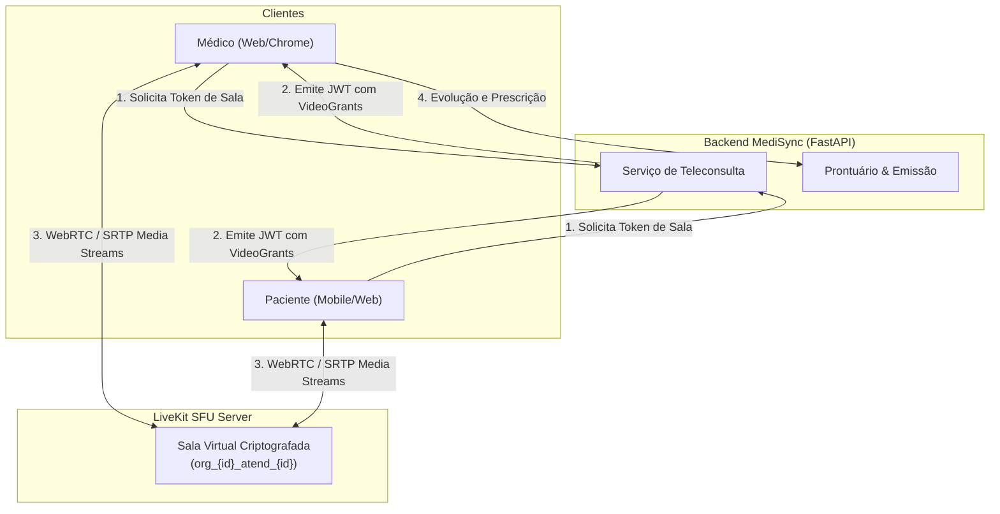
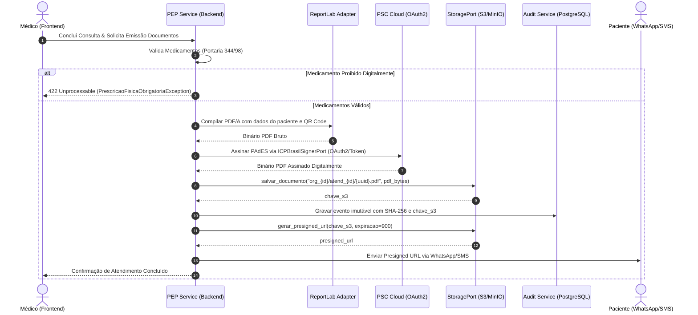

# Conformidade Clínica, Telemedicina e ICP-Brasil (Compliance & Telemedicine)

## MediSync Express — Plataforma de Código Aberto para Pronto-Atendimento Virtual (PA Digital 24/7)

| Metadado | Detalhamento |
| :--- | :--- |
| **Mídia em Tempo Real** | Servidor LiveKit SFU (Go) desacoplado via WebRTC / SRTP |
| **Assinatura Digital** | Padrão PAdES-LTV ICP-Brasil em Nuvem via PSCs (OAuth2) e PyHanko |
| **Armazenamento de PDFs** | Object Storage S3 / MinIO com Presigned URLs temporárias (15 min) |
| **Marco Regulatório** | Resolução CFM nº 2.314/2022 \| Portaria SVS/MS nº 344/98 \| RDC ANVISA nº 20/2011 |
| **Status** | Aprovado (Documento Vivo de Engenharia) |

---

## 1. Diretrizes Regulatórias e Deontológicas (CFM nº 2.314/2022)

A condução da teleconsulta em pronto-atendimento virtual exige conformidade com o marco ético e sanitário brasileiro:

1. **Preservação Soberana do Ato Médico (RN06)**: É expressamente vedado ao software encerrar, bloquear ou desconectar teleconsultas por critério de tempo transcorrido. O atingimento de metas de TMA pode acionar unicamente sinalizadores visuais discretos no prontuário.
2. **Qualidade de Transmissão em Tempo Real (RNF-04)**: Transmissão de áudio e vídeo sob protocolo WebRTC seguro (SRTP) com latência de transporte $\le 150\text{ ms}$.
3. **Validade Jurídica de Documentos Médicos (RNF-06)**: Receituários, atestados e encaminhamentos emitidos durante a teleconsulta devem conter assinatura digital nos padrões da Infraestrutura de Chaves Públicas Brasileira (ICP-Brasil).

---

## 2. Topologia de Mídia WebRTC com LiveKit SFU

Para garantir desempenho e escalabilidade sem sobrecarregar o runtime Python com decodificação ou roteamento de mídia de vídeo, adota-se um servidor **Selective Forwarding Unit (SFU) LiveKit** operando de forma 100% desacoplada:

### 2.1 Emissão de Tokens de Sala
O backend FastAPI apenas gera tokens JWT assinados com a chave secreta do LiveKit, contendo as permissões clínicas (*Video Grants*):
* **Nome da Sala**: `org_{organizacao_id}_atend_{atendimento_id}`
* **Identidade do Participante**: `medico_{id}` ou `paciente_{id}`
* **Permissões**: `room_join: true`, `can_publish: true`, `can_subscribe: true`

---

## 3. Prontuário Eletrônico (PEP) e Emissão de Documentos Clínicos

O sistema modela 5 tipos de documentos emitíveis via telemedicina e veda a prescrição digital de substâncias controladas com retenção de talonário físico:

### 3.1 Tipos de Documentos Permitidos vs. Proibidos

* **Permitidos Digitalmente**:
  * `RECEITA_SIMPLES`: Medicamentos isentos de prescrição ou tarja vermelha simples.
  * `RECEITA_ANTIMICROBIANO`: RDC nº 20/2011 (validade 10 dias).
  * `RECEITA_CONTROLE_ESPECIAL_C1`: Portaria SVS/MS nº 344/98 Lista C1 (validade 30 dias).
  * `ATESTADO_MEDICO`: Atestados de afastamento com CID e carimbo temporal.
  * `RELATORIO_ENCAMINHAMENTO`: Encaminhamento para especialistas ou exames.
* **Proibidos Digitalmente (Exigência Legal de Talonário Físico)**:
  * `NOTIFICACAO_RECEITA_A` (Talonário Amarelo - Entorpecentes como Morfina, Fentanil).
  * `NOTIFICACAO_RECEITA_B` (Talonário Azul - Psicotrópicos como Clonazepam, Diazepam).
  * A tentativa de prescrição dessas substâncias dispara `PrescricaoFisicaObrigatoriaException`, retornando HTTP 422 ao médico com orientações legais.

---

## 4. Pipeline de Assinatura Digital ICP-Brasil (PAdES) e MinIO/S3

### 4.1 Detalhes Técnicos da Assinatura:
1. **Geração do PDF/A**: Geração via `ReportLab`, inserindo QR Code de autenticidade, cabeçalho da unidade de saúde e declaração de atendimento virtual nos termos do CFM nº 2.314/2022.
2. **Assinatura PAdES em Nuvem ([ADR-006](../adrs/ADR-006-Assinatura-Digital-ICP-Brasil-Nuvem-PSC.md))**: Integração via `PyHanko` com provedores PSC (BirdID, SafeID, Vidaas) através de OAuth2, dispensando tokens físicos USB e viabilizando plantões ágeis.
3. **Persistência em Object Storage**: O PDF assinado é salvo no bucket MinIO/S3 (`s3://medisync-docs/{org_id}/atendimentos/{atendimento_id}/{uuid}.pdf`). O PostgreSQL armazena apenas a chave S3 e o hash SHA-256 no log de auditoria imutável.
4. **Presigned URLs**: Entrega ao paciente e farmacêutico via link de validação pública que gera uma *Presigned URL* fresca com validade de 15 minutos (900 segundos).
