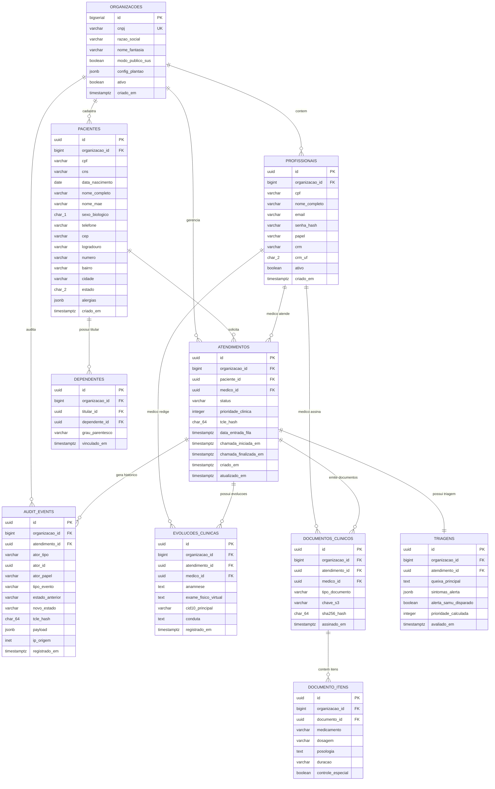

# Modelo de Dados Relacional e Governança Forense (Data Model)

## MediSync Express — Plataforma de Código Aberto para Pronto-Atendimento Virtual (PA Digital 24/| **Metadado** | Detalhamento |
| :--- | :--- |
| **Banco de Dados** | PostgreSQL 17 (com extensões `uuid-ossp` e `pgcrypto`) |
| **Paradigma ORM & IDs** | Modelos Ricos no SQLAlchemy 2.0 (`Mapped[...]`) \| Chaves Clínicas em UUIDv7 (RFC 9562) |
| **Multi-Tenancy** | Segregação Lógica via Coluna `organizacao_id` e Row-Level Security (RLS) nativo |
| **Marco Regulatório** | Resolução CFM nº 2.314/2022 \| Resolução CFM nº 1.821/2007 \| LGPD Art. 11 |
| **Status** | Aprovado (Documento Vivo de Engenharia) |

---

## 1. Princípios de Dados Orientados a DDD

A modelagem reflete os limites de **Bounded Contexts** e as **Raízes de Agregados (Aggregate Roots)** do Domain-Driven Design (DDD), equilibrando a 3ª Forma Normal (3NF) com otimizações de persistência clínica:

1. **3ª Forma Normal (3NF) para Cadastros Mestres**: Tabelas de `organizacoes`, `profissionais` e `pacientes` são normalizadas para evitar anomalias e garantir integridade cadastral perante SUS (CADSUS) e operadoras.
2. **Denormalização Pragmática de `organizacao_id` (RLS em O(1))**: Todas as tabelas multi-tenant contêm a coluna `organizacao_id` indexada diretamente. Isso viabiliza que as políticas de **Row-Level Security (RLS)** do PostgreSQL operem com custo $\mathcal{O}(1)$ via busca direta em índice, sem necessidade de joins em cascata.
3. **Snapshots Clínicos Imutáveis (Exigência CFM e Forense)**: Quando um atendimento é concluído e um documento médico é assinado, os dados civis e de endereço do paciente (essenciais para SAMU 192 e dispensação) e o CRM/UF do médico são congelados no momento da emissão. Mudanças cadastrais posteriores do paciente ou médico não afetam a fidelidade histórica do prontuário oficial.
4. **Ciclo de Vida Controlado pela Raiz do Agregado**: A tabela `atendimentos` governa a jornada. Entidades dependentes (`triagens`, `evolucoes_clinicas` e `documentos_clinicos`) possuem integridade referencial estrita (`ON DELETE RESTRICT`) contra exclusão acidental.
5. **Identificadores UUIDv7 Ordenados no Tempo (RFC 9562)**: Todas as entidades clínicas, prontuários, documentos e eventos de auditoria utilizam UUIDv7 como chave primária (`UUID`). Isso combina a alta performance de inserção e localidade de índice B-Tree equivalente a inteiros com a impossibilidade de enumeração sequencial (anti-IDOR) e desempate determinístico em milissegundos para a fila do Valkey.

---

## 2. Diagrama Entidade-Relacionamento do Sistema (ERD)



---

## 3. Esquema DDL no PostgreSQL 16

O script abaixo consolida a estrutura física das tabelas e índices compatíveis com UUIDv7:

```sql
-- 1. Habilitação de extensões necessárias
CREATE EXTENSION IF NOT EXISTS "uuid-ossp";
CREATE EXTENSION IF NOT EXISTS "pgcrypto";

-- Função utilitária para geração nativa de UUIDv7 no PostgreSQL 16 (RFC 9562)
-- Nota: A aplicação Python também gera UUIDv7 na camada de domínio via uuid_utils / uuid6
CREATE OR REPLACE FUNCTION gen_uuidv7()
RETURNS UUID AS $$
DECLARE
    v_time TIMESTAMP WITH TIME ZONE := clock_timestamp();
    v_unix_time_ms BIGINT;
    v_rand BYTEA;
    v_hex VARCHAR;
BEGIN
    v_unix_time_ms := FLOOR(EXTRACT(EPOCH FROM v_time) * 1000)::BIGINT;
    v_rand := gen_random_bytes(10);
    v_hex := LPAD(TO_HEX(v_unix_time_ms), 12, '0') ||
             '7' || SUBSTRING(ENCODE(v_rand, 'hex') FROM 2 FOR 3) ||
             '8' || SUBSTRING(ENCODE(v_rand, 'hex') FROM 5 FOR 3) ||
             SUBSTRING(ENCODE(v_rand, 'hex') FROM 8 FOR 12);
    RETURN v_hex::UUID;
END;
$$ LANGUAGE plpgsql VOLATILE;

-- 2. Tabela de Organizações (Tenants do SUS e Operadoras)
CREATE TABLE organizacoes (
    id BIGSERIAL PRIMARY KEY,
    cnpj VARCHAR(18) NOT NULL UNIQUE,
    razao_social VARCHAR(255) NOT NULL,
    nome_fantasia VARCHAR(255) NOT NULL,
    modo_publico_sus BOOLEAN NOT NULL DEFAULT FALSE,
    config_plantao JSONB NOT NULL DEFAULT '{"alpha_margem": 1.25, "tma_estimado_segundos": 600, "cota_diaria_maxima": 300}'::jsonb,
    ativo BOOLEAN NOT NULL DEFAULT TRUE,
    criado_em TIMESTAMP WITH TIME ZONE NOT NULL DEFAULT (NOW() AT TIME ZONE 'UTC')
);

-- 3. Tabela de Profissionais (Equipe Médica, Gestores e Faturamento)
CREATE TABLE profissionais (
    id UUID PRIMARY KEY DEFAULT gen_uuidv7(),
    organizacao_id BIGINT NOT NULL REFERENCES organizacoes(id) ON DELETE RESTRICT,
    cpf VARCHAR(14) NOT NULL,
    nome_completo VARCHAR(255) NOT NULL,
    email VARCHAR(255) NOT NULL,
    senha_hash VARCHAR(255) NOT NULL,
    papel VARCHAR(32) NOT NULL, -- 'ADMIN_GLOBAL', 'GESTOR_UNIDADE', 'MEDICO', 'FATURAMENTO'
    crm VARCHAR(20),
    crm_uf CHAR(2),
    ativo BOOLEAN NOT NULL DEFAULT TRUE,
    criado_em TIMESTAMP WITH TIME ZONE NOT NULL DEFAULT (NOW() AT TIME ZONE 'UTC'),
    CONSTRAINT uq_profissional_org_email UNIQUE (organizacao_id, email),
    CONSTRAINT uq_profissional_org_cpf UNIQUE (organizacao_id, cpf)
);
CREATE INDEX idx_profissionais_org_papel ON profissionais(organizacao_id, papel);

-- 4. Tabela de Pacientes (Onboarding Progressivo em 2 Fases com Suporte Pediátrico)
CREATE TABLE pacientes (
    id UUID PRIMARY KEY DEFAULT gen_uuidv7(),
    organizacao_id BIGINT NOT NULL REFERENCES organizacoes(id) ON DELETE RESTRICT,
    cpf VARCHAR(14), -- Opcional para recém-nascidos e pediatria no SUS
    cns VARCHAR(15), -- Cartão Nacional de Saúde (15 dígitos)
    data_nascimento DATE NOT NULL,
    nome_completo VARCHAR(255),
    nome_mae VARCHAR(255),
    sexo_biologico CHAR(1), -- 'M', 'F'
    telefone VARCHAR(20) NOT NULL,
    cep VARCHAR(9),
    logradouro VARCHAR(255),
    numero VARCHAR(20),
    bairro VARCHAR(100),
    cidade VARCHAR(100),
    estado CHAR(2),
    alergias JSONB NOT NULL DEFAULT '[]'::jsonb,
    criado_em TIMESTAMP WITH TIME ZONE NOT NULL DEFAULT (NOW() AT TIME ZONE 'UTC'),
    CONSTRAINT chk_documento_paciente_obrigatorio CHECK (cpf IS NOT NULL OR cns IS NOT NULL)
);
CREATE UNIQUE INDEX uq_paciente_org_cpf ON pacientes(organizacao_id, cpf) WHERE cpf IS NOT NULL;
CREATE UNIQUE INDEX uq_paciente_org_cns ON pacientes(organizacao_id, cns) WHERE cns IS NOT NULL;
CREATE INDEX idx_pacientes_org_telefone ON pacientes(organizacao_id, telefone);

-- 5. Tabela de Dependentes e Menores de Idade
CREATE TABLE dependentes (
    id UUID PRIMARY KEY DEFAULT gen_uuidv7(),
    organizacao_id BIGINT NOT NULL REFERENCES organizacoes(id) ON DELETE RESTRICT,
    titular_id UUID NOT NULL REFERENCES pacientes(id) ON DELETE RESTRICT,
    dependente_id UUID NOT NULL REFERENCES pacientes(id) ON DELETE RESTRICT,
    grau_parentesco VARCHAR(32) NOT NULL, -- 'FILHO', 'CONJUGE', 'TUTELADO'
    vinculado_em TIMESTAMP WITH TIME ZONE NOT NULL DEFAULT (NOW() AT TIME ZONE 'UTC'),
    CONSTRAINT uq_dependente_vinculo UNIQUE (titular_id, dependente_id)
);
CREATE INDEX idx_dependentes_org ON dependentes(organizacao_id);

-- 6. Tabela de Atendimentos (Raiz do Agregado Clínico com Invariante de Estados RN03)
CREATE TABLE atendimentos (
    id UUID PRIMARY KEY DEFAULT gen_uuidv7(),
    organizacao_id BIGINT NOT NULL REFERENCES organizacoes(id) ON DELETE RESTRICT,
    paciente_id UUID NOT NULL REFERENCES pacientes(id) ON DELETE RESTRICT,
    medico_id UUID REFERENCES profissionais(id) ON DELETE RESTRICT,
    status VARCHAR(32) NOT NULL DEFAULT 'TRIADO_AGUARDANDO_ELEGIBILIDADE',
    prioridade_clinica INTEGER NOT NULL DEFAULT 5, -- 1 (Emergência) a 5 (Não Urgente)
    tcle_hash CHAR(64),
    data_entrada_fila TIMESTAMP WITH TIME ZONE,
    chamada_iniciada_em TIMESTAMP WITH TIME ZONE,
    chamada_finalizada_em TIMESTAMP WITH TIME ZONE,
    criado_em TIMESTAMP WITH TIME ZONE NOT NULL DEFAULT (NOW() AT TIME ZONE 'UTC'),
    atualizado_em TIMESTAMP WITH TIME ZONE NOT NULL DEFAULT (NOW() AT TIME ZONE 'UTC'),
    CONSTRAINT chk_atendimento_status CHECK (status IN (
        'TRIADO_AGUARDANDO_ELEGIBILIDADE',
        'APTO_PARA_CHAMADA',
        'CHAMANDO_PACIENTE',
        'EM_ANDAMENTO',
        'PACIENTE_AUSENTE',
        'CONCLUIDO',
        'CANCELADO'
    ))
);
CREATE INDEX idx_atendimentos_org_status ON atendimentos(organizacao_id, status);
CREATE INDEX idx_atendimentos_fila ON atendimentos(organizacao_id, status, prioridade_clinica, data_entrada_fila);

-- 7. Tabela de Triagens Clínicas
CREATE TABLE triagens (
    id UUID PRIMARY KEY DEFAULT gen_uuidv7(),
    organizacao_id BIGINT NOT NULL REFERENCES organizacoes(id) ON DELETE RESTRICT,
    atendimento_id UUID NOT NULL UNIQUE REFERENCES atendimentos(id) ON DELETE RESTRICT,
    queixa_principal TEXT NOT NULL,
    sintomas_alerta JSONB NOT NULL DEFAULT '[]'::jsonb,
    alerta_samu_disparado BOOLEAN NOT NULL DEFAULT FALSE,
    prioridade_calculada INTEGER NOT NULL,
    avaliado_em TIMESTAMP WITH TIME ZONE NOT NULL DEFAULT (NOW() AT TIME ZONE 'UTC')
);
CREATE INDEX idx_triagens_org ON triagens(organizacao_id);

-- 8. Tabela de Evoluções Clínicas do Prontuário (PEP)
CREATE TABLE evolucoes_clinicas (
    id UUID PRIMARY KEY DEFAULT gen_uuidv7(),
    organizacao_id BIGINT NOT NULL REFERENCES organizacoes(id) ON DELETE RESTRICT,
    atendimento_id UUID NOT NULL REFERENCES atendimentos(id) ON DELETE RESTRICT,
    medico_id UUID NOT NULL REFERENCES profissionais(id) ON DELETE RESTRICT,
    anamnese TEXT NOT NULL,
    exame_fisico_virtual TEXT,
    cid10_principal VARCHAR(10),
    conduta TEXT NOT NULL,
    registrado_em TIMESTAMP WITH TIME ZONE NOT NULL DEFAULT (NOW() AT TIME ZONE 'UTC')
);
CREATE INDEX idx_evolucoes_atendimento ON evolucoes_clinicas(atendimento_id);
CREATE INDEX idx_evolucoes_org ON evolucoes_clinicas(organizacao_id);

-- 9. Tabela de Documentos Clínicos Emitidos
CREATE TABLE documentos_clinicos (
    id UUID PRIMARY KEY DEFAULT gen_uuidv7(),
    organizacao_id BIGINT NOT NULL REFERENCES organizacoes(id) ON DELETE RESTRICT,
    atendimento_id UUID NOT NULL REFERENCES atendimentos(id) ON DELETE RESTRICT,
    medico_id UUID NOT NULL REFERENCES profissionais(id) ON DELETE RESTRICT,
    tipo_documento VARCHAR(32) NOT NULL, -- 'RECEITA_SIMPLES', 'RECEITA_ANTIMICROBIANO', 'RECEITA_CONTROLE_ESPECIAL_C1', 'ATESTADO_MEDICO', 'RELATORIO_ENCAMINHAMENTO'
    chave_s3 VARCHAR(512) NOT NULL,
    sha256_hash CHAR(64) NOT NULL,
    assinado_em TIMESTAMP WITH TIME ZONE NOT NULL DEFAULT (NOW() AT TIME ZONE 'UTC')
);
CREATE INDEX idx_documentos_atendimento ON documentos_clinicos(atendimento_id);
CREATE INDEX idx_documentos_org ON documentos_clinicos(organizacao_id);

-- 10. Tabela de Itens de Prescrição / Medicamentos (com isolamento multi-tenant)
CREATE TABLE documento_itens (
    id UUID PRIMARY KEY DEFAULT gen_uuidv7(),
    organizacao_id BIGINT NOT NULL REFERENCES organizacoes(id) ON DELETE RESTRICT,
    documento_id UUID NOT NULL REFERENCES documentos_clinicos(id) ON DELETE CASCADE,
    medicamento VARCHAR(255) NOT NULL,
    dosagem VARCHAR(100) NOT NULL,
    posologia TEXT NOT NULL,
    duracao VARCHAR(50),
    controle_especial BOOLEAN NOT NULL DEFAULT FALSE
);
CREATE INDEX idx_documento_itens_doc ON documento_itens(documento_id);
CREATE INDEX idx_documento_itens_org ON documento_itens(organizacao_id);

-- 11. Tabela de Auditoria Imutável (Append-Only com Ator Polimórfico)
CREATE TABLE audit_events (
    id UUID PRIMARY KEY DEFAULT gen_uuidv7(),
    organizacao_id BIGINT NOT NULL REFERENCES organizacoes(id) ON DELETE RESTRICT,
    atendimento_id UUID NOT NULL REFERENCES atendimentos(id) ON DELETE RESTRICT,
    ator_tipo VARCHAR(20) NOT NULL, -- 'PROFISSIONAL', 'PACIENTE', 'SISTEMA'
    ator_id UUID,                   -- UUID do profissional ou paciente
    ator_papel VARCHAR(32) NOT NULL,-- 'PACIENTE', 'MEDICO', 'GESTOR_UNIDADE', 'FATURAMENTO', 'WORKER_ARQ'
    tipo_evento VARCHAR(64) NOT NULL,
    estado_anterior VARCHAR(32),
    novo_estado VARCHAR(32),
    tcle_hash CHAR(64),
    payload JSONB NOT NULL DEFAULT '{}'::jsonb,
    ip_origem INET,
    registrado_em TIMESTAMP WITH TIME ZONE NOT NULL DEFAULT (NOW() AT TIME ZONE 'UTC')
);
CREATE INDEX idx_audit_atendimento ON audit_events(atendimento_id, registrado_em);
CREATE INDEX idx_audit_ator ON audit_events(organizacao_id, ator_tipo, ator_id);
```

---

## 4. Políticas de Segurança de Dados: RLS e Triggers Restritivas

### 4.1 Row-Level Security (RLS) Nativo com Cobertura Integral ([ADR-003](../adrs/ADR-003-Multi-Tenancy-Logico-Postgres-RLS.md))
O motor do PostgreSQL 16 restringe o acesso por linha baseado na variável de sessão `app.current_tenant_id`:

```sql
-- 1. Ativação e imposição forçada de RLS em 100% das tabelas multi-tenant
ALTER TABLE profissionais ENABLE ROW LEVEL SECURITY;
ALTER TABLE profissionais FORCE ROW LEVEL SECURITY;

ALTER TABLE pacientes ENABLE ROW LEVEL SECURITY;
ALTER TABLE pacientes FORCE ROW LEVEL SECURITY;

ALTER TABLE dependentes ENABLE ROW LEVEL SECURITY;
ALTER TABLE dependentes FORCE ROW LEVEL SECURITY;

ALTER TABLE atendimentos ENABLE ROW LEVEL SECURITY;
ALTER TABLE atendimentos FORCE ROW LEVEL SECURITY;

ALTER TABLE triagens ENABLE ROW LEVEL SECURITY;
ALTER TABLE triagens FORCE ROW LEVEL SECURITY;

ALTER TABLE evolucoes_clinicas ENABLE ROW LEVEL SECURITY;
ALTER TABLE evolucoes_clinicas FORCE ROW LEVEL SECURITY;

ALTER TABLE documentos_clinicos ENABLE ROW LEVEL SECURITY;
ALTER TABLE documentos_clinicos FORCE ROW LEVEL SECURITY;

ALTER TABLE documento_itens ENABLE ROW LEVEL SECURITY;
ALTER TABLE documento_itens FORCE ROW LEVEL SECURITY;

ALTER TABLE audit_events ENABLE ROW LEVEL SECURITY;
ALTER TABLE audit_events FORCE ROW LEVEL SECURITY;

-- 2. Políticas universais de tenant (evita silent deny em tabelas filhas)
CREATE POLICY tenant_isolation_profissionais ON profissionais
    USING (organizacao_id = NULLIF(current_setting('app.current_tenant_id', true), '')::bigint)
    WITH CHECK (organizacao_id = NULLIF(current_setting('app.current_tenant_id', true), '')::bigint);

CREATE POLICY tenant_isolation_pacientes ON pacientes
    USING (organizacao_id = NULLIF(current_setting('app.current_tenant_id', true), '')::bigint)
    WITH CHECK (organizacao_id = NULLIF(current_setting('app.current_tenant_id', true), '')::bigint);

CREATE POLICY tenant_isolation_dependentes ON dependentes
    USING (organizacao_id = NULLIF(current_setting('app.current_tenant_id', true), '')::bigint)
    WITH CHECK (organizacao_id = NULLIF(current_setting('app.current_tenant_id', true), '')::bigint);

CREATE POLICY tenant_isolation_atendimentos ON atendimentos
    USING (organizacao_id = NULLIF(current_setting('app.current_tenant_id', true), '')::bigint)
    WITH CHECK (organizacao_id = NULLIF(current_setting('app.current_tenant_id', true), '')::bigint);

CREATE POLICY tenant_isolation_triagens ON triagens
    USING (organizacao_id = NULLIF(current_setting('app.current_tenant_id', true), '')::bigint)
    WITH CHECK (organizacao_id = NULLIF(current_setting('app.current_tenant_id', true), '')::bigint);

CREATE POLICY tenant_isolation_evolucoes ON evolucoes_clinicas
    USING (organizacao_id = NULLIF(current_setting('app.current_tenant_id', true), '')::bigint)
    WITH CHECK (organizacao_id = NULLIF(current_setting('app.current_tenant_id', true), '')::bigint);

CREATE POLICY tenant_isolation_documentos ON documentos_clinicos
    USING (organizacao_id = NULLIF(current_setting('app.current_tenant_id', true), '')::bigint)
    WITH CHECK (organizacao_id = NULLIF(current_setting('app.current_tenant_id', true), '')::bigint);

CREATE POLICY tenant_isolation_documento_itens ON documento_itens
    USING (organizacao_id = NULLIF(current_setting('app.current_tenant_id', true), '')::bigint)
    WITH CHECK (organizacao_id = NULLIF(current_setting('app.current_tenant_id', true), '')::bigint);

CREATE POLICY tenant_isolation_audit ON audit_events
    USING (organizacao_id = NULLIF(current_setting('app.current_tenant_id', true), '')::bigint)
    WITH CHECK (organizacao_id = NULLIF(current_setting('app.current_tenant_id', true), '')::bigint);
```

### 4.2 Blindagem Anti-Adulteração via DCL e Trigger ([ADR-007](../adrs/ADR-007-Auditoria-Imutavel-Append-Only.md))
```sql
-- Revogação formal de mutações para o perfil da aplicação
REVOKE UPDATE, DELETE, TRUNCATE ON audit_events FROM PUBLIC, medisync_app;
GRANT SELECT, INSERT ON audit_events TO medisync_app;
-- Como audit_events utiliza UUIDv7 gerado na camada de aplicação, nenhuma permissão de sequência numérica (id_seq) é necessária

CREATE OR REPLACE FUNCTION trg_prevent_audit_mutation()
RETURNS TRIGGER AS $$
BEGIN
    RAISE EXCEPTION 'A tabela audit_events é estritamente append-only (CFM 2.314/2022 e LGPD Art. 11). Operações de UPDATE ou DELETE são terminantemente proibidas.'
        USING ERRCODE = 'restrict_violation';
END;
$$ LANGUAGE plpgsql;

CREATE TRIGGER trg_audit_events_immutable
BEFORE UPDATE OR DELETE ON audit_events
FOR EACH ROW EXECUTE FUNCTION trg_prevent_audit_mutation();
```

---

## 5. Governança de Migrações com Alembic Assíncrono (`psycopg 3`)

As migrações operam 100% nativas em `asyncio` utilizando o driver oficial `psycopg 3` (`psycopg[binary]`) e `run_sync`, garantindo máxima compatibilidade com PostgreSQL 17 e tipagem estrita com `basedpyright`.
