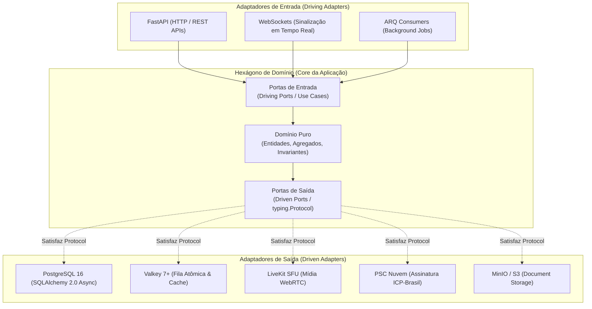
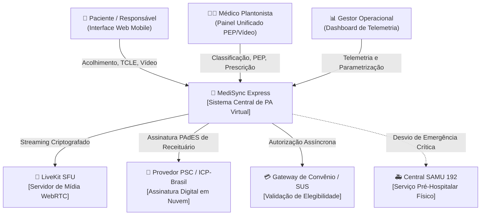
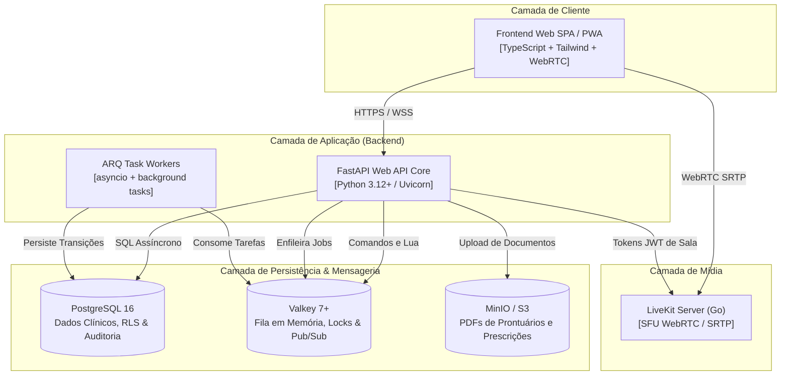

# Macro-Arquitetura do Sistema (Architecture Overview)

## MediSync Express — Plataforma de Código Aberto para Pronto-Atendimento Virtual (PA Digital 24/7)

| Metadado | Detalhamento |
| :--- | :--- |
| **Estilo Arquitetural** | Arquitetura Hexagonal (Ports & Adapters) em Monólito Modular |
| **Paradigma de Tipagem** | Subtipagem Estrutural via `typing.Protocol` (Python 3.12+) |
| **Qualidade & Métricas** | FURPS+ / ISO 25010 \| C4 Model (Contexto, Contêineres e Componentes) |
| **Status do Documento** | Aprovado (Linha de Base de Arquitetura Macro) |

---

## 1. Princípios Arquiteturais e Abordagem Hexagonal Idiomática

O MediSync Express adota a **Arquitetura Hexagonal (Ports and Adapters)** combinada com os princípios de **Monólito Modular**. Essa escolha decorre de uma restrição crítica de domínio: regras de saúde pública, normas éticas do CFM e salvaguardas de atendimento não podem ser contaminadas por decisões voláteis de infraestrutura, bancos de dados, servidores de mídia ou gateways externos.



### 1.1 Por que `typing.Protocol` para as Portas (Ports)?

Em linguagens como Java ou C#, portas são convencionalmente modeladas como `interfaces` explícitas. Em Python, no entanto, forçar herança de classes abstratas (`abc.ABC`) introduz acoplamento de herança, rigidez desnecessária e atrito no uso de ferramentas de análise estática.

O MediSync Express adota **Subtipagem Estrutural (*Static Duck Typing*) via `typing.Protocol`** (PEP 544):

1. **Desacoplamento Absoluto**: O domínio e os casos de uso definem exatamente os métodos de que precisam em um `Protocol`. Qualquer adaptador de infraestrutura que implemente esses métodos satisfaz a porta automaticamente, sem necessidade de importar ou herdar classes do domínio.
2. **Checagem Estrita em Tempo de Análise**: Os checadores estáticos de tipo (`basedpyright` ou `mypy` em modo *strict*) validam em tempo de compilação/CI se os adaptadores atendem a 100% dos contratos das portas.
3. **Testabilidade Impecável e Rápida**: Test doubles (fakes em memória, stubs e spies) são implementados de forma limpa, direta e sem bibliotecas mágicas de mock, acelerando drasticamente o ciclo de feedback em testes unitários.

---

### 1.2 Exemplo Idiomático de Porta e Adaptador em Python

#### 1. A Porta de Saída no Domínio/Aplicação (`ports.py`):
```python
from typing import Protocol, runtime_checkable
from uuid import UUID
from datetime import datetime
from dataclasses import dataclass

@dataclass(frozen=True)
class QueueEntry:
    patient_id: UUID
    severity_level: int
    enqueued_at: datetime

@runtime_checkable
class QueueEnginePort(Protocol):
    """Porta de saída para manipulação atômica da fila de espera."""

    async def enqueue_patient(self, entry: QueueEntry) -> int:
        """Insere o paciente na fila clínica e retorna sua posição relativa."""
        ...

    async def acquire_next_patient(self, doctor_id: UUID) -> QueueEntry | None:
        """Aloca atomicamente o próximo paciente de maior gravidade para o médico."""
        ...

    async def release_call_lock(self, doctor_id: UUID, patient_id: UUID) -> None:
        """Libera a trava de alocação em caso de no-show (ring timeout de 45s)."""
        ...
```

#### 2. O Caso de Uso Consumindo a Porta (`use_cases.py`):
```python
from uuid import UUID

class CallNextPatientUseCase:
    def __init__(self, queue_engine: QueueEnginePort) -> None:
        self._queue = queue_engine  # Acoplamento apenas ao Protocol

    async def execute(self, doctor_id: UUID) -> QueueEntry | None:
        # Executa invariante contratual RN02
        allocated_entry = await self._queue.acquire_next_patient(doctor_id)
        return allocated_entry
```

#### 3. O Adaptador de Infraestrutura Concreta (`valkey_adapter.py`):
```python
# Não herda de QueueEnginePort! Satisfaz o protocolo estruturalmente.
from redis.asyncio import Redis

class ValkeyQueueAdapter:
    def __init__(self, client: Redis) -> None:
        self._client = client

    async def enqueue_patient(self, entry: QueueEntry) -> int:
        # Implementação concreta via script Lua e ZSET atômico
        ...

    async def acquire_next_patient(self, doctor_id: UUID) -> QueueEntry | None:
        # Obtenção atômica respeitando prioridade e FIFO
        ...

    async def release_call_lock(self, doctor_id: UUID, patient_id: UUID) -> None:
        # Liberação de lock em memória
        ...
```

---

## 2. Topologia do Sistema (Modelo C4)

### 2.1 C4 Nível 1: Diagrama de Contexto de Sistema

O diagrama abaixo contextualiza o MediSync Express frente aos seus usuários e sistemas externos:



---

### 2.2 C4 Nível 2: Diagrama de Contêineres de Execução



---

## 3. Decomposição Modular do Código (`src/`)

O repositório é organizado em **módulos verticais de negócio**, onde cada módulo constitui um hexágono autônomo com camadas estritas:

```plaintext
src/
├── core/                              # Infraestrutura transversal e fundações
│   ├── config.py                      # Configurações tipadas (Pydantic BaseSettings)
│   ├── database.py                    # Engine assíncrona SQLAlchemy e sessionmaker
│   ├── valkey.py                      # Pool assíncrono do Valkey
│   └── telemetry.py                   # Exportação de métricas e instrumentação
│
└── modules/
    ├── triage/                        # Módulo de Acolhimento, Triagem e TCLE
    │   ├── domain/                    # Entidades (TriageAssessment), Invariantes (RN01, RN04)
    │   ├── application/               # Use cases e Ports (TriageRepository, EmergencyNotifier)
    │   ├── infrastructure/            # Adaptador PostgreSQL e carga de terminologias
    │   └── presentation/              # Rotas FastAPI e schemas de acolhimento
    │
    ├── queue/                         # Módulo de Fila Dinâmica e Controle de Admissão
    │   ├── domain/                    # Invariantes de Alocação e Backpressure (RN02, RN05)
    │   ├── application/               # Use cases (CallNext, ResolveTimeout) e Ports (QueueEnginePort)
    │   ├── infrastructure/            # Adaptador Valkey (Lua scripts) e agendamento ARQ
    │   └── presentation/              # WebSockets de notificação de avanço e painel de fila
    │
    ├── consultation/                  # Módulo de Teleconsulta, PEP e Prescrição
    │   ├── domain/                    # Agregado MedicalConsultation, Invariante do Ato Médico (RN06)
    │   ├── application/               # Use cases de abertura, evolução clínica e conclusão
    │   ├── infrastructure/            # Adaptador LiveKit SFU e Adaptador PyHanko/PSC ICP-Brasil
    │   └── presentation/              # Endpoints da sala médica e download de receitas
    │
    └── billing/                       # Módulo de Elegibilidade e Liquidação
        ├── domain/                    # Regras de cobertura e máquina de estados (RN03)
        ├── application/               # Use cases de validação assíncrona e contingência
        ├── infrastructure/            # Adaptador SUS (no-op) e adaptadores de planos de saúde
        └── presentation/              # Webhooks de liquidação e parametrização de cotas
```

---

## 4. Requisitos Não Funcionais (FURPS+ / ISO 25010)

Os requisitos não funcionais definem os critérios técnicos mensuráveis e homologáveis da plataforma:

| ID | Categoria | Critério Mensurável (Nível de Serviço) | Método de Homologação / Teste |
| :--- | :--- | :--- | :--- |
| **RNF-01** | Desempenho de Fila | Reordenação dinâmica e obtenção de trava de alocação atômica em tempo $\le 200\text{ ms}$ sob carga nominal. | Testes de estresse simulando requisições concorrentes de alocação via scripts automatizados. |
| **RNF-02** | Resiliência do Worker | Worker de validação de elegibilidade com recuo exponencial e timeout de contingência fixado em 15 segundos. | Testes de injeção de falhas e simulação de latência de rede nos adaptadores externos. |
| **RNF-03** | Confiabilidade | Disponibilidade operacional contínua de no mínimo 99,9% (24/7). | Checagens sintéticas de saúde a cada 30 segundos e monitoramento contínuo de uptime. |
| **RNF-04** | Comunicação em Tempo Real | Transmissão de áudio/vídeo WebRTC com latência de transporte $\le 150\text{ ms}$ sob canais criptografados (SRTP). | Medição das métricas WebRTC `getStats` sob simulação de oscilações em conexões 4G móveis. |
| **RNF-05** | Segurança & LGPD | Criptografia TLS 1.3 em trânsito e AES-256 em repouso. Segregação lógica de dados e trilhas imutáveis append-only. | Verificação estática de segurança (SAST) em pipeline e auditoria de consultas no banco. |
| **RNF-06** | Assinatura Digital | Suporte à emissão de receitas e atestados em PDF com assinatura digital padrão ICP-Brasil em nuvem via OAuth2/PSC. | Validação dos arquivos PDF no verificador oficial de conformidade do ITI. |
| **RNF-07** | Acessibilidade Digital | Conformidade estrita com as diretrizes WCAG 2.1 Nível AA: contraste mínimo de 4,5:1 e alvos de toque $\ge 48\times 48\text{ dp}$. | Auditoria automatizada via Axe/Lighthouse (score $\ge 95$) e testes com leitores de tela. |
| **RNF-08** | Portabilidade & Deploy | Manifesto declarativo de contêineres (`docker compose`) permitindo subida completa de ambiente em menos de 10 minutos. | Execução de rotina limpa de provisionamento e migração automatizada em ambiente isolado. |
| **RNF-09** | Arquitetura Hexagonal | Domínio 100% desacoplado de infraestrutura via `typing.Protocol`, permitindo execução de testes com mocks/fakes. | Verificação estática com `basedpyright` (modo estrito) e verificação de regras com `import-linter`. |
| **RNF-10** | Desempenho de Telemetria | Consolidação e atualização dos indicadores do painel operacional com defasagem temporal inferior a 5 segundos. | Teste de latência ponta a ponta entre a emissão do evento assistencial e a renderização no dashboard. |

---

## 5. Governança Ágil de Decisões de Arquitetura (ADRs)

Para preservar o projeto contra a paralisia por análise e o anti-padrão BDUF (*Big Design Up Front*):

1. **Nenhuma ADR Especulativa Prévia**: Nenhuma decisão arquitetural deve ser registrada antes de o time enfrentar o problema de implementação concreto.
2. **Critério de Nascimento de uma ADR**: Uma ADR em `docs/adrs/` só deve ser criada quando surgir uma decisão técnica estruturante, com trade-offs reais entre alternativas viáveis e impacto de longo prazo.
3. **Formato Padrão**: As decisões registradas seguirão o padrão clássico de Michael Nygard: Contexto, Forças, Opções Consideradas, Decisão Tomada e Consequências Verificadas.
