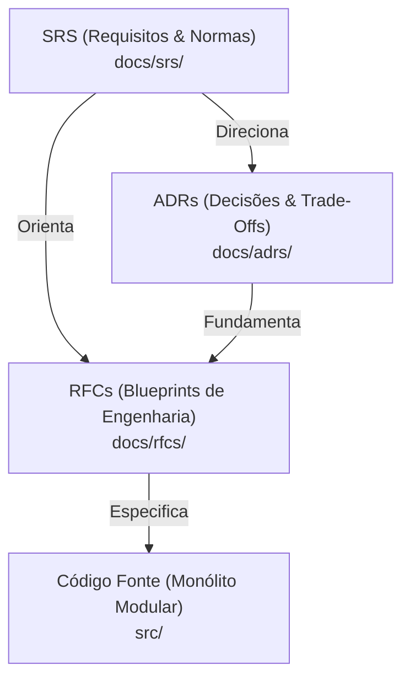

# Documentação Técnica & Governança — MediSync Express

Bem-vindo à documentação arquitetural e de engenharia do **MediSync Express**, plataforma de código aberto para Pronto-Atendimento Virtual (PA Digital 24/7).

A governança do projeto é estruturada sob três pilares metodológicos complementares:
1. **SRS (Software Requirements Specification)**: Define **O QUÊ** o produto e as normas legais exigem (Domínio do Problema, Personas, Requisitos Funcionais, Invariantes e Métricas FURPS+).
2. **ADRs (Architecture Decision Records)**: Registra **O PORQUÊ** de cada decisão técnica fundamental (Contexto, Forças, Opções Descartadas, Decisão e Consequências). São imutáveis no tempo.
3. **RFCs (Technical Design Documents)**: Detalha **O COMO** implementar cada subsistema (Modelagem, Schemas, Fluxos de Concorrência, Scripts Lua, Workers e Testes).

---

## 1. Especificação de Requisitos de Software (SRS)

| Documento | Versão | Descrição |
| :--- | :--- | :--- |
| **[SRS-001: MediSync Express](srs/SRS-001-MediSync-Express.md)** | `1.0` | Especificação de requisitos completa (Vazquez & Simões, CFM 2.314/2022, LGPD Art. 11, FURPS+). |

---

## 2. Registro de Decisões de Arquitetura (ADRs)

| ADR | Título | Status | Decisão Central |
| :--- | :--- | :--- | :--- |
| **[ADR-001](adrs/ADR-001-Monolito-Modular-com-Modelos-Ricos.md)** | Monólito Modular com Modelos Ricos | Aprovado | Adoção de monólito modular pragmático com modelos ricos no SQLAlchemy 2.0, repository e service layer, sem camadas redundantes. |
| **[ADR-002](adrs/ADR-002-Alocacao-Atomica-Valkey-Lua.md)** | Alocação Atômica via Valkey e Lua | Aprovado | Sorted Sets (`ZSET`) e script Lua atômico com locks duplos de 45s para garantir alocação em $\le 200\text{ ms}$ sem race conditions. |
| **[ADR-003](adrs/ADR-003-Multi-Tenancy-Logico-no-ORM.md)** | Multi-Tenancy com Defesa em Profundidade | Aprovado | Interceptação ORM (`do_orm_execute`) combinada com PostgreSQL Row-Level Security (RLS) nativo (`SET LOCAL app.current_tenant_id`). |
| **[ADR-004](adrs/ADR-004-Auditoria-Append-Only-Postgres-Rules.md)** | Trilha Imutável via DCL e Triggers Restritivas | Aprovado | Blindagem de `audit_events` via `REVOKE UPDATE, DELETE` e Triggers com `RAISE EXCEPTION`, eliminando falhas silenciosas. |
| **[ADR-005](adrs/ADR-005-Worker-Assincrono-ARQ-sobre-Valkey.md)** | Worker Assíncrono ARQ sobre Valkey | Aprovado | Processamento em segundo plano nativo em `asyncio` compartilhando instâncias Valkey, sem dependência de RabbitMQ. |
| **[ADR-006](adrs/ADR-006-Ring-Timeout-Deterministico-via-Jobs-Diferidos.md)** | Ring Timeout via Jobs Diferidos | Aprovado | Resolução determinística de no-show em 45 segundos via tarefas agendadas (`_defer_by=45`), eliminando deadlocks. |
| **[ADR-007](adrs/ADR-007-Desacoplamento-de-Midia-LiveKit-SFU.md)** | Desacoplamento de Mídia com LiveKit SFU | Aprovado | Servidor de mídia em Go desacoplado; backend apenas emite tokens JWT, preservando a soberania do médico (CFM 2.314). |
| **[ADR-008](adrs/ADR-008-Assinatura-Digital-Nuvem-PSC-OAuth2.md)** | Assinatura ICP-Brasil em Nuvem via PSC | Aprovado | Assinatura PAdES via porta tipada `ICPBrasilSignerPort` e integração OAuth2/PSC, dispensando tokens USB físicos. |
| **[ADR-009](adrs/ADR-009-Migracoes-Assincronas-Alembic-Asyncpg.md)** | Migrações Assíncronas via Alembic e asyncpg | Aprovado | Runner assíncrono nativo no Alembic conectado via `asyncpg`, eliminando dependências de drivers síncronos legados. |
| **[ADR-010](adrs/ADR-010-Cadastro-Progressivo-e-Identidade-Clinica.md)** | Cadastro Progressivo e Identidade CFM | Aprovado | Onboarding em 2 etapas: acolhimento rápido (< 45s) e enriquecimento na fila com dados CFM, endereço para SAMU e alergias. |
| **[ADR-011](adrs/ADR-011-Armazenamento-de-Documentos-S3-MinIO.md)** | Object Storage S3/MinIO e Presigned URLs | Aprovado | Guarda perene de PDFs e receitas assinadas em bucket compatível com S3, com entrega segura via URLs pré-assinadas temporárias. |
| **[ADR-012](adrs/ADR-012-Sinalizacao-Tempo-Real-WebSockets-Valkey.md)** | Sinalização em Tempo Real via WebSockets e Valkey | Aprovado | Notificação bidirecional instantânea (< 50 ms) para avanço de fila e disparo do ring timeout de 45s via Valkey Pub/Sub. |

---

## 3. Especificações Técnicas de Engenharia (RFCs)

| RFC | Subsistema | Versão | ADRs Fundamentais |
| :--- | :--- | :--- | :--- |
| **[RFC-001](rfcs/RFC-001-Fundacao-Arquitetura-Base-e-Tooling.md)** | Fundação, Arquitetura Base e Tooling | `1.0` | [ADR-001](adrs/ADR-001-Monolito-Modular-com-Modelos-Ricos.md) |
| **[RFC-002](rfcs/RFC-002-Modelo-de-Dados-Agregados-e-Migracoes.md)** | Modelo de Dados Relacional, Agregados DDD e Migrações | `1.0` | [ADR-001](adrs/ADR-001-Monolito-Modular-com-Modelos-Ricos.md), [ADR-003](adrs/ADR-003-Multi-Tenancy-Logico-no-ORM.md), [ADR-004](adrs/ADR-004-Auditoria-Append-Only-Postgres-Rules.md), [ADR-009](adrs/ADR-009-Migracoes-Assincronas-Alembic-Asyncpg.md) |
| **[RFC-003](rfcs/RFC-003-Multi-Tenancy-Identidade-e-Auditoria.md)** | Multi-Tenancy, Autenticação e Trilha Imutável de Auditoria | `1.0` | [ADR-003](adrs/ADR-003-Multi-Tenancy-Logico-no-ORM.md), [ADR-004](adrs/ADR-004-Auditoria-Append-Only-Postgres-Rules.md), [ADR-010](adrs/ADR-010-Cadastro-Progressivo-e-Identidade-Clinica.md) |
| **[RFC-004](rfcs/RFC-004-Motor-de-Fila-e-Concorrencia-Valkey.md)** | Motor de Fila Dinâmica e Concorrência em Valkey | `1.0` | [ADR-002](adrs/ADR-002-Alocacao-Atomica-Valkey-Lua.md), [ADR-006](adrs/ADR-006-Ring-Timeout-Deterministico-via-Jobs-Diferidos.md) |
| **[RFC-005](rfcs/RFC-005-Processamento-Assincrono-e-Ring-Timeout.md)** | Processamento Assíncrono, Ring Timeout e Telemetria Operacional | `1.0` | [ADR-005](adrs/ADR-005-Worker-Assincrono-ARQ-sobre-Valkey.md), [ADR-006](adrs/ADR-006-Ring-Timeout-Deterministico-via-Jobs-Diferidos.md) |
| **[RFC-006](rfcs/RFC-006-Teleconsulta-WebRTC-e-Assinatura-ICP.md)** | Teleconsulta WebRTC e Assinatura Digital ICP-Brasil | `1.0` | [ADR-007](adrs/ADR-007-Desacoplamento-de-Midia-LiveKit-SFU.md), [ADR-008](adrs/ADR-008-Assinatura-Digital-Nuvem-PSC-OAuth2.md), [ADR-011](adrs/ADR-011-Armazenamento-de-Documentos-S3-MinIO.md) |
| **[RFC-007](rfcs/RFC-007-Frontend-e-Painel-Clinico.md)** | Frontend, Experiência do Paciente e Painel Clínico Unificado | `1.0` | [ADR-001](adrs/ADR-001-Monolito-Modular-com-Modelos-Ricos.md), [ADR-007](adrs/ADR-007-Desacoplamento-de-Midia-LiveKit-SFU.md), [ADR-010](adrs/ADR-010-Cadastro-Progressivo-e-Identidade-Clinica.md), [ADR-012](adrs/ADR-012-Sinalizacao-Tempo-Real-WebSockets-Valkey.md) |
