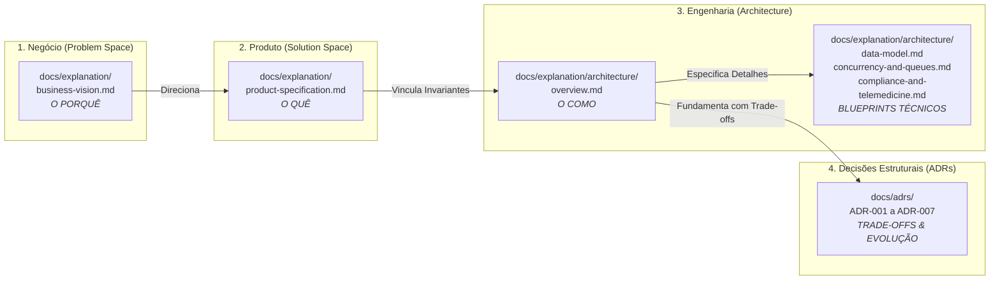

# Governança & Arquitetura — MediSync Express

Bem-vindo à documentação oficial do **MediSync Express**, plataforma de código aberto para Pronto-Atendimento Virtual (PA Digital 24/7).

Para garantir rigor técnico e agilidade real sem cair na armadilha do modelo cascata (*Big Design Up Front*), a documentação do projeto é estritamente segregada em **três pilares ortogonais de responsabilidade única**:

```mermaid
flowchart LR
    subgraph P1["1. Negócio (Problem Space)"]
        BV["docs/explanation/<br/>business-vision.md<br/><i>O PORQUÊ</i>"]
    end

    subgraph P2["2. Produto (Solution Space)"]
        SP["docs/explanation/<br/>product-specification.md<br/><i>O QUÊ</i>"]
    end

    subgraph P3["3. Engenharia (Architecture)"]
        AR["docs/explanation/architecture/<br/>overview.md<br/><i>O COMO</i>"]
        BM["docs/explanation/architecture/<br/>data-model.md<br/>concurrency-and-queues.md<br/>compliance-and-telemedicine.md<br/><i>BLUEPRINTS TÉCNICOS</i>"]
    end

    subgraph P4["4. Decisões Estruturais (ADRs)"]
        ADR["docs/adrs/<br/>ADR-001 a ADR-007<br/><i>TRADE-OFFS & EVOLUÇÃO</i>"]
    end

    BV -->|Direciona| SP
    SP -->|Vincula Invariantes| AR
    AR -->|Especifica Detalhes| BM
    AR -->|Fundamenta com Trade-offs| ADR
```

---

## 1. Estrutura da Documentação

### 📄 [01. Modelagem de Negócio & Visão de Produto](explanation/business-vision.md)
* **Responsabilidade**: *Problem Space* (O Porquê).
* **Conteúdo**:
  * Contexto do Pronto-Atendimento Virtual (PA Digital 24/7);
  * Esteira de Atendimento Integral de ponta a ponta;
  * Declaração do Problema (Modelo Canvas de Requisitos);
  * Objetivos Estratégicos e Metas SMART;
  * Personas do Sistema (Juliana, Dr. Eduardo, Patrícia e Carlos);
  * Matriz de Necessidades de Negócio (NEC-01 a NEC-08);
  * Dualidade de Modelos Operacionais: Atenção Pública (SUS) vs. Saúde Privada.

### 📄 [02. Especificação de Produto & Invariantes de Domínio](explanation/product-specification.md)
* **Responsabilidade**: *Solution Space* (O Quê).
* **Conteúdo**:
  * Marco Regulatório e Salvaguardas Éticas (CFM nº 2.314/2022, 1.821/2007 e LGPD Art. 11);
  * Invariantes Formais e Regras Contratuais (*Design by Contract*):
    * **RN01**: Priorização Dinâmica por Gravidade (5 níveis e FIFO estrito);
    * **RN02**: Bloqueio de Sobreposição e Prevenção de Deadlock (Ring Timeout de 45s);
    * **RN03**: Transição de Estados de Atendimento e Desvio Temporário Seguro;
    * **RN04**: Redirecionamento Mandatório e Rota de Fuga SAMU 192;
    * **RN05**: Controle de Admissão, Backpressure Estocástico ($\alpha$) e Transbordo;
    * **RN06**: Preservação Soberana do Ato Médico (sem corte temporal de chamada);
    * **RN07**: Imutabilidade, Carimbo UTC e Hash Criptográfico do TCLE;
  * Requisitos Funcionais de Usuário (RF-01 a RF-10);
  * Requisitos de Transição (RT-01 a RT-03);
  * Matriz de Rastreabilidade Vertical Auditável.

### 📄 [03. Macro-Arquitetura do Sistema](explanation/architecture/overview.md)
* **Responsabilidade**: *Architecture & Engineering Foundations* (O Como).
* **Conteúdo**:
  * **Hexagonal Pragmático em Python**:
    * Modelos Ricos no SQLAlchemy 2.0 (`Mapped[...]`) para o domínio persistido (zero *Mapper Hell*);
    * Portas externas e de fronteira inter-módulos modeladas com `typing.Protocol` (PEP 544);
    * Comunicação inter-módulos em duas vias: *Ports & Adapters* (síncrona) e *Event Bus em memória* (assíncrona);
    * Isolamento estrito de fronteiras e módulos auditado via **Tach** (`tach check`);
  * **Topologia C4**: Diagramas de Contexto (Nível 1) e Contêineres (Nível 2);
  * Decomposição Modular do Código (`src/` dividido em módulos verticais: `identity`, `triage`, `queue`, `consultation`, `billing`);
  * Matriz de Requisitos Não Funcionais (FURPS+ / ISO 25010: fila $\le 200\text{ ms}$, resiliência do worker, WebRTC $\le 150\text{ ms}$, segurança TLS 1.3/AES-256 e acessibilidade WCAG 2.1 AA).

---

## 2. Blueprints Técnicos de Engenharia

Para orientar a implementação sem burocracia de RFCs estáticas:
* 📄 **[Modelo de Dados Relacional e Governança Forense](explanation/architecture/data-model.md)**: Diagrama Entidade-Relacionamento (DER), DDL das 10 tabelas relacionais, políticas PostgreSQL RLS nativas e regras forenses do CFM para snapshots clínicos.
* 📄 **[Concorrência, Fila Valkey e Ring Timeout](explanation/architecture/concurrency-and-queues.md)**: Script Lua atômico com double-locking de 45s, fórmula do score ponderado de 64 bits para o ZSET do Valkey e agendamento de tarefas no ARQ Worker.
* 📄 **[Conformidade Clínica, Telemedicina e ICP-Brasil](explanation/architecture/compliance-and-telemedicine.md)**: Topologia WebRTC com LiveKit SFU, fluxo de assinatura digital PAdES-LTV com PyHanko e armazenamento de PDFs no S3/MinIO via presigned URLs.

---

## 3. Registro de Decisões de Arquitetura (ADRs)

* Diretório: **[`docs/adrs/`](adrs/README.md)**
* **Decisões Estruturantes Consolidadas**:
  * **[ADR-001](adrs/ADR-001-Hexagonal-Pragmatico-Modelos-Ricos-Protocols-e-Tach.md)**: Hexagonal Pragmático com Modelos Ricos, Protocols e Tach
  * **[ADR-002](adrs/ADR-002-Alocacao-Atomica-Valkey-Lua.md)**: Alocação Atômica via Valkey Sorted Sets e Scripts Lua
  * **[ADR-003](adrs/ADR-003-Multi-Tenancy-Logico-Postgres-RLS.md)**: Multi-Tenancy Lógico com Defesa em Profundidade no PostgreSQL (RLS)
  * **[ADR-004](adrs/ADR-004-Worker-Assincrono-ARQ-sobre-Valkey.md)**: Adoção do Motor de Tarefas Assíncronas ARQ sobre Valkey
  * **[ADR-005](adrs/ADR-005-Desacoplamento-de-Midia-LiveKit-SFU.md)**: Desacoplamento do Servidor de Mídia WebRTC via LiveKit SFU
  * **[ADR-006](adrs/ADR-006-Assinatura-Digital-ICP-Brasil-Nuvem-PSC.md)**: Assinatura Digital ICP-Brasil em Nuvem via PSCs e PAdES
  * **[ADR-007](adrs/ADR-007-Auditoria-Imutavel-Append-Only.md)**: Trilha de Auditoria Imutável Append-Only via DCL e Triggers Restritivas
* **Diretriz Ágil**: Novas decisões são registradas sob demanda quando a equipe de engenharia se depara com encruzilhadas técnicas reais ao longo da implementação.
