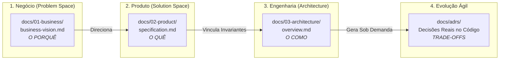

# Governança & Arquitetura — MediSync Express

Bem-vindo à documentação oficial do **MediSync Express**, plataforma de código aberto para Pronto-Atendimento Virtual (PA Digital 24/7).

Para garantir rigor técnico sem cair na armadilha do modelo cascata (*Big Design Up Front*), a documentação do projeto é estritamente segregada em **três pilares ortogonais de responsabilidade única**:

```mermaid
flowchart LR
    subgraph P1["1. Negócio (Problem Space)"]
        BV["docs/01-business/<br/>business-vision.md<br/><i>O PORQUÊ</i>"]
    end

    subgraph P2["2. Produto (Solution Space)"]
        SP["docs/02-product/<br/>specification.md<br/><i>O QUÊ</i>"]
    end

    subgraph P3["3. Engenharia (Architecture)"]
        AR["docs/03-architecture/<br/>overview.md<br/><i>O COMO</i>"]
    end

    subgraph P4["4. Evolução Ágil"]
        ADR["docs/adrs/<br/>Decisões Reais no Código<br/><i>TRADE-OFFS</i>"]
    end

    BV -->|Direciona| SP
    SP -->|Vincula Invariantes| AR
    AR -->|Gera Sob Demanda| ADR
```

---

## 1. Estrutura da Documentação

### 📄 [01. Modelagem de Negócio & Visão de Produto](01-business/business-vision.md)
* **Responsabilidade**: *Problem Space* (O Porquê).
* **Conteúdo**:
  * Contexto do Pronto-Atendimento Virtual (PA Digital 24/7);
  * Esteira de Atendimento Integral de ponta a ponta;
  * Declaração do Problema (Modelo Canvas de Requisitos);
  * Objetivos Estratégicos e Metas SMART;
  * Personas do Sistema (Juliana, Dr. Eduardo, Patrícia e Carlos);
  * Matriz de Necessidades de Negócio (NEC-01 a NEC-08);
  * Dualidade de Modelos Operacionais: Atenção Pública (SUS) vs. Saúde Privada.

### 📄 [02. Especificação de Produto & Invariantes de Domínio](02-product/specification.md)
* **Responsabilidade**: *Solution Space* (O Quê).
* **Conteúdo**:
  * Marco Regulatório e Salvaguardas Éticas (CFM nº 2.314/2022, 1.821/2007 e LGPD Art. 11);
  * Invariantes Formais e Regras Contratuais (*Design by Contract*):
    * **RN01**: Priorização Dinâmica por Gravidade (5 níveis e FIFO estrito);
    * **RN02**: Bloqueio de Sobreposição e Prevenção de Deadlock (Ring Timeout de 45s);
    * **RN03**: Transição de Estados de Atendimento e Desvio Temporário Seguro;
    * **RN04**: Redirecionamento Mandatório e Rota de Fuga SAMU 192;
    * **RN05**: Controle de Admissão, Backpressure Estocástico ($\alpha$) e Transbordo;
    * **RN06**: Preservação Soberana do Ato Médico (sem corte temporal de chamada);
    * **RN07**: Imutabilidade, Carimbo UTC e Hash Criptográfico do TCLE;
  * Requisitos Funcionais de Usuário (RF-01 a RF-10);
  * Requisitos de Transição (RT-01 a RT-03);
  * Matriz de Rastreabilidade Vertical Auditável.

### 📄 [03. Macro-Arquitetura do Sistema](03-architecture/overview.md)
* **Responsabilidade**: *Architecture & Engineering Foundations* (O Como).
* **Conteúdo**:
  * **Arquitetura Hexagonal Idiomática em Python**:
    * Desacoplamento absoluto do domínio;
    * Portas de entrada e saída modeladas estritamente com `typing.Protocol` (PEP 544 - Subtipagem Estrutural / *Static Duck Typing*);
    * Exemplos práticos de use cases e adaptadores;
  * **Topologia C4**: Diagramas de Contexto (Nível 1) e Contêineres (Nível 2);
  * Decomposição Modular do Código (`src/` dividido em módulos verticais com hexágonos internos);
  * Matriz de Requisitos Não Funcionais (FURPS+ / ISO 25010: latência $\le 200\text{ ms}$, resiliência do worker, WebRTC $\le 150\text{ ms}$, segurança TLS 1.3/AES-256 e acessibilidade WCAG 2.1 AA).

---

## 2. Registro de Decisões de Arquitetura (ADRs)

* Diretório: **[`docs/adrs/`](adrs/README.md)**
* **Diretriz Ágil**: Nenhuma decisão arquitetural é pré-fabricada de forma especulativa. As ADRs são registradas **sob demanda ao longo do desenvolvimento**, documentando tensões reais, alternativas avaliadas e consequências observadas em testes e benchmarks de código.
