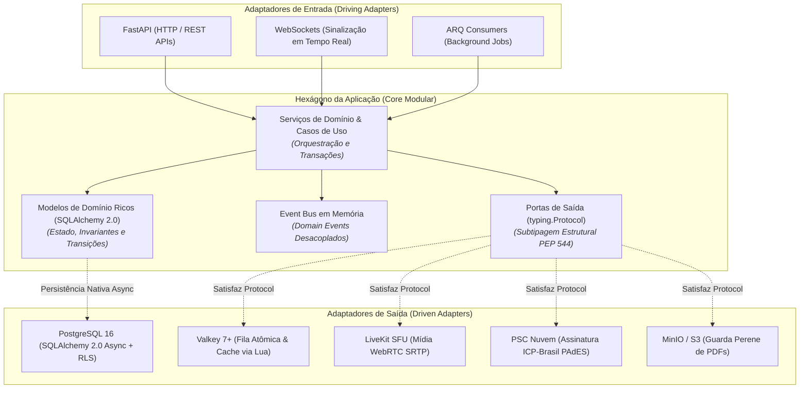
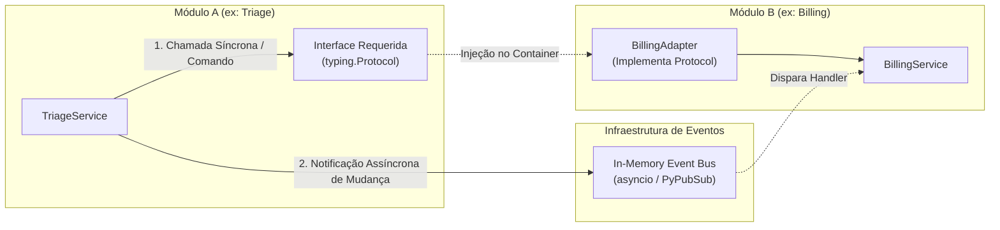
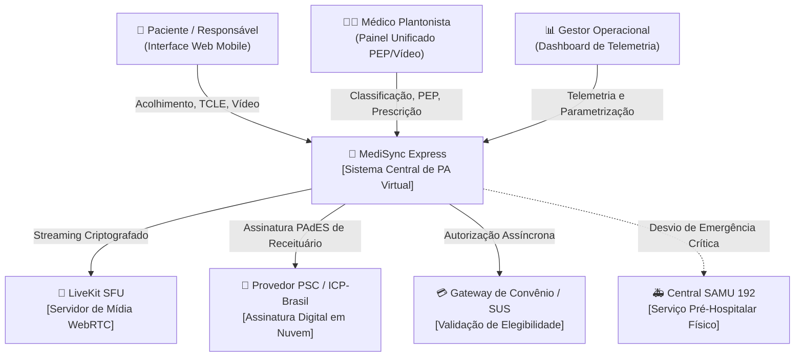

# Macro-Arquitetura do Sistema (Architecture Overview)

## MediSync Express — Plataforma de Código Aberto para Pronto-Atendimento Virtual (PA Digital 24/7)

| Metadado | Detalhamento |
| :--- | :--- |
| **Estilo Arquitetural** | Hexagonal Pragmático (Ports & Adapters) em Monólito Modular |
| **Paradigma de Tipagem** | Modelos Ricos (SQLAlchemy 2.0) + Chaves Clínicas em UUIDv7 + Subtipagem Estrutural via `typing.Protocol` (PEP 544) |
| **Comunicação Inter-Módulos** | Síncrona via Ports & Adapters (`typing.Protocol`) \| Assíncrona via Event Bus em Memória |
| **Isolamento de Fronteiras** | Tach (Verificação estática de dependências e interfaces públicas em Rust) |
| **Qualidade & Métricas** | FURPS+ / ISO 25010 \| C4 Model (Contexto, Contêineres e Componentes) |
| **Status do Documento** | Aprovado (Linha de Base de Arquitetura Macro) |

---

## 1. Princípios Arquiteturais e Abordagem Hexagonal Pragmática

O **MediSync Express** adota a **Arquitetura Hexagonal Pragmática (Ports and Adapters)** combinada com os princípios de **Monólito Modular**. Essa abordagem busca o equilíbrio ideal entre:
1. **Desacoplamento de Infraestruturas Voláteis**: Componentes externos ou voláteis (servidores de mídia WebRTC, brokers em memória, provedores de assinatura digital e gateways externos) são isolados atrás de **Portas** (`typing.Protocol`).
2. **Eliminação do "Mapper Hell" (Modelos Ricos)**: Em vez de duplicar classes em entidades puras e modelos de banco com conversores manuais (`to_domain`/`to_orm`), as entidades de domínio persistidas são modeladas diretamente como **Modelos Ricos do SQLAlchemy 2.0 (`Mapped[...]`)**, contendo regras de negócio, validações e transições de estado, preservando o Unit of Work e o Identity Map.
3. **Comunicação Inter-Módulos Blindada**: Nenhum módulo acessa tabelas, modelos internos ou repositórios de outro módulo diretamente. A comunicação entre módulos ocorre estritamente por **Ports & Adapters (`typing.Protocol`)** para chamadas síncronas ou por **Event Bus em Memória** para notificações de domínio assíncronas.
4. **Governança de Fronteiras via Tach**: O controle estrito de importações entre módulos e camadas é garantido em tempo de desenvolvimento e CI pelo **Tach**, impedindo vazamento de dependências.



---

### 1.1 Dupla Estratégia de Comunicação Inter-Módulos

Para garantir independência total entre os Bounded Contexts sem overhead de rede:



1. **Comunicação Síncrona via Ports & Adapters (`typing.Protocol`)**:
   * O módulo consumidor declara em `ports.py` a interface exata dos métodos de que precisa.
   * O módulo provedor implementa essa interface em um adaptador público.
   * A injeção é resolvida no container de dependências do FastAPI (`Depends`).
   * *Regra de Ouro*: O módulo consumidor **nunca** importa modelos do SQLAlchemy do módulo provedor; apenas tipos primitivos ou DTOs imutáveis (`dataclass(frozen=True)`).

2. **Comunicação Assíncrona via Event Bus em Memória**:
   * Quando uma mutação relevante de estado ocorre, o módulo emite um evento de domínio desacoplado (ex.: `AtendimentoTriadoEvent`, `ConsultaFinalizadaEvent`).
   * O Event Bus entrega a mensagem aos ouvintes registrados em corrotinas concorrentes assíncronas no mesmo processo (`asyncio.create_task`).
   * Elimina completamente o acoplamento temporal e de dependência entre módulos.

---

### 1.2 Por que `typing.Protocol` para as Portas (Ports)?

Em Python, portas modeladas com herança de classes abstratas (`abc.ABC`) geram acoplamento rígido de tipos. Adotamos **Subtipagem Estrutural (*Static Duck Typing*) via `typing.Protocol`** (PEP 544):

1. **Desacoplamento Absoluto**: Adaptadores de infraestrutura e módulos parceiros satisfazem a porta automaticamente caso implementem os métodos exigidos, sem precisar herdar classes da porta.
2. **Checagem Estrita em Tempo de CI**: Checadores como `basedpyright` validam em modo *strict* se adaptadores atendem a 100% dos contratos.
3. **Testes Instantâneos**: Test doubles (fakes em memória, stubs) são escritos diretamente em Python puro, acelerando o ciclo de testes unitários sem bibliotecas mágicas de mock.

---

### 1.3 Exemplo Idiomático de Porta e Adaptador de Fila

#### 1. A Porta de Saída do Módulo de Fila (`src/modules/queue/application/ports/allocation_port.py`):
```python
from typing import Protocol
class AllocationPort(Protocol):
    async def alocar_chamada(self, client, keys, args): ...
```
Ver fonte completa em `src/modules/queue/application/ports/allocation_port.py`.

#### 2. O Caso de Uso Consumindo a Porta (`src/modules/queue/application/services/alocacao_service.py`):
```python
codigo = await self._lua_manager.alocar_chamada(client, keys, args)
atendimento.iniciar_chamada(command.medico_id)
await self._db_session.commit()
```
Ver fluxo completo em `src/modules/queue/application/services/alocacao_service.py`.

#### 3. O Adaptador Concreto (`src/modules/queue/infrastructure/lua/alocar_chamada.lua`):
```python
codigo = await lua_manager.alocar_chamada(client, keys, args)
if codigo == AlocacaoCodigo.SUCESSO:
    await session.commit()
```
Script atômico em `src/modules/queue/infrastructure/lua/alocar_chamada.lua`, loader em `src/modules/queue/infrastructure/lua_loader.py`.

---

## 2. Topologia do Sistema (Modelo C4)

### 2.1 C4 Nível 1: Diagrama de Contexto de Sistema



---

### 2.2 C4 Nível 2: Diagrama de Contêineres de Execução

```mermaid
flowchart TD
    subgraph ClientLayer["Camada de Cliente"]
        WebPWA["Frontend Web SPA / PWA<br/>[TypeScript + Tailwind + WebRTC]"]
    end

    subgraph AppLayer["Camada de Aplicação (Backend)"]
        API["FastAPI Web API Core<br/>[Python 3.12+ / Granian (Rust)]"]
        Worker["ARQ Task Workers<br/>[asyncio + background tasks]"]
    end

    subgraph DataLayer["Camada de Persistência & Mensageria"]
        DB[(PostgreSQL 17<br/>Dados Clínicos, RLS & Auditoria (Psycopg 3))]
        Cache[(Valkey 8.0<br/>Fila em Memória, Locks & Pub/Sub)]
        Storage[(MinIO / S3<br/>PDFs de Prontuários e Prescrições)]
    end

    subgraph MediaLayer["Camada de Mídia"]
        SFU["LiveKit Server (Go)<br/>[SFU WebRTC / SRTP]"]
    end

    WebPWA -->|HTTPS / WSS| API
    WebPWA -->|WebRTC SRTP| SFU

    API -->|SQL Assíncrono| DB
    API -->|Comandos e Lua| Cache
    API -->|Tokens JWT de Sala| SFU
    API -->|Upload de Documentos| Storage
    API -->|Enfileira Jobs| Cache

    Worker -->|Consome Tarefas| Cache
    Worker -->|Persiste Transições| DB
```

---

## 3. Decomposição Modular do Código (`src/`)

O repositório é organizado em **módulos verticais de negócio**, correspondentes a *Bounded Contexts* do DDD. O controle estrito de dependências é auditado pelo **Tach**:

```plaintext
src/
├── core/                              # Infraestrutura transversal e fundações
│   ├── config.py                      # Configurações tipadas (Pydantic BaseSettings)
│   ├── database.py                    # Engine assíncrona SQLAlchemy e sessionmaker
│   ├── valkey.py                      # Pool assíncrono do Valkey
│   ├── event_bus.py                   # In-memory Event Bus assíncrono
│   └── telemetry.py                   # Exportação de métricas e instrumentação
│
└── modules/
    ├── identity/                      # Bounded Context de Identidade, Autenticação e Multi-Tenancy
    │   ├── domain/                    # Modelos ricos: Organizacao, Usuario, Profissional (CRM/UF)
    │   ├── application/               # Autenticação JWT, Argon2id, RBAC, propagação de tenant
    │   ├── infrastructure/            # Repositórios SQLAlchemy e políticas Postgres RLS
    │   └── presentation/              # Endpoints de login, refresh e onboarding
    │
    ├── triage/                        # Módulo de Acolhimento, Triagem e TCLE
    │   ├── domain/                    # Modelos ricos: Triagem, TCLE, Invariantes (RN01, RN04), Ports
    │   ├── application/               # Use cases de triagem e Ports (EmergencyNotifierPort)
    │   ├── infrastructure/            # Adaptador PostgreSQL e carga de terminologias abertas
    │   └── presentation/              # Rotas FastAPI e schemas Pydantic de acolhimento
    │
    ├── queue/                         # Módulo de Fila Dinâmica e Controle de Admissão
    │   ├── domain/                    # Regras de Alocação e Backpressure (RN02, RN05), Ports
    │   ├── application/               # Use cases (CallNext, ResolveTimeout)
    │   ├── infrastructure/            # Adaptador Valkey (Lua scripts) e agendador ARQ
    │   └── presentation/              # WebSockets de notificação de avanço e painel de fila
    │
    ├── consultation/                  # Módulo de Teleconsulta, PEP e Prescrição
    │   ├── domain/                    # Agregado Atendimento, PEP, Prescrição, Invariante do Ato Médico (RN06)
    │   ├── application/               # Use cases de abertura, evolução e conclusão
    │   ├── infrastructure/            # Adaptador LiveKit SFU e Adaptador PyHanko/PSC ICP-Brasil
    │   └── presentation/              # Endpoints da sala médica e download de receitas
    │
    └── billing/                       # Módulo de Elegibilidade e Liquidação
        ├── domain/                    # Regras de cobertura e máquina de estados (RN03)
        ├── application/               # Use cases de validação assíncrona e contingência
        ├── infrastructure/            # Adaptador SUS (no-op) e adaptadores de planos privados
        └── presentation/              # Webhooks de liquidação e parametrização de cotas
```

> **Composition roots (ADR-001 §7)**: `auth/composition.py`, `consultation/composition.py`,
> `identity/composition.py`, `queue/composition.py` — únicos lugares que importam
> adaptadores concretos de `infrastructure`. Routers recebem services via `*Dep`
> (`AuthServiceDep`, `PEPServiceDep`, …). `billing`/`triage` sem composition própria
> (stateless ou sem presentation).
>
> **Prefixo de rotas**: HTTP sob `/api/v1` (`src/main.py`: `APIRouter(prefix="/api/v1")`
> monta `auth/onboarding/pacientes/consultations/documents`); WebSockets de sinalização
> (`/ws/queue/{id}`, `/ws/doctor/{id}`) fora do prefixo, montados direto no `app`.
>
> **Breakings routers finos**: alias `/atendimentos/{id}/prontuario` removido (usar
> `/api/v1/consultations/{id}/prontuario`); tenant ausente `400 TENANT_INVALIDO`, login sem
> tenant `422`, validação órfã `500 DOCUMENTO_INTEGRIDADE`; rate por IP `validate` 30/min +
> `download` 20/min (`429`+`Retry-After`); novos `EVOLUCAO_NAO_ENCONTRADA` / `DOCUMENTO_CLINICO_NAO_ENCONTRADO` (`404`).

---

### 3.1 Convenção de Schemas e DTOs (ADR-008)

Para erradicar o *Mapper Hell* entre a apresentação e os serviços de aplicação:

1. **Schemas de Entrada (`presentation/schemas.py`)**:
   * Entradas que vêm exclusivamente do JSON HTTP utilizam o próprio Pydantic (`frozen=True`) diretamente como argumento do Service.
   * `Command` (`@dataclass(frozen=True)` em `application/dtos.py`) é reservado para agregação contextual (Path Parameters + Tenant Context + Socket IP + Body).
2. **Schemas de Saída (`presentation/schemas.py`)**:
   * Devem declarar `model_config = ConfigDict(from_attributes=True)`.
   * A serialização a partir de entidades ORM ou DTOs de resultado ocorre exclusivamente via `ResponseSchema.model_validate(entidade)` ou pelo motor do FastAPI (`response_model=ResponseSchema`), proibindo mappers manuais.
3. **Consistência de Localização**:
   * Todo schema Pydantic vive em `presentation/schemas.py`.
   * Todo DTO ou Command puro de aplicação vive em `application/dtos.py`.

---

## 4. Governança de Fronteiras Modulares com Tach

Para assegurar que o monólito modular permaneça desacoplado sem degradação arquitetural ao longo do tempo, o projeto utiliza **[Tach](https://github.com/gauge-sh/tach)**:

1. **Configuração Declarativa (`tach.toml`)**:
   * Cada módulo em `src/modules/` é declarado como um módulo fechado.
   * **Camadas estritas (Stage B, ADR-001 §7)**: `presentation → application + composition + core`;
     `composition → application + domain + infrastructure + core`;
     `infrastructure → application + domain + core`; `application → domain + core`; `domain → core`.
     Guard extra via `tests/architecture/test_routers_are_thin.py` (AST): router nunca importa
     `sqlalchemy/infrastructure/domain.models`, nunca chama `.commit()/.refresh()/text()/select()`,
     nunca levanta `HTTPException` (só `presentation/dependencies.py`), nunca instancia `*Service(`.
   * **Modelos Ricos e Dependência ORM**: O domínio de cada módulo pode importar `sqlalchemy.orm` para definir suas entidades ricas (`Mapped[...]`), mas **jamais** importa infraestrutura externa ou modelos de outro módulo.
   * **Comunicação Inter-Módulos Blindada**: Consumidores acessam outros módulos exclusivamente através de portas públicas (`typing.Protocol`), manipulando tipos primitivos ou DTOs imutáveis (`dataclass(frozen=True)`).
   * As portas e eventos em `domain/ports.py` e `events.py` representam as **únicas interfaces públicas expostas**.
2. **Comando de Verificação Contínua**:
   ```bash
   tach check
   ```
   Integrado ao pipeline de CI e aos hooks de pré-commit, o `tach check` bloqueia qualquer PR que tente importar diretamente arquivos privados de outro módulo.

---

## 5. Requisitos Não Funcionais (FURPS+ / ISO 25010)

| ID | Categoria | Critério Mensurável (Nível de Serviço) | Método de Homologação / Teste |
| :--- | :--- | :--- | :--- |
| **RNF-01** | Desempenho de Fila | Reordenação dinâmica e obtenção de trava de alocação atômica em tempo $\le 200\text{ ms}$ sob carga nominal. | Testes de estresse simulando requisições concorrentes de alocação via scripts automatizados. |
| **RNF-02** | Resiliência do Worker | Worker de validação de elegibilidade com recuo exponencial e timeout de contingência fixado em 15 segundos. | Testes de injeção de falhas e simulação de latência de rede nos adaptadores externos. |
| **RNF-03** | Confiabilidade | Disponibilidade operacional contínua de no mínimo 99,9% (24/7). | Checagens sintéticas de saúde a cada 30 segundos e monitoramento contínuo de uptime. |
| **RNF-04** | Comunicação em Tempo Real | Transmissão de áudio/vídeo WebRTC com latência de transporte $\le 150\text{ ms}$ sob canais criptografados (SRTP). | Medição das métricas WebRTC `getStats` sob simulação de oscilações em conexões 4G móveis. |
| **RNF-05** | Segurança & LGPD | Criptografia TLS 1.3 em trânsito e AES-256 em repouso. Segregação lógica de dados e trilhas imutáveis append-only. | Verificação estática de segurança (SAST) em pipeline e auditoria de consultas no banco. |
| **RNF-06** | Assinatura Digital | Suporte à emissão de receitas e atestados em PDF com assinatura digital padrão ICP-Brasil em nuvem via OAuth2/PSC. | Validação dos arquivos PDF no verificador oficial de conformidade do ITI. |
| **RNF-07** | Acessibilidade Digital | Conformidade estrita com as diretrizes WCAG 2.1 Nível AA: contraste mínimo de 4,5:1 e alvos de toque $\ge 48\times 48\text{ dp}$. | Auditoria automatizada via Axe/Lighthouse (score $\ge 95$) e testes com leitores de tela. |
| **RNF-08** | Portabilidade & Deploy | Manifesto declarativo de contêineres (`docker compose`) permitindo subida completa de ambiente em menos de 10 minutos. | Execução de rotina limpa de provisionamento e migração automatizada em ambiente isolado. |
| **RNF-09** | Governança Modular | Arquitetura Hexagonal Pragmática com `typing.Protocol` e validação estrita de fronteiras modulares via Tach. | Execução de `tach check` e `basedpyright` (modo estrito) no pipeline CI. |
| **RNF-10** | Desempenho de Telemetria | Consolidação e atualização dos indicadores do painel operacional com defasagem temporal inferior a 5 segundos. | Teste de latência ponta a ponta entre a emissão do evento assistencial e a renderização no dashboard. |

---

## 6. Documentação Técnica de Apoio aos Módulos

Para guiar a implementação sem cair em burocracias de RFCs estáticas, a macro-arquitetura é complementada por **três guias técnicos vivos**:
* 📄 **[Modelo de Dados Relacional e Regras Forenses (data-model.md)](data-model.md)**: Diagrama Entidade-Relacionamento (DER), DDL das 10 tabelas, políticas Postgres RLS e snapshots forenses do CFM.
* 📄 **[Concorrência, Fila Valkey e Ring Timeout (concurrency-and-queues.md)](concurrency-and-queues.md)**: Script Lua atômico com double-locking de 45s, fórmula do score do ZSET e agendamento de tarefas no ARQ Worker.
* 📄 **[Conformidade Clínica, Telemedicina e ICP-Brasil (compliance-and-telemedicine.md)](compliance-and-telemedicine.md)**: Topologia WebRTC com LiveKit SFU, fluxo de assinatura digital PAdES-LTV com PyHanko e guarda em S3/MinIO.
