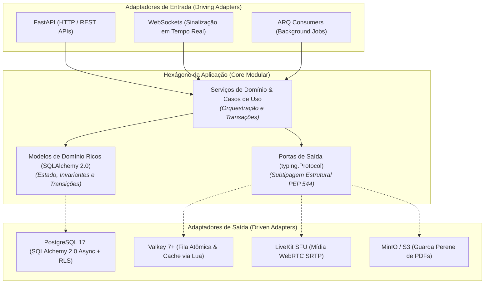
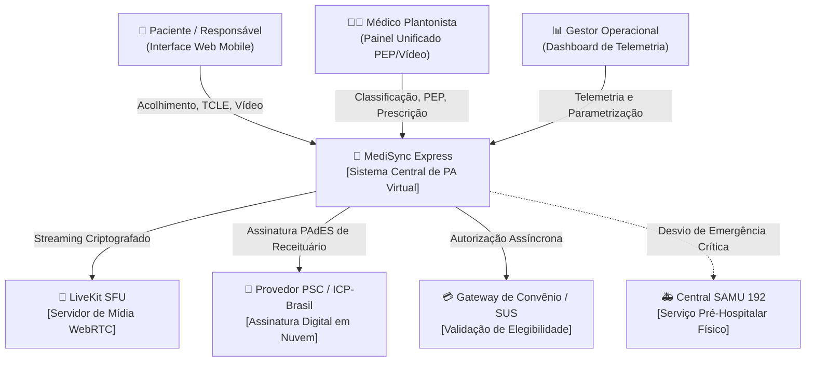
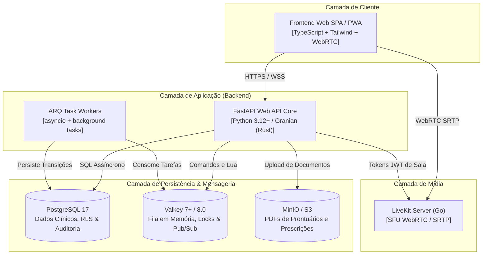

# Macro-Arquitetura do Sistema (Architecture Overview)

> Visão sistêmica do MediSync Express: monólito modular hexagonal, topologia C4, catálogo dos 7 bounded contexts e governança de fronteiras via Tach.

| Metadado | Detalhamento |
| :--- | :--- |
| **Estilo Arquitetural** | Hexagonal Pragmático (Ports & Adapters) em Monólito Modular |
| **Paradigma de Tipagem** | Modelos Ricos (SQLAlchemy 2.0) + Chaves Clínicas em UUIDv7 + Subtipagem Estrutural via `typing.Protocol` (PEP 544) |
| **Comunicação Inter-Módulos** | Síncrona via Ports & Adapters (`typing.Protocol`) \| Assíncrona via Event Bus em Memória |
| **Isolamento de Fronteiras** | Tach (Verificação estática de dependências e interfaces públicas em Rust) |
| **Qualidade & Métricas** | FURPS+ / ISO 25010 \| C4 Model (Contexto, Contêineres e Componentes) |

## Contexto

O MediSync Express é uma plataforma de pronto-atendimento virtual (PA Digital 24/7) desenhada para operar com alta disponibilidade, latência de transporte em tempo real sub-150ms e isolamento multi-tenant estrito. 

Para evitar a complexidade prematura de microsserviços distribuídos sem abrir mão de alta coesão e baixo acoplamento, adota-se o padrão de **Monólito Modular** estruturado sob o **Hexagonal Pragmático**. Fronteiras modulares não são meras convenções: são asseguradas por análise estática contínua via `tach check` e testes de arquitetura AST.

## Conceito

### 1. Hexagonal Pragmático e Separação de Responsabilidades

O núcleo da aplicação reside em modelos de domínio ricos e serviços de aplicação, isolando tecnologias voláteis atrás de adaptadores:
- **Driving Adapters (Entrada)**: FastAPI (HTTP / REST APIs), WebSockets (sinalização de fila e chamadas, veja [WebSocket Channels](../../reference/api/websocket-channels.md)) e ARQ Workers (tarefas em segundo plano, veja [ARQ Background Tasks](../../reference/worker/arq-tasks.md)).
- **Core Modular**: Entidades persistidas com SQLAlchemy 2.0 (`Mapped[...]`) encapsulam validações e invariantes clínicas, sem duplicar DTOs espelho manuais (veja [Hexagonal Pragmático](../concepts/hexagonal-pragmatico.md)).
- **Driven Adapters (Saída)**: PostgreSQL 17 (persistência relacional com RLS, veja [Database Schema & RLS](../../reference/database/schema-and-rls.md)), Valkey 7+ (fila atômica via Lua e chaves operacionais, veja [Valkey Keys Dictionary](../../reference/valkey/keys-dictionary.md)), LiveKit SFU (WebRTC SRTP), PSC Nuvem (assinatura ICP-Brasil PAdES) e MinIO/S3 (armazenamento perene de PDFs).
- **Comunicação entre Módulos**: Realizada exclusivamente por portas abstratas (`typing.Protocol`) com DTOs imutáveis ou eventos de domínio assíncronos em memória, conforme detalhado em [Inter-Module Protocols](../concepts/inter-module-protocols.md).


```mermaid
flowchart TD
    subgraph DrivingAdapters["Adaptadores de Entrada (Driving Adapters)"]
        HTTP["FastAPI (HTTP / REST APIs)"]
        WS["WebSockets (Sinalização em Tempo Real)"]
        Worker["ARQ Consumers (Background Jobs)"]
    end

    subgraph Hexagon["Hexágono da Aplicação (Core Modular)"]
        Services["Serviços de Domínio & Casos de Uso<br/><i>(Orquestração e Transações)</i>"]
        RichModels["Modelos de Domínio Ricos (SQLAlchemy 2.0)<br/><i>(Estado, Invariantes e Transições)</i>"]
        OutPorts["Portas de Saída (typing.Protocol)<br/><i>(Subtipagem Estrutural PEP 544)</i>"]
        Services --> RichModels
        Services --> OutPorts
    end

    subgraph DrivenAdapters["Adaptadores de Saída (Driven Adapters)"]
        Postgres["PostgreSQL 17 (SQLAlchemy 2.0 Async + RLS)"]
        Valkey["Valkey 7+ (Fila Atômica & Cache via Lua)"]
        LiveKit["LiveKit SFU (Mídia WebRTC SRTP)"]
        S3["MinIO / S3 (Guarda Perene de PDFs)"]
    end

    HTTP --> Services
    WS --> Services
    Worker --> Services
    RichModels -.-> Postgres
    OutPorts -.-> Valkey
    OutPorts -.-> LiveKit
    OutPorts -.-> S3
```

### 2. Topologia do Sistema (Modelo C4)

#### C4 Nível 1: Diagrama de Contexto de Sistema


```mermaid
flowchart TD
    Pac["👤 Paciente / Responsável<br/>(Interface Web Mobile)"]
    Med["👨‍⚕️ Médico Plantonista<br/>(Painel Unificado PEP/Vídeo)"]
    Ges["📊 Gestor Operacional<br/>(Dashboard de Telemetria)"]
    Sys["🏥 MediSync Express<br/>[Sistema Central de PA Virtual]"]
    LiveKit["🎥 LiveKit SFU<br/>[Servidor de Mídia WebRTC]"]
    PSC["🔑 Provedor PSC / ICP-Brasil<br/>[Assinatura Digital em Nuvem]"]
    GovPay["💳 Gateway de Convênio / SUS<br/>[Validação de Elegibilidade]"]
    SAMU["🚑 Central SAMU 192<br/>[Serviço Pré-Hospitalar Físico]"]

    Pac -->|Acolhimento, TCLE, Vídeo| Sys
    Med -->|Classificação, PEP, Prescrição| Sys
    Ges -->|Telemetria e Parametrização| Sys
    Sys -->|Streaming Criptografado| LiveKit
    Sys -->|Assinatura PAdES de Receituário| PSC
    Sys -->|Autorização Assíncrona| GovPay
    Sys -.->|Desvio de Emergência Crítica| SAMU
```

#### C4 Nível 2: Diagrama de Contêineres de Execução


```mermaid
flowchart TD
    subgraph ClientLayer["Camada de Cliente"]
        WebPWA["Frontend Web SPA / PWA<br/>[TypeScript + Tailwind + WebRTC]"]
    end

    subgraph AppLayer["Camada de Aplicação (Backend)"]
        API["FastAPI Web API Core<br/>[Python 3.12+ / Granian (Rust)]"]
        Worker["ARQ Task Workers<br/>[asyncio + background tasks]"]
    end

    subgraph DataLayer["Camada de Persistência & Mensageria"]
        DB[(PostgreSQL 17<br/>Dados Clínicos, RLS & Auditoria)]
        Cache[(Valkey 7+ / 8.0<br/>Fila em Memória, Locks & Pub/Sub)]
        Storage[(MinIO / S3<br/>PDFs de Prontuários e Prescrições)]
    end

    subgraph MediaLayer["Camada de Mídia"]
        SFU["LiveKit Server (Go)<br/>[SFU WebRTC / SRTP]"]
    end

    WebPWA -->|HTTPS / WSS| API
    WebPWA -->|WebRTC SRTP| SFU
    API -->|SQL Assíncrono| DB
    API -->|Comandos e Lua| Cache
    API -->|Tokens JWT de Sala| SFU
    API -->|Upload de Documentos| Storage
    Worker -->|Consome Tarefas| Cache
    Worker -->|Persiste Transições| DB
```

### 3. Decomposição Modular dos 7 Bounded Contexts (`src/modules/`)

O repositório é segregado em 7 módulos verticais de negócio, correspondentes aos *Bounded Contexts* clínicos e de suporte:

```plaintext
src/
├── core/                              # Infraestrutura transversal e fundações
│   ├── audit/                         # Trilha de auditoria imutável append-only
│   ├── config.py                      # Configurações tipadas (Pydantic BaseSettings)
│   ├── database.py                    # Engine assíncrona SQLAlchemy e sessionmaker
│   ├── valkey.py                      # Pool assíncrono do Valkey
│   └── event_bus.py                   # In-memory Event Bus assíncrono
│
└── modules/
    ├── auth/                          # Autenticação JWT, Argon2id, RBAC e lockout OWASP
    ├── billing/                       # Elegibilidade, regras de cobertura de convênios e SUS
    ├── consultation/                  # Teleconsulta WebRTC, PEP e prescrição assinada ICP-Brasil
    ├── identity/                      # Identidade, organizações, profissionais e pacientes
    ├── queue/                         # Fila dinâmica, controle de admissão e locks atômicos Lua
    ├── telemetry/                     # Agregação de telemetria e métricas operacionais
    └── triage/                        # Acolhimento, triagem de Manchester e acionamento SAMU 192
```

- **Composition Roots (ADR-001 §7)**: Centralizam a injeção de dependências concretas (`auth`, `consultation`, `identity`, `queue`, `telemetry`, `triage`). Routers recebem serviços via dependências tipadas (`*Dep`). Detalhes em [Composition Root e Dependências](../concepts/composition-root-and-dependencies.md).
- **Roteadores Agregados (ADR-001 §7.1 / Issue #68)**: Cada módulo agrega rotas em `presentation/routers/__init__.py`, exportando `http_router` sob `/api/v1`. O Composition Root `src/main.py` monta 1 router HTTP por módulo.

### 4. Governança de Fronteiras Modulares com Tach

A integridade arquitetural do monólito modular é fiscalizada pelo **Tach** via `tach.toml` (especificação formal em [Matriz de Fronteiras Modulares Tach](../../reference/architecture-standards/tach-boundaries-matrix.md)):
1. **Camadas Estritas**: `presentation` $\to$ `application` + `composition` + `core`; `composition` $\to$ `application` + `domain` + `infrastructure` + `core`; `infrastructure` $\to$ `application` + `domain` + `core`; `application` $\to$ `domain` + `core`; `domain` $\to$ `core`.
2. **Routers Finos**: `tests/architecture/test_routers_are_thin.py` garante por AST que rotas nunca importam persistência direta, nunca chamam `.commit()` e nunca instanciam serviços manualmente.
3. **Contratos Inter-Módulos**: Comunicação permitida apenas através de portas públicas tipadas em `ports/`, bloqueando imports de modelos internos ou adaptadores privados alheios.

## Onde no código

- Impl: `src/main.py:app`
- Impl: `src/core/database.py`
- Impl: `src/core/valkey.py`
- Impl: `src/modules/queue/composition.py`
- Impl: `src/modules/consultation/composition.py`
- Impl: `src/modules/auth/composition.py`
- Impl: `src/modules/identity/composition.py`
- Impl: `src/modules/triage/composition.py`
- Impl: `src/modules/telemetry/composition.py`
- Spec: `tach.toml`
- Spec: `docs/reference/architecture-standards/tach-boundaries-matrix.md`
- Spec: `docs/reference/database/schema-and-rls.md`
- Spec: `docs/reference/valkey/keys-dictionary.md`
- Spec: `docs/reference/worker/arq-tasks.md`
- Spec: `docs/reference/api/websocket-channels.md`
- Spec: `docs/adrs/ADR-001-Hexagonal-Pragmatico-Modelos-Ricos-Protocols-e-Tach.md`
- Prova viva: `tests/architecture/test_main_composition_root.py`
- Prova viva: `tests/architecture/test_routers_are_thin.py`
- Prova viva: `tests/architecture/test_services_and_composition.py`
- Ver: `tach check`
- Ver: `rg -n "http_router" src/modules/*/presentation/routers/__init__.py`

## Verificação

```bash
just tach
uv run pytest tests/architecture/
```

## Ver também

- [Hexagonal Pragmático](../concepts/hexagonal-pragmatico.md)
- [Inter-Module Protocols](../concepts/inter-module-protocols.md)
- [Composition Root e Injeção de Dependências](../concepts/composition-root-and-dependencies.md)
- [Modelo de Dados (Data Model)](data-model.md)
- [Concorrência e Filas (Concurrency & Queues)](concurrency-and-queues.md)
- [Conformidade Clínica e Telemedicina](compliance-and-telemedicine.md)
- [Database Schema & RLS](../../reference/database/schema-and-rls.md)
- [Valkey Keys Dictionary](../../reference/valkey/keys-dictionary.md)
- [Matriz de Fronteiras Modulares Tach](../../reference/architecture-standards/tach-boundaries-matrix.md)
- [WebSocket Channels](../../reference/api/websocket-channels.md)
- [ARQ Background Tasks](../../reference/worker/arq-tasks.md)
- `docs/adrs/ADR-001-Hexagonal-Pragmatico-Modelos-Ricos-Protocols-e-Tach.md`
- `docs/adrs/ADR-008-Padronizacao-de-DTOs-e-Eliminacao-de-Mapper-Hell-na-Apresentacao.md`
