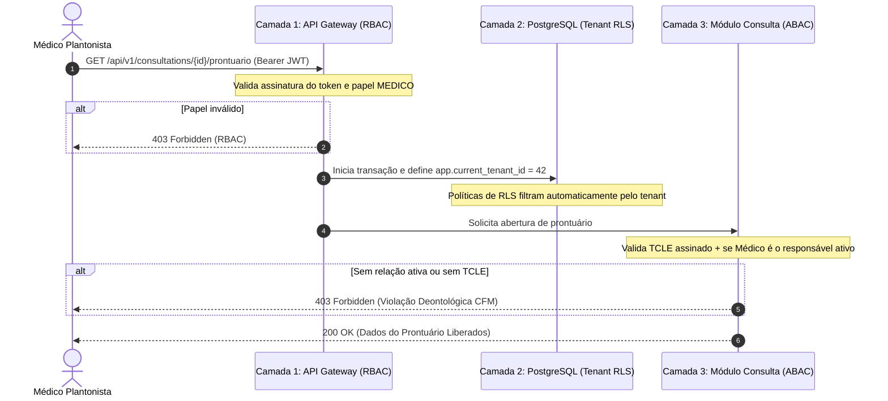

# Arquitetura de Segurança, Autenticação e Autorização em 3 Camadas

## MediSync Express — Plataforma de Código Aberto para Pronto-Atendimento Virtual (PA Digital 24/7)

| Metadado | Detalhamento |
| :--- | :--- |
| **Frameworks de Referência** | [OWASP Authentication Cheat Sheet](https://cheatsheetseries.owasp.org/cheatsheets/Authentication_Cheat_Sheet.html) \| [OWASP Authorization Cheat Sheet](https://cheatsheetseries.owasp.org/cheatsheets/Authorization_Cheat_Sheet.html) |
| **Padrões Criptográficos** | Argon2id (RFC 9106) \| RFC 9562 (UUIDv7) \| JWT / PASETO com chaves assimétricas |
| **Marco Regulatório** | Resolução CFM nº 2.314/2022 \| Resolução CFM nº 1.821/2007 \| Lei Geral de Proteção de Dados (LGPD - Lei nº 13.709/2018) |
| **Status** | Aprovado (Documento Vivo de Arquitetura) |

---

## 1. Princípios Arquiteturais e Separação de Preocupações

Para evitar o acoplamento clássico de sistemas monolíticos onde regras de acesso, hashing de senhas e dados clínicos ficam entrelaçados nas mesmas entidades, o **MediSync Express** adota uma separação estrita de responsabilidades entre três conceitos fundamentais:

```mermaid
flowchart LR
    subgraph Identity ["1. Identidade (Quem você é)"]
        Prof["Profissional<br/>(CRM, UF, Nome, CPF, Papel)"]
        Pac["Paciente<br/>(CNS, Nome Mãe, Alergias)"]
        Org["Organização<br/>(Tenant SUS/Privado)"]
    end

    subgraph AuthN ["2. Autenticação (Como você prova quem é)"]
        Cred["Credenciais & Hashes<br/>(Argon2id, MFA/TOTP)"]
        Sess["Sessão & Tokens<br/>(JWT, Refresh Token, OTP)"]
        Rate["Anti-Brute Force<br/>(Valkey Sliding Window)"]
    end

    subgraph AuthZ ["3. Autorização (O que você pode fazer)"]
        RBAC["Camada 1: Macro RBAC<br/>(Guards de API / FastAPI)"]
        RLS["Camada 2: Tenant RLS<br/>(PostgreSQL 17 Policies)"]
        ABAC["Camada 3: Contexto Clínico<br/>(ABAC: TCLE + Relação Ativa)"]
    end

    Identity -->|Fornece Claims| AuthN
    AuthN -->|Emite Token Validado| AuthZ
```



### Regras Fundamentais de Domínio:
1. **Modelos de Identidade são Puros:** As entidades clínicas em `src/modules/identity/domain/models/` (`Profissional`, `Paciente`, `Organizacao`, `Dependente`) representam cadastros civis e corporativos. **Nenhuma entidade clínica armazena colunas de senha (`senha_hash`) nem executa rotinas criptográficas**.
2. **Autenticação é Desacoplada:** Gerenciamento de credenciais locais, validação de hashes Argon2id, tokens de acesso efêmeros e bloqueios por taxa de requisição residem exclusivamente no módulo de segurança/autenticação (`src/modules/auth/`).
3. **Autorização não é Centralizada na Identidade:** A autorização é distribuída em 3 camadas complementares orientadas ao Princípio do Menor Privilégio (*Least Privilege*) e à Negação por Padrão (*Deny by Default*).

---

## 2. Arquitetura de Autenticação (OWASP AuthN Cheat Sheet)

O sistema opera sob uma **jornada de acesso bimodal**, respeitando a natureza de cada ator:

### 2.1 Atores Corporativos (Profissionais de Saúde e Gestão)
* **Credenciais Fortes:** Senhas corporativas armazenadas exclusivamente sob o algoritmo **Argon2id** (`pwdlib[argon2]`), configurado com parâmetros recomendados pela OWASP e RFC 9106.
* **Mitigação de Força Bruta e Credential Stuffing:** Implementação de contadores de tentativas falhas com janelas deslizantes (*sliding window*) no **Valkey 8.0** em memória. Bloqueio progressivo de IP e conta após 5 tentativas incorretas.
* **Prevenção de Enumeração de Usuários:** Respostas padronizadas sob o formato **RFC 7807 Problem Details** com mensagens genéricas (`"Credenciais inválidas"`), sem revelar se o e-mail ou CPF existe na base.
* **MFA / TOTP:** Suporte mandatório a autenticação multifator para médicos em conformidade com a Resolução CFM nº 2.314/2022 para atos de telemedicina.

### 2.2 Pacientes em Pronto-Atendimento (Passwordless / Efêmero)
* **Zero Fricção na Urgência (Acolhimento < 45s):** Em pronto-atendimento virtual, exigir criação de senhas alfanuméricas complexas antes da triagem causaria risco clínico e abandono.
* **Tokens Efêmeros de Ingestão:** Durante as Fases 1 e 2 do cadastro progressivo, o paciente recebe um token temporário assinado e autenticação baseada em posse via código OTP (One-Time Password) de 6 dígitos enviado por SMS/WhatsApp.
* **Acesso Pós-Consulta:** Documentos assinados digitalmente (receitas e atestados) são entregues via links assinados com tempo de expiração curto e validados pelo código de autenticidade do documento ICP-Brasil.

---

## 3. Modelo de Autorização em 3 Camadas (OWASP AuthZ Cheat Sheet)

A decisão de autorização segue uma estratégia em profundidade (*Defense in Depth*):



### Camada 1: Macro-Autorização na Borda da API (RBAC)
* **Objetivo:** Filtrar o acesso a endpoints baseado nas atribuições funcionais (*roles*).
* **Implementação:** Injeção de dependências nativa do FastAPI (`Depends(require_role("MEDICO"))` ou `Depends(require_permission("atendimentos:chamar"))`).
* **Regra OWASP:** *Deny by Default*. Rotas protegidas rejeitam requisições sem claims explícitas válidas.

### Camada 2: Isolamento de Dados Multitenant (PostgreSQL Row-Level Security - RLS)
* **Objetivo:** Impedir o vazamento de dados entre prefeituras e operadoras distintas (*cross-tenant leakage*), eliminando a vulnerabilidade de *IDOR (Insecure Direct Object Reference)*.
* **Implementação:** O `TenantResolutionMiddleware` intercepta a requisição, valida o tenant ativo e injeta a variável de sessão `set_config('app.current_tenant_id', :tenant_id, true)`.
* **Políticas no Banco:** As tabelas mestres e transacionais possuem `FORCE ROW LEVEL SECURITY`:
  ```sql
  CREATE POLICY tenant_isolation_pacientes ON pacientes
      USING (organizacao_id = NULLIF(current_setting('app.current_tenant_id', true), '')::BIGINT);
  ```

### Camada 3: Micro-Autorização de Contexto Clínico (ABAC / ReBAC)
* **Objetivo:** Garantir a conformidade legal e deontológica do sigilo médico (CFM nº 1.821/2007 e LGPD).
* **Por que não fica na Identidade:** A regra depende do estado transacional da fila e do atendimento, que residem nos módulos `queue` e `consultation`.
* **Regras de Avaliação:**
  1. O paciente concedeu aceite explícito ao TCLE digital (`tcle_hash IS NOT NULL`)?
  2. O ciclo de vida do atendimento permite a operação solicitada:
     - **Leitura do Prontuário (`is_mutation=False`):** `EM_ATENDIMENTO`, `CHAMANDO_PACIENTE` ou `CONCLUIDO` (Resolução CFM nº 1.821/2007 — Guarda de Prontuário e Acesso Histórico pelo Médico Assistente).
     - **Mutações Clínicas (`is_mutation=True`):** estritamente `EM_ATENDIMENTO` ou `CHAMANDO_PACIENTE` (Resolução CFM nº 2.314/2022). Tentativas de mutação em atendimento `CONCLUIDO` são bloqueadas com erro 403 Forbidden.
  3. O médico autenticado é exatamente o `medico_id` atribuído ao atendimento?
  *Se qualquer condição for falsa, o acesso aos dados sensíveis do prontuário é bloqueado com erro 403.*

---

## 4. Matriz de Acesso e Papéis Corporativos (RBAC)

| Recurso / Ação | ADMIN_GLOBAL | GESTOR_UNIDADE | MEDICO | FATURAMENTO | PACIENTE (Token) |
| :--- | :---: | :---: | :---: | :---: | :---: |
| **Configurar TMA / Parâmetros da Unidade** | Sim | Sim | Não | Não | Não |
| **Cadastrar / Desativar Profissionais** | Sim | Sim (sua org) | Não | Não | Não |
| **Visualizar Fila Geral da Unidade** | Sim | Sim | Sim | Não | Não |
| **Chamar Próximo Paciente da Fila** | Não | Não | Sim | Não | Não |
| **Visualizar / Editar Prontuário Ativo** | Não | Não | Sim (se alocado) | Não | Não |
| **Assinar Receitas e Atestados (ICP)** | Não | Não | Sim (se alocado) | Não | Não |
| **Consolidar Lotes de Faturamento** | Sim | Sim | Não | Sim | Não |
| **Acompanhar Posição na Fila / TME** | Não | Não | Não | Não | Sim (seu id) |
| **Visualizar Documentos Próprios** | Não | Não | Não | Não | Sim (seu id) |

---

## 5. Rastreabilidade de Implementação

A arquitetura descrita é implementada e auditada através das seguintes issues do repositório:

* **[Issue #11](https://github.com/Rafaelp122/medisync/issues/11)**: `feat(security): implement PostgreSQL Row-Level Security (RLS) policies` (Camada 2 - Tenant Isolation).
* **[Issue #35](https://github.com/Rafaelp122/medisync/issues/35)**: `feat(auth): implement OWASP authentication service, Argon2id verification, rate limiting and JWT session management` (Autenticação Desacoplada).
* **[Issue #36](https://github.com/Rafaelp122/medisync/issues/36)**: `feat(authz): implement OWASP multi-tier authorization guards (RBAC, API policies and clinical ABAC/ReBAC context)` (Camadas 1 e 3 - RBAC e ABAC Clínico).
* **[Issue #39](https://github.com/Rafaelp122/medisync/issues/39)**: `fix(security): blindar mutações clínicas do PEP e leitura na ClinicalAccessPolicy` (Blindagem de Mutações e Acesso Histórico ao PEP).
* **[Issue #12](https://github.com/Rafaelp122/medisync/issues/12)**: `feat(identity): implement progressive 2-phase onboarding API and dependent management` (Cadastro Progressivo do Paciente).
* **[Issue #40](https://github.com/Rafaelp122/medisync/issues/40)**: `fix(identity): implementar prova de posse via intake token no onboarding Fase 2 e dependentes` (Blindagem contra IDOR no Onboarding e Dependentes).
