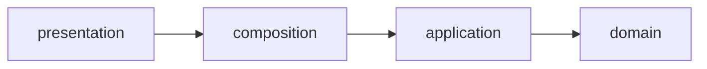

# Hexagonal Pragmático

Modelo de organização usado no MediSync: domínio rico no centro,
adaptadores nas bordas e fronteiras verificadas por máquina.
Regra de ouro: regra clínica mora na entidade; protocolo e
serialização moram na borda.

## 1. Contexto

MediSync separa o que muda por motivo clínico do que muda por
motivo técnico. Entidades SQLAlchemy 2.0 são modelos ricos com
regras, transições e invariantes. Camadas externas apenas
transportam dados, nunca decidem regra de negócio.

A decisão está registrada em
`docs/adrs/ADR-001-Hexagonal-Pragmatico-Modelos-Ricos-Protocols-e-Tach.md`
e o padrão de DTOs em
`docs/adrs/ADR-008-Padronizacao-de-DTOs-e-Eliminacao-de-Mapper-Hell-na-Apresentacao.md`.

## 2. Modelo rico no domínio

Entidades encapsulam transições de estado e validações. Quem
chama não manipula flag diretamente; invoca método que impõe a
regra e levanta erro de domínio quando a transição é inválida.

Exemplos reais:

- `src/modules/queue/domain/models/atendimento.py` expõe
  transições como promover para apto, iniciar chamada, atender
  chamada, registrar ausência, concluir e cancelar, além de
  cálculo de score de fila e predicados de estado.
- `src/modules/triage/domain/models/triagem.py` concentra
  classificação, alerta crítico e sintomas de piora.

Erros de domínio viajam em tipos de `src/core/errors.py`,
nunca como `HTTPException` dentro do domínio ou do service.

## 3. Pydantic só na borda

Schemas Pydantic vivem só em `presentation/schemas.py` de cada
módulo. Entradas vindas 100% do corpo JSON entram direto no
service como schema congelado. Saídas convertem via
`model_validate` sobre o objeto de domínio, sem mapeamento
manual campo a campo.

Arquivos que mostram o padrão:

- `src/modules/identity/presentation/schemas.py`
- `src/modules/consultation/presentation/schemas.py`
- `src/modules/auth/presentation/schemas.py`

Conversão na saída aparece em pontos como
`src/modules/identity/presentation/routers/onboarding_router.py`,
`src/modules/identity/presentation/routers/pacientes_router.py` e
`src/modules/consultation/presentation/routers/consultation_router.py`,
sempre com `from_attributes=True` no schema de resposta.

Proibido: DTO espelho com conversor manual. Se o dado já vem
pronto do JSON, o schema é a entrada. Sem camada extra.

## 4. Commands com enriquecimento

Quando a entrada agrega várias origens (path params, tenant,
IP, sessão), usa-se `@dataclass(frozen=True)` com sufixo
`Command` em `application/dtos.py`. Quando não há
enriquecimento, o schema Pydantic basta.

Exemplos reais:

- `src/modules/queue/application/dtos.py` define comandos
  imutáveis de alocação, ingresso em fila e avaliação de
  admissão, agregando organização, médico e parâmetros de
  janela que nunca viriam só do corpo JSON.
- `src/modules/identity/application/dtos.py` usa modelos de
  entrada e saída congelados para onboarding e dependentes.

Detalhe completo do critério em
`docs/adrs/ADR-008-Padronizacao-de-DTOs-e-Eliminacao-de-Mapper-Hell-na-Apresentacao.md`.

## 5. Transação única no service

Cada caso de uso que persiste commita uma vez, no fim do
método público do service. Helpers, policies e repositórios
nunca commitam. Isso mantém a transação legível e evita
commit parcial em fluxo com vários passos.

Pontos que mostram o padrão:

- `src/modules/identity/application/services/onboarding_service.py`
  commita ao fim de cada fase pública de onboarding.
- `src/modules/identity/application/services/dependente_service.py`
  commita ao fim da operação pública de escrita.
- `src/modules/queue/application/services/fila_service.py`
  orquestra o caso de uso de fila sem delegar commit a helper.

## 6. Router fino e composition

Router declara rota, resolve dependência e delega. Nunca
importa `sqlalchemy`, `infrastructure` ou `domain.models`,
nunca chama commit, refresh ou select, nunca instancia
service com construtor direto e nunca levanta
`HTTPException` própria. Serviços chegam via dependências
`Dep` exportadas pelo `composition.py` do módulo.

Fiação real:

- `src/modules/queue/composition.py` expõe deps de fila,
  admissão e alocação.
- `src/modules/identity/composition.py` expõe deps de
  onboarding e dependentes.
- `src/modules/consultation/composition.py` expõe deps de
  documento, pep e validação.
- `src/modules/auth/composition.py` expõe dep de auth.

Fluxo entre camadas:

`presentation` declara rotas e schemas. `composition`
monta services. `application` orquestra casos de uso.
`domain` guarda regras. Dependência sempre aponta para
dentro; nunca o inverso.

## 7. Limites verificados por máquina

Fronteira não é convenção oral. Dois guardas bloqueiam
regressão:

- `tach.toml` declara dependências permitidas entre
  camadas e o comando `just tach` valida o grafo.
  Comando definido em `justfile`.
- `tests/architecture/test_routers_are_thin.py` varre
  routers via ast e falha em import proibido, chamada de
  persistência, `HTTPException` local ou instanciação
  direta de service.

## 8. Referências

- Decisão hexagonal:
  `docs/adrs/ADR-001-Hexagonal-Pragmatico-Modelos-Ricos-Protocols-e-Tach.md`
- Padrão de dtos:
  `docs/adrs/ADR-008-Padronizacao-de-DTOs-e-Eliminacao-de-Mapper-Hell-na-Apresentacao.md`
- Fronteiras: `tach.toml` mais `justfile`
- Guarda de routers:
  `tests/architecture/test_routers_are_thin.py`
- Domínio rico:
  `src/modules/queue/domain/models/atendimento.py` e
  `src/modules/triage/domain/models/triagem.py`
- Borda pydantic:
  `src/modules/identity/presentation/schemas.py` e
  `src/modules/consultation/presentation/schemas.py`
