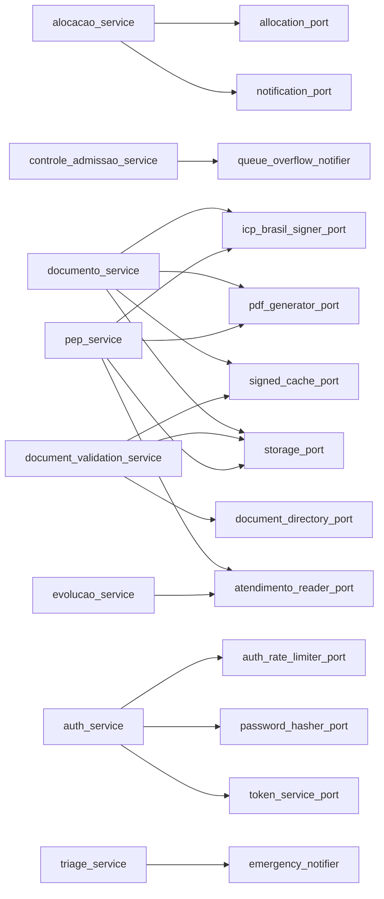

# Inter-Module Protocols

Módulos conversam por protocolos abstratos, nunca por import
direto de modelo alheio. Cada módulo declara seus ports em
`application/ports`, consome via service do próprio módulo e
recebe adaptador concreto via `composition.py`.
Regra de ouro: dependência aponta para protocolo próprio;
fiação concreta mora na borda.

## 1. Contexto

MediSync divide o sistema em módulos fechados em
`src/modules`. Comunicação síncrona entre módulos usa
portas abstratas no estilo `typing.Protocol` e objetos
imutáveis de transferência. Nenhum service importa
repositório, tabela ou modelo de outro módulo.

O padrão aparece nos ports de fila, cobrança, consulta e
triagem. Cada port tem dono único. Consumidor injeta o
protocolo no construtor e recebe a implementação na
composição ou no worker. Troca de adaptador não toca no
service.

Decisão base em
`docs/adrs/ADR-001-Hexagonal-Pragmatico-Modelos-Ricos-Protocols-e-Tach.md`
e padrão hexagonal em
`docs/explanation/concepts/hexagonal-pragmatico.md`.

## 2. Catálogo de ports por dono

Só ports que existem em disco. Dono é o módulo que
declara o arquivo. Consumidor é quem importa o símbolo,
confirmado via busca de imports no código.

| Port | Dono | Consumidor |
| --- | --- | --- |
| `src/modules/queue/application/ports/allocation_port.py` | queue | `src/modules/queue/application/services/alocacao_service.py`, `src/modules/queue/composition.py`, `src/modules/queue/infrastructure/lua_loader.py` |
| `src/modules/queue/application/ports/lua_script_port.py` | queue | `src/modules/queue/application/ports/allocation_port.py`, `src/modules/queue/infrastructure/lua_loader.py` |
| `src/modules/queue/application/ports/notification_port.py` | queue | `src/modules/queue/application/services/alocacao_service.py`, `src/modules/queue/composition.py` |
| `src/modules/queue/application/ports/paciente_ausente_notifier.py` | queue | `src/worker/tasks/ring_timeout.py` |
| `src/modules/queue/application/ports/queue_overflow_notifier.py` | queue | `src/modules/queue/application/services/controle_admissao_service.py` |
| `src/modules/billing/application/ports/eligibility_provider.py` | billing | `src/modules/billing/application/services/eligibility_service.py`, `src/worker/tasks/eligibility.py` |
| `src/modules/billing/application/ports/eligibility_notifier.py` | billing | `src/modules/billing/application/services/eligibility_service.py`, `src/worker/tasks/eligibility.py` |
| `src/modules/consultation/application/ports/atendimento_reader_port.py` | consultation | `src/modules/consultation/application/services/pep_service.py`, `src/modules/consultation/application/services/evolucao_service.py`, `src/modules/consultation/application/policies/clinical_access_policy.py`, `src/modules/consultation/composition.py`, `src/modules/consultation/infrastructure/atendimento_reader_sql.py` |
| `src/modules/consultation/application/ports/signed_cache_port.py` | consultation | `src/modules/consultation/application/services/documento_service.py`, `src/modules/consultation/application/services/document_validation_service.py`, `src/modules/consultation/composition.py`, `src/modules/consultation/infrastructure/memory_signed_cache.py` |
| `src/modules/consultation/application/ports/pdf_generator_port.py` | consultation | `src/modules/consultation/application/services/documento_service.py`, `src/modules/consultation/application/services/pep_service.py`, `src/modules/consultation/composition.py`, `src/modules/consultation/infrastructure/pdf_generator.py` |
| `src/modules/consultation/application/ports/document_directory_port.py` | consultation | `src/modules/consultation/application/services/document_validation_service.py`, `src/modules/consultation/composition.py`, `src/modules/consultation/infrastructure/document_directory_sql.py` |
| `src/modules/consultation/application/ports/icp_brasil_signer_port.py` | consultation | `src/modules/consultation/application/services/documento_service.py`, `src/modules/consultation/application/services/pep_service.py`, `src/modules/consultation/composition.py`, `src/modules/consultation/infrastructure/pyhanko_signer.py`, `src/modules/consultation/presentation/routers/consultation_router.py` |
| `src/modules/consultation/application/ports/livekit_media_port.py` | consultation | `src/modules/consultation/composition.py`, `src/modules/consultation/presentation/routers/livekit_router.py`, `src/modules/consultation/infrastructure/livekit_adapter.py` |
| `src/modules/consultation/application/ports/storage_port.py` | consultation | `src/modules/consultation/application/services/documento_service.py`, `src/modules/consultation/application/services/pep_service.py`, `src/modules/consultation/application/services/document_validation_service.py`, `src/modules/consultation/composition.py`, `src/modules/consultation/infrastructure/s3_storage.py` |
| `src/modules/consultation/application/ports/validation_rate_limiter_port.py` | consultation | `src/modules/consultation/presentation/dependencies.py`, `src/modules/consultation/composition.py`, `src/modules/consultation/infrastructure/valkey_validation_rate_limiter.py` |
| `src/modules/triage/application/ports/emergency_notifier.py` | triage | `src/modules/triage/application/services/triage_service.py` |
| `src/modules/auth/application/ports/auth_rate_limiter_port.py` | auth | `src/modules/auth/application/services/auth_service.py`, `src/modules/auth/composition.py`, `src/modules/auth/infrastructure/valkey_rate_limiter.py` |
| `src/modules/auth/application/ports/password_hasher_port.py` | auth | `src/modules/auth/application/services/auth_service.py`, `src/modules/auth/composition.py`, `src/modules/auth/infrastructure/argon2_hasher.py` |
| `src/modules/auth/application/ports/token_service_port.py` | auth | `src/modules/auth/application/services/auth_service.py`, `src/modules/auth/composition.py`, `src/modules/auth/infrastructure/jwt_token_service.py` |

## 3. Services consomem ports do próprio módulo

Busca em services mostra o padrão sem exceção: cada
service importa ports do próprio módulo, nunca de outro.
Comando de prova:

`rg -n "ports\." src/modules/queue/application/services/alocacao_service.py`

Retorna import de `allocation_port` e `notification_port`
dentro da fila. Mesmo vale para consulta, triagem e auth:

- `src/modules/queue/application/services/alocacao_service.py` consome `allocation_port` e `notification_port`.
- `src/modules/queue/application/services/controle_admissao_service.py` consome `queue_overflow_notifier`.
- `src/modules/consultation/application/services/pep_service.py` consome `atendimento_reader_port`, `icp_brasil_signer_port`, `pdf_generator_port` e `storage_port`.
- `src/modules/consultation/application/services/documento_service.py` consome `icp_brasil_signer_port`, `pdf_generator_port`, `signed_cache_port` e `storage_port`.
- `src/modules/consultation/application/services/document_validation_service.py` consome `document_directory_port`, `signed_cache_port` e `storage_port`.
- `src/modules/consultation/application/services/evolucao_service.py` consome `atendimento_reader_port`.
- `src/modules/billing/application/services/eligibility_service.py` consome `eligibility_provider` e `eligibility_notifier` do próprio billing.
- `src/modules/triage/application/services/triage_service.py` consome `emergency_notifier` do próprio triage.
- `src/modules/auth/application/services/auth_service.py` consome `auth_rate_limiter_port`, `password_hasher_port` e `token_service_port`.

## 4. Regra de ouro

Nunca importar modelos, tabelas ou repositórios de outro
módulo. Erros de domínio viajam em tipos de
`src/core/errors.py`, nunca como exceção http dentro do
service. Fronteira entre módulos é protocolo mais objeto
imutável, nunca classe concreta alheia.

Na prática isso significa três proibições:

- service de fila não importa modelo de cobrança.
- service de consulta não importa modelo de fila; lê
  atendimento via `atendimento_reader_port`.
- worker cruza módulos por ports e domínio explícito,
  nunca por import escondido de service alheio.

Quem precisa de dado de outro contexto declara um reader
ou notifier no próprio módulo e deixa o adaptador
resolver fora do domínio.

## 5. Composition como wiring

Só a raiz de composição pode importar adaptadores de
infraestrutura. Routers e tasks pedem deps prontas, nunca
instanciam service com construtor direto. Há 4 raízes:

- `src/modules/queue/composition.py` fia fila, admissão e alocação sobre valkey e lua.
- `src/modules/consultation/composition.py` fia documento, pep, validação, leitor de atendimento, midia e armazenamento.
- `src/modules/auth/composition.py` fia hash, token e rate limit de auth.
- `src/modules/identity/composition.py` expõe onboarding e dependentes sem ports externos.

Billing e triage não têm `composition.py`; expõem ports
consumidos por service próprio e por worker. A fiação de
fila usa `get_lua_manager` e `get_notification_adapter`;
a de consulta usa `get_storage`, `get_pdf_generator`,
`get_signer`, `get_signed_cache`, `get_atendimento_reader`
e `get_livekit_adapter`.

## 6. Grafo confirmado por busca

Grafo abaixo contém só arestas service para port do
próprio módulo, exatamente as retornadas pela busca em
services. Sem aresta inventada entre módulos.

Cruzamento entre módulos acontece fora de services, em
pontos permitidos: `src/worker/tasks/eligibility.py`
consome ports de billing e lê domínio de fila;
`src/worker/tasks/ring_timeout.py` consome notifier de
fila. Isso mantém o grafo de application acíclico e
auditável pelo guarda de fronteiras.

## 7. Limites verificados por máquina

Fronteira não é acordo verbal. Dois guardas travam
regressão e um comando prova o grafo:

- `tach.toml` declara que cada `application` depende só
  de `core` mais domínio próprio; `worker` pode puxar
  queue e billing. Comando `just tach` valida o grafo.
  Definição do comando em `justfile`.
- `tests/architecture/test_routers_are_thin.py` varre
  routers e falha em import proibido ou instanciação
  direta de service.
- Prova de consumo via busca tipada, por exemplo buscar
  `EmergencyNotifierPort` em
  `src/modules/triage/application/services/triage_service.py`
  ou `AllocationPort` em
  `src/modules/queue/application/services/alocacao_service.py`.

## 8. Referências

- Decisão hexagonal:
  `docs/adrs/ADR-001-Hexagonal-Pragmatico-Modelos-Ricos-Protocols-e-Tach.md`
- Conceito base:
  `docs/explanation/concepts/hexagonal-pragmatico.md`
- Fronteiras: `tach.toml` mais `justfile`
- Guarda de routers:
  `tests/architecture/test_routers_are_thin.py`
- Erros de domínio: `src/core/errors.py`
- Fiação queue: `src/modules/queue/composition.py`
- Fiação consultation: `src/modules/consultation/composition.py`
- Fiação auth: `src/modules/auth/composition.py`
- Fiação identity: `src/modules/identity/composition.py`
- Consumo fora de services:
  `src/worker/tasks/eligibility.py` e
  `src/worker/tasks/ring_timeout.py`
- Infra de leitura e mídia:
  `src/modules/consultation/infrastructure/atendimento_reader_sql.py`,
  `src/modules/consultation/infrastructure/s3_storage.py`,
  `src/modules/consultation/infrastructure/livekit_adapter.py` e
  `src/modules/queue/infrastructure/lua_loader.py`
