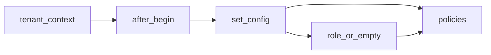

# Multi-Tenancy RLS

Isolamento de tenant imposto pelo banco, não só pelo
filtro da aplicação. Cada sessão carrega o tenant ativo
em variável local de transação e assume papel restrito;
policies de row-level security barram leitura e escrita
fora do tenant mesmo quando o código esquece o filtro.

## 1. Contexto

MediSync atende várias organizações no mesmo schema
`public`. Todo registro multi-tenant carrega
`organizacao_id`. A aplicação filtra por tenant em
queries, mas filtro de app é convenção revogável: um
`select` sem `where` vazaria dados de outra prefeitura.
A resposta é segunda barreira no postgres: RLS com
`force`, papel sem bypass e fail-safe que nega tudo sem
tenant ativo.

A cadeia tem três elos: contexto de tenant no código em
`src/core/context.py`, ponte de sessão em
`src/core/database.py` e imposição no banco em
`migrations/versions/0002_row_level_security.py`.
Prova ponta a ponta em
`tests/integration/test_rls_security.py`.

## 2. Tenant no código

Tenant ativo viaja em `ContextVar` por fluxo de execução,
nunca em global mutável. O contrato mora em
`src/core/context.py`:

- `current_tenant_id` guarda o id da organização ativa,
  com default `none`.
- `tenant_context` liga o tenant num bloco e restaura o
  anterior ao sair, mesmo sob exceção.
- `get_current_tenant_id` expõe leitura para a ponte de
  sessão sem acoplar domínio a detalhe de banco.

Middleware e workers entram no bloco com o tenant da
requisição; fora de bloco não há tenant, e sem tenant o
banco nega. Detalhe de tabelas e colunas em
`../architecture/data-model.md`.

## 3. Ponte after_begin

Toda transação aberta pela sessão assíncrona passa pelo
listener `after_begin` em `src/core/database.py`, que
injeta o tenant na sessão postgres antes de qualquer
query do caso de uso:

Comportamento exato, confirmado por busca:

`rg -n "SET LOCAL ROLE|set_config" src/core/database.py`

- sempre executa `set_config` com o id do tenant, ou
  string vazia quando não há tenant ativo.
- só executa `SET LOCAL ROLE medisync_app` quando há
  tenant; sem tenant a sessão segue sem o papel restrito
  e o predicado avalia nulo, negando acesso.
- escopo é local à transação, então pool compartilhado
  nunca vaza tenant entre requisições.

## 4. Papel, grants e default privileges

O papel de aplicação nasce travado em
`migrations/versions/0002_row_level_security.py`,
confirmado por busca:

`rg -n "CREATE ROLE|ALTER DEFAULT PRIVILEGES|CREATE POLICY" migrations/versions/0002_row_level_security.py`

- `CREATE ROLE medisync_app NOBYPASSRLS`: nem o dono da
  policy escapa da checagem; `force` mais `nobypassrls`
  fecha as duas rotas de fuga do superusuário lógico.
- grants mínimos em tabelas e sequências existentes,
  mais `ALTER DEFAULT PRIVILEGES` para tabelas e
  sequências futuras herdarem o mesmo piso sem passo
  manual por migration.
- trilha de auditoria blindada: revoga
  `UPDATE, DELETE, TRUNCATE` sobre `audit_events` e
  concede só `SELECT, INSERT`, tornando o log
  append-only no nível do banco.

## 5. Policies e tabelas cobertas

Cada tabela multi-tenant recebe `ENABLE` mais `FORCE
ROW LEVEL SECURITY` e uma policy `tenant_isolation_*`
com predicado único: `organizacao_id` igual ao tenant da
sessão, lido via `current_setting`, com `USING` para
leitura e `WITH CHECK` para escrita. Tentativa de
inserir registro de outro tenant falha na checagem de
escrita, não em validação de app.

Cobertura é de 9 tabelas multi-tenant; a tabela de
organizações fica fora do RLS por ser raiz do tenant.
Lista e colunas em `../architecture/data-model.md`,
sem duplicar definição aqui. Nomes das policies seguem
o padrão `tenant_isolation_*`, um por tabela, o que
permite auditar cobertura por consulta a `pg_policies`.

## 6. Defesa em profundidade e lição issue #38

Peculiaridade central: bug de filtro no app não vaza
dados. Se um service esquecer o `where` de tenant, a
query retorna só linhas do tenant da sessão; sem tenant
na sessão, retorna zero linhas. RLS transforma omissão
de filtro em resultado vazio, nunca em vazamento.

Lição registrada como issue #38: a migration
`migrations/versions/0003_auth_credentials.py` concede
privilégio sob `IF EXISTS` do papel, então banco criado
fora do alembic (schema refeito à mão sem rodar a base)
não tem o grant e a escrita falha com `permission
denied`. O condicional protege re-execução, mas esconde
banco dessincronizado. Moral: banco sempre nasce do
alembic até o `head`; schema manual fora de migration é
deriva garantida.

## 7. Limites verificados por máquina

Cobertura travada por teste de integração em
`tests/integration/test_rls_security.py`, existência
confirmada com `ls tests/integration/test_rls_security.py`.
Cinco testes cobrem flags e policies, isolamento entre
dois tenants nas 9 tabelas, bloqueio de insert
cross-tenant via `WITH CHECK`, negação fail-safe sem
tenant e DCL append-only de auditoria.

Execução serial de um teste para registro:

`uv run pytest tests/integration/test_rls_security.py::test_rls_flags_and_policies_on_all_tables -q --no-cov -p no:tach`

Resultado em 2026-10-07: erro de ambiente, sem correção
de código. Postgres indisponível
(`connection refused` em `127.0.0.1:5432`), fixture nem
chega a subir schema. Prova lógica segue válida no
arquivo; reexecutar com banco local ativo.

Buscas de prova repetíveis sem banco:

- `rg -n "SET LOCAL ROLE|set_config" src/core/database.py`
- `rg -n "CREATE ROLE|ALTER DEFAULT PRIVILEGES|CREATE POLICY" migrations/versions/0002_row_level_security.py`

## 8. Referências

- Contexto de tenant: `src/core/context.py`
- Ponte de sessão e papel local: `src/core/database.py`
- Papel, grants e policies:
  `migrations/versions/0002_row_level_security.py`
- Grant condicional da lição issue #38:
  `migrations/versions/0003_auth_credentials.py`
- Modelo de dados e tabelas cobertas:
  `docs/explanation/architecture/data-model.md`
- Prova de isolamento:
  `tests/integration/test_rls_security.py`
- Comando de docs: `justfile` com `docs-check`
