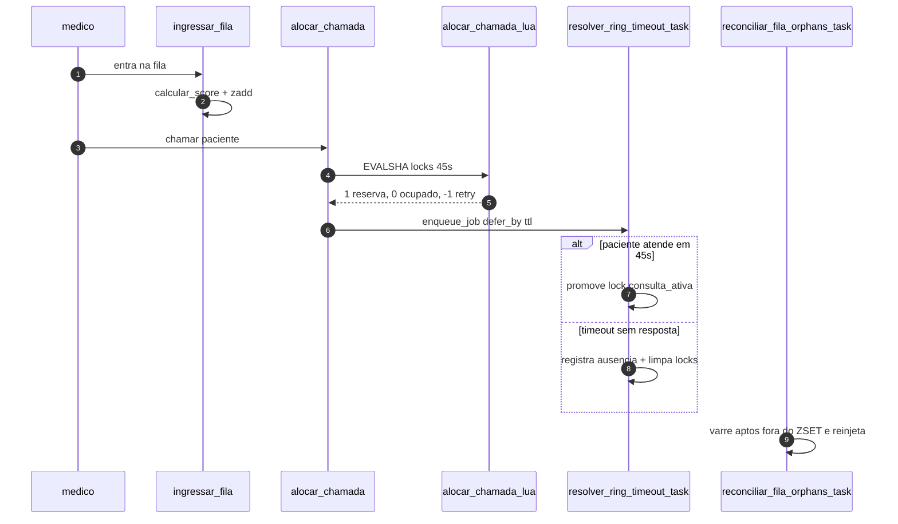

# Queue Lua ARQ

Fila de aptos em Valkey com alocação atômica Lua e
resolução de ausência via worker ARQ. Três peças se
encaixam: score ordena, script Lua reserva, tarefas
de fundo fecham o ciclo quando ninguém atende.
Regra de ouro: Valkey decide velocidade; postgres
decide verdade; worker decide prazo.

Regras clínicas fonte moram no futuro
[queue-domain](../domains/queue-domain.md) (planejado,
detentor de RN01, RN02 e RN05); este conceito não
recopia regras, só o mecanismo que as executa.
Motor em
`docs/explanation/architecture/concurrency-and-queues.md`,
decisões em
`docs/adrs/ADR-002-Alocacao-Atomica-Valkey-Lua.md` e
`docs/adrs/ADR-004-Worker-Assincrono-ARQ-sobre-Valkey.md`.

## 1. Contexto

Vários médicos plantonistas disputam o mesmo paciente
no mesmo milissegundo. `select` travado estoura o
teto de resposta, e paciente que não atende não pode
travar a tela do médico. A resposta separa as
camadas: ZSET ordena por score, Lua aloca sem
corrida, ARQ resolve ausência com prazo exato e
sweeper cura divergência entre memória e banco.

Prova de existência das peças, confirmada por busca:

`ls src/modules/queue/infrastructure/lua/`

`rg -n "async def |_defer_by" src/worker/tasks/ring_timeout.py src/worker/tasks/sweeper.py`

`rg -n "def calcular_score" src/modules/queue/domain/scoring.py`

Retornam `alocar_chamada.lua`, as duas tasks e
`calcular_score`, respectivamente.

## 2. Score ZSET de 64 bits e FIFO via UUIDv7

Ordenação mora em
`src/modules/queue/domain/scoring.py`. Função
`calcular_score` combina prioridade clínica (1 a 5,
fora disso levanta erro de validação) com epoch de
entrada: prioridade vezes `SCORE_PRIORITY_MULTIPLIER`
(1 trilhão) mais segundos. Menor número = maior
gravidade; dentro da mesma prioridade, entrou antes
vem antes.

Ingestão mora em
`src/modules/queue/application/services/fila_service.py`.
Método `ingressar_fila` calcula o score e grava com
`zadd` na chave `fila:{org}:aptos`, depois lê
`zrank` para devolver a posição. Reentrada após
falha preserva score original porque a fórmula é
pura em cima de prioridade mais timestamp.

Empate no mesmo segundo e mesma prioridade gera
scores idênticos. O desempate é lexicográfico do
membro, e o membro é UUIDv7: `src/core/uuid7.py`
define `uuid7`, usado como default da chave primária
em `src/modules/queue/domain/models/atendimento.py`.
UUIDv7 carrega timestamp nos primeiros caracteres,
então ordem lexicográfica reflete ordem cronológica
de acolhimento sem risco de estouro de mantissa.
Detalhe na seção de desempate FIFO de
`docs/explanation/architecture/concurrency-and-queues.md`.

Busca de prova:

`rg -n "calcular_score|zadd" src/modules/queue/application/services/fila_service.py`

`rg -n "uuid7" src/modules/queue/domain/models/atendimento.py src/core/uuid7.py`

## 3. Alocação atômica Lua

Script em
`src/modules/queue/infrastructure/lua/alocar_chamada.lua`,
carregado e executado via
`src/modules/queue/infrastructure/lua_loader.py`.
Classe `LuaScriptManager` descobre os arquivos da
pasta `lua`, executa por `EVALSHA` com auto-cura em
`NOSCRIPT` (recarrega e reexecuta, com fallback para
`EVAL`), e expõe método tipado `alocar_chamada` que
converte o inteiro bruto em `AlocacaoCodigo`.

O script recebe dois locks mais a fila como chaves e
ids mais ttl como argumentos. Médico com lock
retorna `0`; atendimento reservado ou fora da fila
retorna `-1`; senão remove com `ZREM`, cria os dois
locks com `SET EX ttl` e retorna `1`. TTL padrão de
toque é 45 segundos, definido em
`src/modules/queue/application/dtos.py`.

Orquestração em
`src/modules/queue/application/services/alocacao_service.py`.
Método `alocar_chamada` monta as chaves, chama o
manager, traduz `0` em erro de médico ocupado e
`-1` em erro de atendimento indisponível, persiste
`iniciar_chamada` com commit único e, em qualquer
falha de banco, desfaz os locks via `liberar_locks`.
Só o caminho de sucesso agenda o timeout e publica
eventos; notificação por mensagem nunca bloqueia a
progressão da fila.

Busca de prova:

`rg -n "return 0|return -1|return 1" src/modules/queue/infrastructure/lua/alocar_chamada.lua`

`rg -n "alocar_chamada|liberar_locks|enqueue_job" src/modules/queue/application/services/alocacao_service.py`

## 4. No-show determinístico via ARQ

Logo após alocar, o service agenda a tarefa com
`enqueue_job` para `resolver_ring_timeout_task`,
passando organização, atendimento e médico, com
`_defer_by` igual ao ttl do comando e id de job
`ring_timeout:{atendimento_id}` para deduplicar.
Implementação em
`src/worker/tasks/ring_timeout.py`: se o estado
ainda é chamado tocando, registra ausência via
`registrar_ausencia_paciente`, commita, apaga os
dois locks de toque e emite o evento de paciente
ausente; se já virou consulta ativa, promove o lock
do médico para `consulta_ativa` com 2 horas de
contingência; estado terminal só limpa lock
residual.

Sobre não usar expiração com pub-sub: registrado
aqui como decisão de arquitetura, não como fato de
código — não há comentário no fonte afirmando o
motivo. A justificativa vive na seção de
expiração de
`docs/explanation/architecture/concurrency-and-queues.md`:
entrega fire-and-forget perde evento em restart e
expiração por amostragem atrasa além do prazo, o
que é inaceitável para fluxo crítico. Por isso a
decisão por jobs diferidos com precisão de
milissegundos, conforme
`docs/adrs/ADR-004-Worker-Assincrono-ARQ-sobre-Valkey.md`.

Busca de prova:

`rg -n "_defer_by|_job_id" src/modules/queue/application/services/alocacao_service.py`

`rg -n "async def resolver_ring_timeout_task|registrar_ausencia_paciente" src/worker/tasks/ring_timeout.py`

## 5. Sweeper de auto-cura

Dual-write falha: crash entre Lua e commit deixa
atendimento apto no banco mas fora do ZSET. Cura
mora em `src/worker/tasks/sweeper.py`, função
`reconciliar_fila_orphans_task`. Varre atendimentos
`APTO_PARA_CHAMADA` sem atualização há mais que o
limiar (padrão 60 segundos), pula quem já está no
ZSET, quem tem lock de toque ou cujo médico tem
lock ativo, e reinjeta o órfão real com score
recalculado via `calcular_score` sobre prioridade e
timestamp originais.

Agendamento em `src/worker/settings.py`: função
registrada no worker mais cron por minuto
(`reconciliar_fila_orphans_cron`). Escopo por
organização sob contexto de tenant, então
reconciliação nunca cruza tenant.

Busca de prova:

`rg -n "async def reconciliar_fila_orphans_task|calcular_score|zadd" src/worker/tasks/sweeper.py`

`rg -n "reconciliar_fila_orphans_cron|cron" src/worker/settings.py`

## 6. Fluxo ponta a ponta

Diagrama contém só funções reais confirmadas nas
buscas acima.

Leitura: `ingressar_fila` publica posição;
`alocar_chamada` reserva via `L`; `R` fecha o toque;
`S` devolve ao ZSET quem caiu no vão entre banco e
memória.

## 7. Limites verificados por máquina

Execução real para registro, em 2026-10-07:

`uv run pytest tests/unit/test_alocacao_service.py -q --no-cov`

Resultado: 6 passed. Cobre alocação via service sem
subir banco nem Valkey.

Guardas repetíveis sem infra:

- `uv run python scripts/docs_check.py` sai 0; só
  links curtos e um bloco mermaid, zero python >5.
- `rg -n "async def |_defer_by" src/worker/tasks/ring_timeout.py src/worker/tasks/sweeper.py`
  ancora as tasks do diagrama.
- `rg -n "def calcular_score" src/modules/queue/domain/scoring.py`
  ancora a fórmula. Comando em `justfile`.

## 8. Referências

- Score: `src/modules/queue/domain/scoring.py`
- Ingestão: `src/modules/queue/application/services/fila_service.py`
- Id ordenável: `src/core/uuid7.py`, `src/modules/queue/domain/models/atendimento.py`
- Script: `src/modules/queue/infrastructure/lua/alocar_chamada.lua`
- Loader: `src/modules/queue/infrastructure/lua_loader.py`
- Orquestra, ttl, defer: `src/modules/queue/application/services/alocacao_service.py`, `src/modules/queue/application/dtos.py`
- Timeout: `src/worker/tasks/ring_timeout.py`
- Reconciliação: `src/worker/tasks/sweeper.py`, `src/worker/settings.py`
- Motor e porquê: `docs/explanation/architecture/concurrency-and-queues.md`
- Decisões: `docs/adrs/ADR-002-Alocacao-Atomica-Valkey-Lua.md`, `docs/adrs/ADR-004-Worker-Assincrono-ARQ-sobre-Valkey.md`
- Regras fonte (planejado): [queue-domain](../domains/queue-domain.md)
- Prova: `tests/unit/test_alocacao_service.py`; comando em `justfile`
