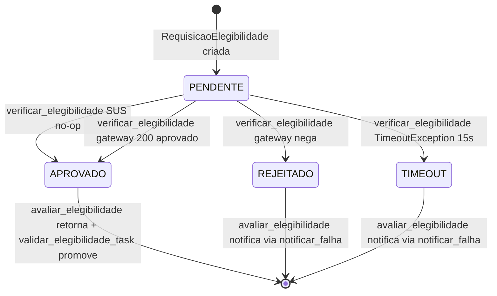

# Billing Domain

> Elegibilidade concorrente em background, SUS no-op aprova na hora, privado valida com timeout de 15s. Decide cobertura, nunca ordem clínica nem expulsão da fila.

## 1. Contexto

Billing valida cobertura sem travar acolhimento. Atendimento nasce `TRIADO_AGUARDANDO_ELEGIBILIDADE`, worker valida em paralelo, aprovação promove para `APTO_PARA_CHAMADA`.

Vocabulário ubíquo: `elegibilidade` (cobertura), `no-op SUS` (aprovação imediata), `gateway privado` (consulta operadora 15s), `falha elegibilidade` (rejeição ou timeout com aviso).

Entrada via RF-02 (validação concorrente + enriquecimento cadastral CFM). Saída alimenta queue: aprovado vira ZSET, falho preserva triado e alerta espera.

Escopo termina na decisão de cobertura. Fila decide ordem, triagem decide prioridade, consulta decide registro; billing decide apenas se convênio ou SUS cobre.

Deploy define caminho: `organizacoes.modo_publico_sus = True` usa no-op sem rede, `False` consulta gateway externo com CPF, CNS, operadora e carteirinha.

## 2. Regras

- **RN03 — Elegibilidade concorrente em background, transição condicionada.** Worker valida em paralelo à espera; só `APTO_PARA_CHAMADA` chama; desvio temporário convoca próximo validado e sinaliza triado de maior prioridade. [Fonte](../product-specification.md) (RN03)
- **RN03 (bis) — SUS no-op aprova imediato.** `SusEligibilityAdapter.verificar_elegibilidade` retorna `APROVADO` com `SUS-ISENTO`, sem HTTP, perfil `MODO_PUBLICO_SUS`. [Fonte](../product-specification.md) (RN03)
- **RN03 (ter) — Privado com timeout de 15s.** `PrivateInsuranceGatewayAdapter.verificar_elegibilidade` consulta operadora com `timeout_segundos = 15.0`; `TimeoutException` vira `TIMEOUT`, HTTP não-200 ou `aprovado = False` vira `REJEITADO`. [Fonte](../product-specification.md) (RN03)
- **RN03 (orquestra) — Service orquestra, nunca decide sozinho.** `ElegibilidadeService.avaliar_elegibilidade` delega a `EligibilityProviderPort` e só notifica quando `aprovado = False` via `ElegibilidadeFalhaEvent`. [Fonte](../product-specification.md) (RN03)

Guardiões: `avaliar_elegibilidade` só notifica em falha; aprovado passa silencioso. Gateway valida `status_code == 200` antes de ler `aprovado`; fora disso loga e rejeita sem exceção.

SUS exige CPF ou CNS na requisição, privado exige `operadora_id` + `numero_carteirinha`. Dados faltantes não bloqueiam fila, apenas aumentam chance de rejeição na operadora.

## 3. Máquina de estados

Quatro valores em `StatusElegibilidade`, sem coluna própria: resultado efêmero por requisição. Única transição real é `verificar_elegibilidade` + `avaliar_elegibilidade`; worker converte aprovação em `promover_para_apto` no agregado queue.



`verificar_elegibilidade` SUS só produz `APROVADO` em `src/modules/billing/infrastructure/adapters/sus_adapter.py`. Sem rede, sem erro, `codigo_autorizacao = SUS-ISENTO`.

`verificar_elegibilidade` privado produz três saídas em `src/modules/billing/infrastructure/adapters/private_gateway_adapter.py`. `200 + aprovado` vira `APROVADO`, `200 + negado` ou HTTP fora de 200 vira `REJEITADO`, `httpx.TimeoutException` vira `TIMEOUT`.

`avaliar_elegibilidade` só bifurca notificação em `src/modules/billing/application/services/eligibility_service.py`. Falha monta `ElegibilidadeFalhaEvent` e chama `notificar_falha`; aprovação retorna direto sem evento.

`PENDENTE` declarado em `src/modules/billing/domain/enums.py` mas nunca retornado pelos adapters atuais. Reservado para requisição criada ainda não avaliada; nenhum `rg` encontra produção de `PENDENTE` fora do enum.

`validar_elegibilidade_task` converte resultado em estado queue em `src/worker/tasks/eligibility.py`. Aprovado com `TRIADO_AGUARDANDO_ELEGIBILIDADE` chama `promover_para_apto` + `zadd`; reprovado ou timeout preserva status e retorna motivo sem `commit`.

## 4. Relações

- Expõe cobertura via porta tipada. `EligibilityProviderPort.verificar_elegibilidade` recebe `RequisicaoElegibilidade` e devolve `ResultadoElegibilidade`; queue consome sem importar adapter concreto.
- Notifica falha via porta abstrata. `ElegibilidadeNotifierPort.notificar_falha` recebe `ElegibilidadeFalhaEvent` imutável com motivo, status e ids; default `LoggingElegibilidadeNotifier` só loga, sala de espera pluga.
- Sem tabelas próprias, reusa jornada. Billing não cria `__tablename__`; lê `organizacoes.modo_publico_sus` e promove `atendimentos.status`; RLS por `organizacao_id` herdada da raiz. [Modelo](../architecture/data-model.md)
- Worker executa fora do request. `src/worker/tasks/eligibility.py` resolve adapter por `modo_publico_sus`, avalia, promove e injeta no ZSET `fila:{org}:aptos` com score 64 bits.
- Orquestra concorrência conforme desenho de filas e locks. [Concorrência](../architecture/concurrency-and-queues.md)
- Falha vira RF-05, não exceção fatal. Rejeição ou timeout retorna dicionário com `status` + `motivo`; paciente regulariza documento ou pagamento sem perder posição clínica.

## 5. Peculiaridades

- Pendência financeira nunca expulsa da fila. Rejeição preserva `TRIADO_AGUARDANDO_ELEGIBILIDADE`, pula `commit` e `zadd`; posição cronológica e clínica intacta enquanto regulariza.
- SUS é isenção, não autorização. `SUS-ISENTO` documenta gratuidade pública; auditoria distingue de `AUTH-OK` privado por código, não por flag extra.
- Timeout é status, não exceção. `15s excedido` vira `TIMEOUT` com motivo pronto para UI; retry pode reavaliar sem novo atendimento.
- Serviço nunca commita. `ElegibilidadeService` só orquestra provider + notifier; `commit` e `zadd` pertencem ao worker após `promover_para_apto`.
- DTOs imutáveis ponta a ponta. `RequisicaoElegibilidade` e `ResultadoElegibilidade` são `frozen`; evento de falha também; nenhum passo muta entrada.
- Erro inesperado vira rejeição explicável. Exceção fora de timeout loga com stack e retorna `REJEITADO` com mensagem de comunicação; fila nunca quebra por queda de operadora.
- Idempotente por leitura de estado. `already_promoted` retorna quando atendimento já saiu de triado; duplo disparo de worker não duplica ZSET nem regrede status.
- Modo resolvido por banco quando ausente. Sem `modo_publico_sus` explícito, worker lê `organizacoes` via `SELECT`; deploy SUS e privado usam mesmo código.

## 6. Onde no código

- `src/modules/billing/domain/enums.py`
- `src/modules/billing/application/dtos.py`
- `src/modules/billing/application/ports/eligibility_provider.py`
- `src/modules/billing/application/ports/eligibility_notifier.py`
- `src/modules/billing/application/services/eligibility_service.py`
- `src/modules/billing/infrastructure/adapters/sus_adapter.py`
- `src/modules/billing/infrastructure/adapters/private_gateway_adapter.py`
- `src/worker/tasks/eligibility.py`
- `tests/unit/test_billing_eligibility.py`
- `tests/unit/test_eligibility_task.py`

Prova viva:

```bash
ls tests/unit | rg -i "billing|eligibility"
# test_billing_eligibility.py
# test_eligibility_task.py
```

## 7. Verificação

```bash
rg -n "APROVADO|REJEITADO|TIMEOUT|PENDENTE" src/modules/billing/domain/enums.py
# enums.py:9 APROVADO, :10 REJEITADO, :11 TIMEOUT, :12 PENDENTE

rg -n "def " src/modules/billing/application/services/eligibility_service.py
# eligibility_service.py:22 __init__, :30 avaliar_elegibilidade

uv run pytest tests/unit/test_billing_eligibility.py -q --no-cov
# 8 passed (2026-10-07)

uv run pytest tests/unit/test_eligibility_task.py -q --no-cov
# 4 passed (2026-10-07)
```

Sem corrigir código. Divergência entre doc e guardião real exige atualizar doc, nunca relaxar invariante de elegibilidade.

## 8. Ver também

- [Product Specification](../product-specification.md) — RN03 contratual, RF-02 concorrente, RF-05 exceção, RT-01 modo SUS
- [Data Model](../architecture/data-model.md) — tabela `atendimentos`, `organizacoes.modo_publico_sus`, RLS por `organizacao_id`
- [Concurrency and Queues](../architecture/concurrency-and-queues.md) — worker background, ZSET, promoção após aprovação
- [Domains Index](./index.md) — visão conceitual por domínio
