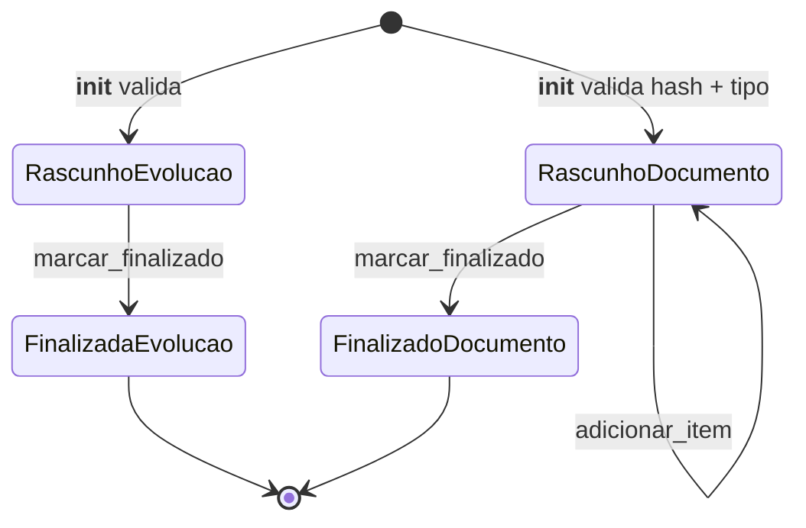

# Consultation Domain

> Ato médico soberano com PEP append-only, documentos assinados PAdES e vídeo que nunca passa pelo Python. Decide registro, trava edição, emite JWT sem desconectar ninguém.

## 1. Contexto

Consulta executa o ato médico dentro de atendimento EM_ATENDIMENTO. Duas peças: evolução SOAP alimenta PEP, documento clínico gera receita/atestado/encaminhamento assinado.

Vocabulário ubíquo: `evolução` (SOAP), `documento clínico`, `item de prescrição`, `finalizado` (trava in-memory), `chave_s3` (canônica), `sha256_hash` (64 hex), `assinado_em`/`registrado_em` (UTC).

Entrada via RF-07 (consulta, PEP e assinatura). Saída alimenta auditoria RN07 e validação pública de documentos via QR + hash.

Escopo termina no registro. Fila decide ordem, triagem decide prioridade, billing decide cobertura; consulta decide apenas o que o médico registra e assina.

## 2. Regras

- **RN06 — Ato médico nunca interrompido por tempo.** `marcar_finalizado`/`validar_pode_excluir` travam registro, nunca derrubam chamada; backend só emite JWT via `src/modules/consultation/infrastructure/livekit_adapter.py`. [Fonte](../product-specification.md) (RN06)
- **RN07 — PEP append-only com UTC e prova criptográfica.** `EvolucaoClinica`/`DocumentoClinico` carimbam `registrado_em`/`assinado_em` em UTC, hash SHA-256 de 64 hex, assinatura PAdES; guarda canônica em `src/modules/consultation/domain/s3_keys.py`. [Fonte](../product-specification.md) (RN07)

Guardiões: `__init__` rejeita `organizacao_id <= 0`, anamnese/conduta vazias, CID-10 fora do padrão, `chave_s3` vazia, hash fora de 64 hex (`ConsultaInvalidaError`).

`adicionar_item` exige mesmo `organizacao_id` (multi-tenant), valida substância via Portaria 344/98 Listas A e B, força `controle_especial = True` quando tipo é C1.

`validar_pode_excluir` recusa quando `is_finalizado` ou status do atendimento é terminal (CONCLUIDO, PACIENTE_AUSENTE, CANCELADO_PACIENTE); `before_delete` repete a trava no nível ORM.

## 3. Máquina de estados

Dois agregados, mesma trava binária: rascunho editável vira finalizado imutável via `marcar_finalizado`. Nenhum caminho reverso existe no código.



`marcar_finalizado` só liga `_is_finalizado = True` em `src/modules/consultation/domain/models/evolucao_clinica.py` e `src/modules/consultation/domain/models/documento_clinico.py`. Serviço chama quando atendimento atinge status terminal.

`adicionar_item` só antes de finalizar: serviço bloqueia emissão e mutação quando `is_finalizado` ou atendimento terminal; direto no agregado, itens vinculam `documento_id` após checar tenant e Portaria 344/98.

`validar_pode_excluir` + `before_delete` fecham a porta de saída: finalizado nunca deleta, terminal nunca deleta. Exclusão exige rascunho + atendimento ativo.

CID-10 normaliza para maiúsculas (`J02.9`) e rejeita fora do padrão letra + 2 dígitos + subcategoria opcional. Hash normaliza para lowercase e exige 64 hex.

## 4. Relações

- Lê atendimento sem importar queue. `src/modules/consultation/application/ports/atendimento_reader_port.py` devolve `AtendimentoResumoDTO` com `status` e `is_terminal`; consulta nunca toca em models de outro módulo.
- Emite PDF via porta abstrata. `src/modules/consultation/application/ports/pdf_generator_port.py` recebe `DocumentoPDFPayload` e devolve bytes PDF/A com QR de verificação ITI.
- Assina via porta abstrata. `src/modules/consultation/application/ports/icp_brasil_signer_port.py` aplica PAdES com `DoctorCertificateCredentials` (PSC OAuth2); infra PyHanko pluga sem tocar serviço.
- Guarda bytes via porta abstrata. `src/modules/consultation/application/ports/storage_port.py` persiste em `chave_s3` canônica e gera URL pré-assinada de 300s para download.
- Persiste em três tabelas (`evolucoes_clinicas`, `documentos_clinicos`, `documento_itens` com RLS por `organizacao_id`, `RESTRICT` nas FKs clínicas, `CASCADE` de documento para itens). [Modelo](../architecture/data-model.md)
- Orquestra mídia sem transportar mídia. `src/modules/consultation/application/ports/livekit_media_port.py` define `generate_room_token` e ciclo de sala; SFU LiveKit carrega áudio/vídeo, Python só sinaliza.
- Finalização centralizada no PEP. `src/modules/consultation/application/services/pep_service.py` marca evolução + documentos quando atendimento encerra; evolução e documento services repetem a guarda na borda.

## 5. Peculiaridades

- Mídia nunca passa pelo Python. Backend gera JWT e gerencia sala via Twirp RPC; pacotes WebRTC fluem paciente ↔ SFU, nunca por FastAPI.
- `TipoDocumentoClinico` fecha o vocabulário. Cinco valores (RECEITA_SIMPLES, RECEITA_ANTIMICROBIANO, RECEITA_CONTROLE_ESPECIAL_C1, ATESTADO_MEDICO, RELATORIO_ENCAMINHAMENTO) espelhados em `CheckConstraint` no banco; fora disso é `ConsultaInvalidaError`.
- `_is_finalizado` é in-memory, não coluna. Trava vale na sessão; persistência da finalidade vem do status terminal do atendimento, não de flag no banco.
- Chave S3 canônica única. `build_signed_document_key` monta `orgs/{org}/consultations/{atendimento}/documents/{documento}.pdf`; prefixo não indica assinatura, fonte da verdade é `SignedCachePort`.
- Portaria 344/98 no domínio. `validar_substancia_permitida_telemedicina` barra Listas A e B em `DocumentoItem.__init__` e em `adicionar_item`; entorpecente via teleconsulta nem chega ao PDF.
- UTC sempre, relógio do cliente nunca. `registrado_em` e `assinado_em` usam `datetime.now(UTC)` como default; auditoria RN07 depende desse carimbo.
- Erros de domínio tipados. `ConsultaFinalizadaError` para mutação/exclusão pós-trava, `ConsultaInvalidaError` para dado inválido; borda converte em 4xx sem vazar stack.

## 6. Onde no código

- `src/modules/consultation/domain/models/evolucao_clinica.py`
- `src/modules/consultation/domain/models/documento_clinico.py`
- `src/modules/consultation/domain/models/documento_item.py`
- `src/modules/consultation/domain/s3_keys.py`
- `src/modules/consultation/application/ports/atendimento_reader_port.py`
- `src/modules/consultation/application/ports/storage_port.py`
- `src/modules/consultation/application/ports/pdf_generator_port.py`
- `src/modules/consultation/application/ports/icp_brasil_signer_port.py`
- `src/modules/consultation/application/ports/livekit_media_port.py`
- `src/modules/consultation/application/services/evolucao_service.py`
- `src/modules/consultation/application/services/documento_service.py`
- `src/modules/consultation/application/services/pep_service.py`
- `src/modules/consultation/infrastructure/livekit_adapter.py`
- `tests/unit/test_consultation_models.py`
- `tests/unit/test_evolucao_service.py`
- `tests/unit/test_documento_service.py`
- `tests/unit/test_livekit_token.py`

Prova viva:

```bash
ls tests/unit | rg -i "consultation|evolucao|documento|livekit"
# test_consultation_models.py
# test_documento_service.py
# test_evolucao_service.py
# test_livekit_token.py
```

## 7. Verificação

```bash
rg -n "def marcar_finalizado|def adicionar_item|def validar_pode_excluir" src/modules/consultation/domain/
# documento_clinico.py:159 marcar_finalizado, :163 adicionar_item, :181 validar_pode_excluir
# evolucao_clinica.py:129 marcar_finalizado, :133 validar_pode_excluir

pytest tests/unit/test_consultation_models.py -q --no-cov
# 58 passed (2026-10-07)
```

Sem corrigir código. Divergência entre doc e guardião real exige atualizar doc, nunca relaxar trava clínica.

## 8. Ver também

- [Product Specification](../product-specification.md) — RN06, RN07 contratuais
- [Data Model](../architecture/data-model.md) — tabelas `evolucoes_clinicas`, `documentos_clinicos`, `documento_itens`, RLS por `organizacao_id`
- [Compliance and Telemedicine](../architecture/compliance-and-telemedicine.md) — RN06, CFM 2.314/2022, PAdES ICP-Brasil
- [Domains Index](./index.md) — visão conceitual por domínio
