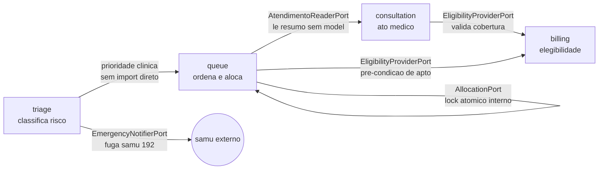

# Context Map — Domínios Clínicos

> Como triage, queue, consultation e billing se conectam via ports abstratas, sem importar modelos uns dos outros.

Fluxo clínico corre em uma direção: triagem classifica, fila ordena e aloca, consulta executa o ato médico, faturamento valida cobertura.

Dependência de código corre na direção oposta quando precisa: quem precisa de dado declara uma port, quem detém o dado pluga o adaptador.

Este mapa registra as duas visões e a regra que impede acoplamento direto.

## 1. Mapa visual

Jornada feliz de um atendimento, da esquerda para a direita.

Cada aresta indica a port consumida para atravessar a fronteira.



Leitura: triage produz prioridade que queue consome como inteiro, consultation lê estado da fila via reader, billing responde elegibilidade para queue e consultation.

Queue usa alocação tipada internamente, triage escapa para samu sem passar pela fila.

## 2. Upstream e downstream por módulo

Tabela resumo, detalhe por módulo abaixo.

| módulo | papel | consome | expõe | caminho da port |
|---|---|---|---|---|
| triage | classifica risco | nada de outro módulo | alerta de emergência | `src/modules/triage/application/ports/emergency_notifier.py` |
| queue | ordena e aloca | elegibilidade do billing | alocação, ausência, transbordo | `src/modules/queue/application/ports/allocation_port.py` |
| consultation | ato médico | resumo de atendimento | evolução e pep | `src/modules/consultation/application/ports/atendimento_reader_port.py` |
| billing | cobertura | nada de outro módulo | elegibilidade e falha | `src/modules/billing/application/ports/eligibility_provider.py` |

### 2.1 triage — origem, sem upstream

Consome apenas núcleo e domínio próprio, nunca fila ou faturamento.

Expõe `src/modules/triage/application/ports/emergency_notifier.py` para fuga de emergência nível um.

Serviço que dispara: `src/modules/triage/application/services/triage_service.py`.

Downstream lógico: prioridade clínica alimenta score da fila, sem chamada de função entre módulos.

### 2.2 queue — centro gravitacional

Consome `src/modules/billing/application/ports/eligibility_provider.py` antes de promover para apto.

Expõe `src/modules/queue/application/ports/allocation_port.py` para alocação atômica com enum tipado.

Expõe `src/modules/queue/application/ports/paciente_ausente_notifier.py` para no-show de quarenta e cinco segundos.

Expõe `src/modules/queue/application/ports/queue_overflow_notifier.py` para transbordo regulatório.

Serviços que orquestram: `src/modules/queue/application/services/alocacao_service.py` e `src/modules/queue/application/services/controle_admissao_service.py`.

Notificação genérica reutiliza `src/core/notifications.py` via `src/modules/queue/application/ports/notification_port.py`.

### 2.3 consultation — lê sem possuir

Consome `src/modules/consultation/application/ports/atendimento_reader_port.py` para checar estado terminal sem importar modelo da fila.

Implementação sql isolada em `src/modules/consultation/infrastructure/atendimento_reader_sql.py`, ligada em `src/modules/consultation/composition.py`.

Consumidor interno: `src/modules/consultation/application/services/evolucao_service.py` barra evolução em atendimento finalizado.

Downstream lógico: atendimento concluído gera fato faturável, billing valida em seguida.

### 2.4 billing — autoridade de cobertura

Consome apenas provedor externo via abstração própria, nada de triage ou queue.

Expõe `src/modules/billing/application/ports/eligibility_provider.py` para verificação assíncrona de convênio.

Expõe `src/modules/billing/application/ports/eligibility_notifier.py` para alerta de falha na sala de espera.

Serviço que orquestra: `src/modules/billing/application/services/eligibility_service.py` com worker em `src/worker/tasks/eligibility.py`.

Queue chama o provedor em background, nunca bloqueia http esperando convênio.

## 3. Regra de ouro

Nunca importar modelos, tabelas ou repositórios de outro módulo.

Comunicação síncrona ocorre exclusivamente via ports abstratas e dtos imutáveis.

Violação é bloqueada por `tach.toml` com `just tach` e pelo teste de arquitetura de routers finos.

Sintoma de violação: import cruzado do tipo queue dentro de billing, ou consultation importando atendimento da fila.

Correção: declarar port no consumidor, implementar adaptador na composição, injetar via dependência.

## 4. Onde no código

Ports que sustentam as arestas do diagrama:

- `src/modules/triage/application/ports/emergency_notifier.py`
- `src/modules/queue/application/ports/allocation_port.py`
- `src/modules/queue/application/ports/paciente_ausente_notifier.py`
- `src/modules/queue/application/ports/queue_overflow_notifier.py`
- `src/modules/queue/application/ports/notification_port.py`
- `src/modules/consultation/application/ports/atendimento_reader_port.py`
- `src/modules/billing/application/ports/eligibility_provider.py`
- `src/modules/billing/application/ports/eligibility_notifier.py`
- `src/core/notifications.py`
- `tach.toml`

## 5. Verificação

```bash
ls src/modules/queue/application/ports/ src/modules/billing/application/ports/ src/modules/consultation/application/ports/ src/modules/triage/application/ports/
# allocation_port, eligibility_provider, atendimento_reader_port, emergency_notifier visiveis

just tach
# fronteiras modulares ok, sem import cruzado

just test-fast
# suite rapida verde
```

Divergência entre mapa e import real exige atualizar o mapa, nunca relaxar a fronteira.

## 6. Ver também

- [queue domain](./queue-domain.md) — score, double-lock, backpressure
- [triage domain](./triage-domain.md) — classificação e fuga samu
- [consultation domain](./consultation-domain.md) — ato médico e evolução
- [billing domain](./billing-domain.md) — elegibilidade e faturamento
- [domain events](./domain-events.md) — eventos ponto a ponto sem barramento
- [product specification](../product-specification.md) — requisitos contratuais
