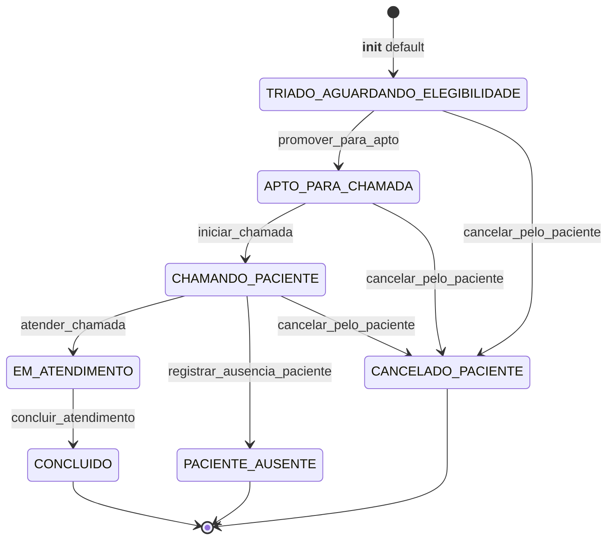

# Queue Domain

> Fila virtual com score determinístico de 64 bits, alocação atômica via Lua e backpressure estocástico. Decide ordem, trava chamada, suspende admissão sem tocar ato médico.

## 1. Contexto

Queue recebe prioridade clínica e transforma em ordem de chamada. Três peças: score ordena, Lua aloca, admissão freia entrada.

Vocabulário ubíquo: `score` (64 bits), `fila aptos` (ZSET Valkey), `lock médico`, `lock atendimento`, `ring timeout 45s`, `alpha` (margem estocástica), `transbordo`.

Entrada via RF-03 (alocação e chamada) e RF-04 (backpressure). Saída alimenta consulta: médico trava chamada, paciente conecta, atendimento inicia.

Escopo termina na entrega do par médico-paciente. Elegibilidade decide quem fica apto, consulta decide o que acontece dentro do ato médico.

Chaves Valkey seguem convenção fixa: `fila:{org}:aptos` (ZSET de aptos), `lock:{org}:medico:{id}`, `lock:{org}:atendimento:{id}`, `plantao:{org}:medicos_ativos` (SET de plantão), `cota:{org}:{data}` (contador diário com expiração de 2 dias).

Defaults operacionais: TMA estimado 600s, alpha 1,25, cota diária 300. Deploy SUS aperta alpha e cota, privado relaxa; código não muda, só parâmetro.

## 2. Regras

- **RN01 — Score 64 bits: prioridade domina, tempo desempata.** `calcular_score` devolve `prioridade * 10^12 + epoch`; menor inteiro chama primeiro dentro do nível, FIFO cronológico puro. [Fonte](../product-specification.md) (RN01)
- **RN01 (bis) — Identidade FIFO via UUIDv7.** `Atendimento` usa `uuid7()` como PK; ordenação temporal embutida no id elimina disputa de desempate. [Fonte](../product-specification.md) (RN01)
- **RN02 — Double-lock atômico com ring de 45s.** `alocar_chamada.lua` trava médico + atendimento, remove do ZSET, expira em TTL; `0` médico ocupado, `-1` atendimento indisponível, `1` sucesso. [Fonte](../product-specification.md) (RN02)
- **RN02 (bis) — No-show determinístico.** `iniciar_chamada` abre janela CHAMANDO; sem resposta em 45s, `registrar_ausencia_paciente` fecha em PACIENTE_AUSENTE e libera médico. [Fonte](../product-specification.md) (RN02)
- **RN05 — Backpressure com α e transbordo.** `avaliar_capacidade_admissao` suspende entrada por cota diária ou carga `(aguardando * TMA * alpha) / medicos > restante`; bloqueio emite `QUEUE_OVERFLOW_TRANSIT`. [Fonte](../product-specification.md) (RN05)

Guardiões: `promover_para_apto` exige TCLE prévio; `iniciar_chamada` exige médico não vazio; `cancelar_pelo_paciente` bloqueado em EM_ATENDIMENTO; `atualizar_prioridade` preserva soberania diagnóstica do assistente.

Alpha fora de `1,20–1,30` é erro de configuração, não de domínio: função valida `alpha > 0` e TMA positivo, resto é política de deploy.

Exemplo numérico RN01: emergência (1) com epoch atual gera ~`1000000000000 + epoch`; eletivo (5) gera ~`5000000000000 + epoch`. Diferença de nível vale `10^12`, espera máxima humana vale `10^8`; prevalência garantida por magnitude.

Lua executa em 4 passos indivisíveis: checa lock médico, checa lock atendimento, confirma `ZRANK` na fila, depois `ZREM` + dois `SET EX`. Qualquer falha retorna antes de mutar; sem meio-estado observável.

Admissão avalia em ordem fixa: sem médicos ativos, cota diária atingida, carga estocástica. Primeira condição verdadeira define `motivo_bloqueio` (`SEM_MEDICOS_ATIVOS`, `COTA_ATINGIDA`, `CAPACIDADE_EXCEDIDA`) e mensagem explicativa pronta para UI.

## 3. Máquina de estados

Sete estados em `StatusAtendimento`, três terminais em `TERMINAL_STATUSES` (CONCLUIDO, PACIENTE_AUSENTE, CANCELADO_PACIENTE). Toda transição passa por `_assegurar_nao_finalizado` primeiro.



`promover_para_apto` só sai de TRIADO e exige `tcle_hash` presente. Sem consentimento, sem fila; guarda RN07 dentro da transição RN03.

`iniciar_chamada` só sai de APTO e grava `medico_id` + `chamada_iniciada_em`. Lua garante reserva distribuída, modelo garante reserva de estado; ambos precisam concordar.

`atender_chamada` só sai de CHAMANDO. Conexão do paciente é o único evento que abre EM_ATENDIMENTO; nenhum atalho de código pula esse passo.

`registrar_ausencia_paciente` só sai de CHAMANDO e carimba `chamada_finalizada_em`. Terminal: ausência encerra jornada, retorno exige novo atendimento.

`concluir_atendimento` só sai de EM_ATENDIMENTO. Único caminho para CONCLUIDO; consulta decide quando, queue apenas registra.

`cancelar_pelo_paciente` aceita TRIADO, APTO e CHAMANDO, recusa EM_ATENDIMENTO. Ato médico em curso nunca sofre corte administrativo.

`registrar_tcle` não muda estado, só fixa hash SHA-256 uma vez. Pré-condição silenciosa de `promover_para_apto`.

Helpers de leitura espelham estados sem mutar: `is_em_fila`, `is_apto_para_chamada`, `is_chamando`, `is_em_atendimento`, `is_ativo`, `is_finalizado`. Painel usa esses predicados; nunca compara string de status na mão.

Métricas derivadas vivem no agregado: `tempo_espera_segundos` (`chamada_iniciada_em - data_entrada_fila`), `duracao_chamada_segundos` (`chamada_finalizada_em - chamada_iniciada_em`). Nulos quando evento ainda não ocorreu; sem exceção, sem zero falso.

## 4. Relações

- Consome elegibilidade do billing. `EligibilityProviderPort` valida cobertura antes de `promover_para_apto`; queue nunca importa tabela de convênio, só a porta abstrata.
- Expõe alocação via porta tipada. `AllocationPort.alocar_chamada` esconde códigos Lua (`AlocacaoCodigo` 0/1/-1) atrás de enum; infra Valkey pluga sem tocar serviço.
- Persiste em tabela `atendimentos` (FKs `organizacoes`, `pacientes`, `profissionais` com `RESTRICT`, RLS por `organizacao_id`, índices por status e fila). [Modelo](../architecture/data-model.md)
- Notifica transbordo via porta abstrata. `QueueOverflowNotifierPort.emitir_transbordo` recebe `QueueOverflowEvent` imutável com motivo, carga e alpha; default loga, regulação externa pluga.
- Publica ausência via `paciente_ausente_notifier`. Timeout vira evento de domínio, não só mudança de coluna; painel e métricas reagem sem polling.
- Orquestra concorrência conforme desenho de filas e locks. [Concorrência](../architecture/concurrency-and-queues.md)
- Worker de elegibilidade roda fora do request. `src/worker/tasks/eligibility.py` consome `EligibilityProviderPort` em background e devolve resultado; fila nunca bloqueia HTTP esperando convênio.
- `FilaService` compõe admissão + alocação. `ingressar_fila` calcula score e insere no ZSET; `adquirir_proximo` puxa cabeça e delega lock ao `AlocacaoChamadaService`; backpressure avaliado antes de inserir.
- Transmite posição e avanço em tempo real via WebSocket (`/ws/queue/{atendimento_id}`). O handshake exige autenticação via `?token=` (HMAC ou JWT) com checagem de posse ReBAC em sessão de banco efêmera (código WS 4401/4403 pré-accept) para evitar esgotamento de conexões durante o streaming via Valkey Pub/Sub (Issue #42).

## 5. Peculiaridades

- Score determinístico, sem aprendizado de máquina. Mesmo `(prioridade, epoch)` sempre devolve mesmo inteiro; auditoria reproduz ordem sem replay de eventos.
- Prioridade multiplica por `10^12`, epoch soma segundos Unix. Nível urgente jamais perde para eletivo antigo; invariante de prevalência clínica vira aritmética.
- Double-lock previne overbooking nos dois sentidos. Médico ocupado retorna `0` (HTTP 409), atendimento capturado retorna `-1` (retry); nunca meio-estado.
- TTL de 45s é deadlock breaker, não SLA clínico. Expirou sem conexão, lock some sozinho; fila nunca trava por crash de worker.
- `calcular_score_fila` no agregado exige `data_entrada_fila` presente. Sem carimbo de entrada, sem score; `ValidationError` em vez de zero silencioso.
- Ato médico nunca cortado — ponte RN06. Nenhum timer, quota ou backpressure transiciona EM_ATENDIMENTO para fora; TMA gera só sinal visual discreto. [Fonte](../product-specification.md) (RN06)
- Admissão suspensa protege quem já entrou. Transbordo fecha a porta, nunca despeja a sala; contingência vira evento externo, não cancelamento interno.
- UUIDv7 como PK dá FIFO aproximado até sem score. Inserção ordenada por tempo correlaciona id com chegada; índice de fila refina com prioridade.
- `atualizar_prioridade` permite reclassificar sem sair da fila. Soberania do assistente (RN-REG-01) sobrepõe triagem inicial; score recalcula no próximo ciclo.
- `CheckConstraint` no banco espelha validação do modelo. Status e prioridade 1–5 checados em DDL e em `__init__`; invariante sobrevive a escrita fora da ORM.
- Erros de domínio tipados, não genéricos. `TransicaoEstadoInvalidaError` para salto ilegal, `ValidationError` para dado inválido, `MedicoOcupadoError` / `AtendimentoNaoDisponivelError` / `AdmissaoFilaSuspensaError` na borda de serviço.
- `FilaService.calcular_score_fila` é wrapper fino sobre domínio. Fonte única em `scoring.py`; serviço reexporta para compatibilidade sem duplicar fórmula.

## 6. Onde no código

- `src/modules/queue/domain/scoring.py`
- `src/modules/queue/domain/models/atendimento.py`
- `src/modules/queue/infrastructure/lua/alocar_chamada.lua`
- `src/modules/queue/application/ports/queue_store_port.py` (QueueStorePort - interface profunda consolidando PostgreSQL + Valkey)
- `src/modules/queue/application/services/fila_service.py` (Implementação de QueueStorePort, admissão em fila e reconciliação)
- `src/modules/queue/application/services/admissao_service.py` (Acolhimento clínico integrado com Triagem persistida)
- `src/modules/queue/presentation/routers/admissao_router.py` (POST /api/v1/fila/admissao)
- `src/modules/queue/presentation/routers/queue_ws_router.py` (WebSocket de avanço da fila do paciente: /ws/queue/{atendimento_id})
- `src/modules/queue/presentation/dependencies.py` (Guards de autenticação e posse do paciente via QueueWsAuthDep)
- `src/modules/queue/application/services/alocacao_service.py`
- `src/modules/queue/application/services/controle_admissao_service.py`
- `src/modules/queue/application/ports/allocation_port.py`
- `src/modules/queue/application/ports/queue_overflow_notifier.py`
- `src/modules/billing/application/ports/eligibility_provider.py`
- `tests/unit/test_queue_store.py`
- `tests/unit/test_admissao_service.py`
- `tests/unit/test_alocacao_service.py`
- `tests/unit/test_atendimento_model.py`
- `tests/unit/test_controle_admissao.py`
- `tests/unit/test_fila_service.py`

Prova viva:

```bash
ls tests/unit | rg -i "alocacao|atendimento|admissao|fila|queue"
# test_admissao_service.py
# test_alocacao_service.py
# test_atendimento_model.py
# test_controle_admissao.py
# test_fila_service.py
# test_queue_store.py
```

## 7. Verificação

```bash
rg -n "def calcular_score|def iniciar_chamada|def registrar_ausencia_paciente" src/modules/queue/domain/
# scoring.py:11 def calcular_score + atendimento.py:234 iniciar_chamada, :268 registrar_ausencia, :334 calcular_score_fila

ls src/modules/queue/infrastructure/lua/
# alocar_chamada.lua

pytest tests/unit/test_alocacao_service.py tests/unit/test_atendimento_model.py -q --no-cov
# 22 passed (2026-10-07)
```

Sem corrigir código. Divergência entre doc e guardião real exige atualizar doc, nunca relaxar transição clínica.

## 8. Ver também

- [Product Specification](../product-specification.md) — RN01, RN02, RN05, RN06 contratuais
- [Data Model](../architecture/data-model.md) — tabela `atendimentos`, RLS por `organizacao_id`
- [Concurrency and Queues](../architecture/concurrency-and-queues.md) — ZSET, double-lock Lua, TTL 45s
- [Domains Index](./index.md) — visão conceitual por domínio
