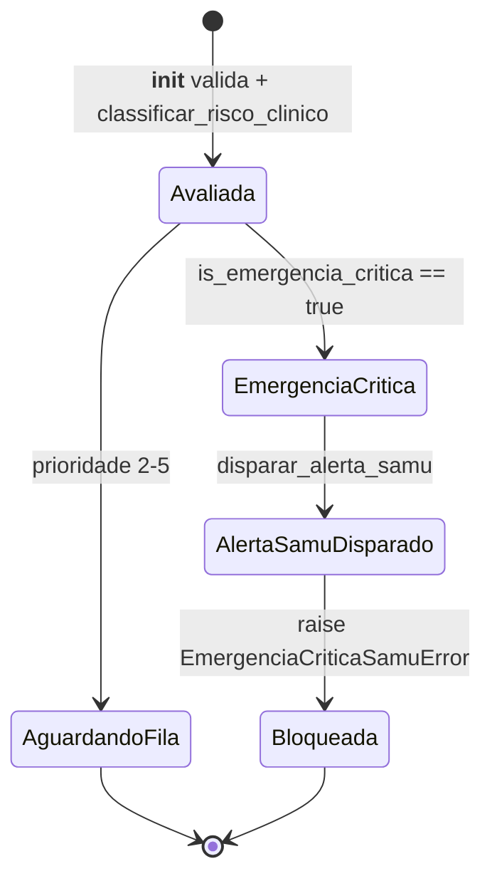

# Triage Domain

> Classificação clínica de risco e salvaguarda SAMU. Decide prioridade, bloqueia fila em emergência, prova consentimento por hash.

## 1. Contexto

Acolhimento gera `Triagem` 1:1 com atendimento. Função pura classifica, agregado valida, serviço aplica salvaguarda.

Vocabulário ubíquo: `queixa_principal`, `sintomas_alerta`, `prioridade_calculada` (1–5), `alerta_samu_disparado`, `avaliado_em` (UTC).

Entrada via RF-01 (queixa + dor 0–10 + sinais + aceite TCLE). Saída alimenta ordenação da fila sem chamar módulo queue.

Escopo termina na decisão. Fila, chamada e consulta pertencem a outros domínios.

## 2. Regras

- **RN01 — 5 níveis alimentam score da fila via dado.** `classificar_risco_clinico` devolve 1 (Emergência) a 5 (Não Urgente); queue ordena por esse inteiro. [Fonte](../product-specification.md) (RN01)
- **RN04 — Nível 1 bloqueia PA Virtual e dispara SAMU 192.** `disparar_alerta_samu` marca flag + `self._notifier` emite instrução 192. [Fonte](../product-specification.md) (RN04)
- **RN07 — TCLE vinculado por hash, acolhimento ágil <45s.** `calcular_hash_tcle` (SHA-256) amarra termo aceito ao prontuário, append-only UTC. [Fonte](../product-specification.md) (RN07)

Guardiões: `__init__` rejeita `organizacao_id <= 0`, queixa vazia, prioridade fora de 1–5, dor fora de 0–10 (`TriagemInvalidaError`).

Sinais Nível 1 vencem tudo: conjunto `SINAIS_ALARME_NIVEL_1` ou palavra-chave na queixa normalizada força retorno 1 antes de avaliar dor.

Cascata determinística: N1 sinais → N2 (dor 8–10 ou sintoma N2) → N3 (dor 5–7 ou sintoma N3) → N4 (dor 1–4 ou qualquer sintoma) → N5 eletivo.

## 3. Máquina de estados

Estados derivam de `prioridade_calculada` + `alerta_samu_disparado`. Sem coluna de status. Guardiões reais: `is_emergencia_critica`, `disparar_alerta_samu`, `adicionar_sintoma_alerta`.



`is_emergencia_critica` retorna verdadeiro quando `prioridade_calculada == 1` ou flag já disparada. Caminho crítico nunca alcança fila.

`disparar_alerta_samu` apenas liga `alerta_samu_disparado = True`. Envio externo cabe a `EmergencyNotifierPort`, nunca ao agregado.

`adicionar_sintoma_alerta` normaliza (trim + lower) e ignora duplicata. Não reclassifica sozinho; reavaliação exige nova chamada ao classificador.

## 4. Relações

- Consome nada. Nenhuma dependência síncrona de outro módulo. Entradas são primitivas (queixa, sintomas, dor, texto TCLE).
- Expõe classificação via dado para queue. `ResultadoTriagemDTO` carrega `prioridade_clinica`, `tcle_hash`, `admissao_bloqueada`, `alerta_samu_disparado`. Queue ordena sem importar triage.
- Persiste em tabela `triagens` (1:1 com `atendimentos`, `ON DELETE RESTRICT`, `organizacao_id` + RLS). [Modelo](../architecture/data-model.md)
- Notifica via porta abstrata. `EmergencyNotifierPort.notificar_emergencia_samu` recebe `EmergencyAlertDTO` imutável. Infraestrutura concreta pluga sem tocar domínio.
- Falha de emergência via exceção de domínio `EmergenciaCriticaSamuError`, convertida na borda em resposta de bloqueio.

## 5. Peculiaridades

- Acoplamento via dado, não chamada. Triage nunca importa queue, nunca chama fila. Contraste com queue, que importa Valkey e orquestra atomicamente.
- Emergência é bloqueio de admissão, não prioridade alta. Nível 1 não entra na fila; retorna instrução SAMU e levanta erro de domínio.
- Hash permite TCLE vazio em testes (`tcle_hash = ""`), mas produção exige texto do termo aceito antes de submeter.
- Normalização dupla: sintomas com `strip().lower()`, queixa com NFKD sem diacríticos. Evita bypass por caixa alta ou acento.
- `avaliado_em` sempre UTC com default `datetime.now(UTC)`. Auditoria RN07 depende desse carimbo, não do relógio do cliente.
- Sem enum de prioridade. Inteiro 1–5 com `CheckConstraint` no banco espelha validação do `__init__`.

## 6. Onde no código

- `src/modules/triage/domain/models/triagem.py`
- `src/modules/triage/domain/classification.py`
- `src/modules/triage/application/ports/emergency_notifier.py`
- `src/modules/triage/application/services/triage_service.py`
- `src/modules/triage/application/dtos.py`
- `tests/unit/test_triage_model.py`

Prova viva:

```bash
ls tests/unit | rg -i triag
# tests/unit/test_triage_model.py
```

## 7. Verificação

```bash
rg -n "classificar_risco_clinico" src/
# 5 matches: domain/classification.py (def), domain/__init__.py (x2), application/services/triage_service.py (x2)

pytest tests/unit -k triag -q --no-cov
# 12 passed, 392 deselected (2026-10-07)
```

Sem corrigir código. Divergência entre doc e guardião real exige atualizar doc, nunca relaxar validação clínica.

## 8. Ver também

- [Product Specification](../product-specification.md) — RN01, RN04, RN07 contratuais
- [Data Model](../architecture/data-model.md) — tabela `triagens`, RLS por `organizacao_id`
- [Concurrency and Queues](../architecture/concurrency-and-queues.md) — como queue consome prioridade via dado
- [Domains Index](./index.md) — visão conceitual por domínio
