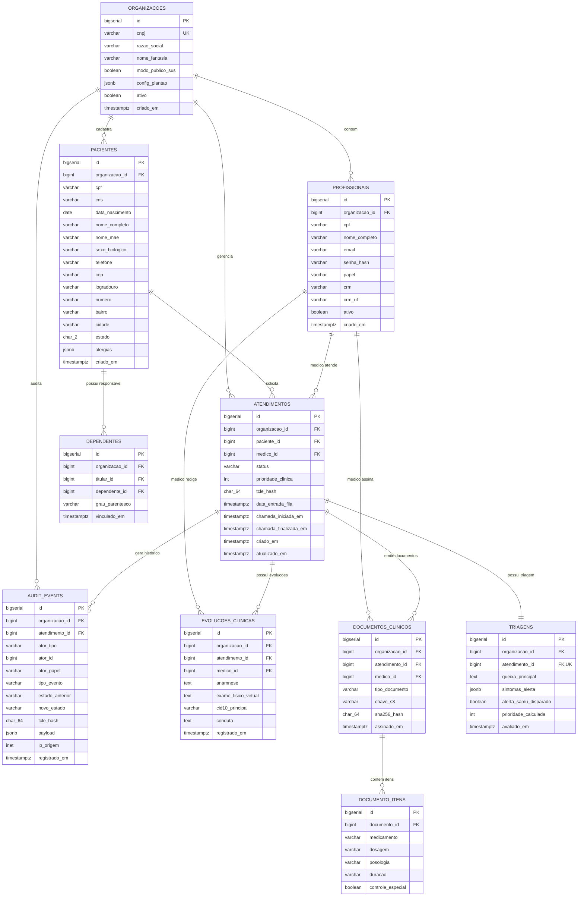

# [RFC-002] Modelo de Dados Relacional, Agregados DDD e Migrações

| Metadado | Detalhe |
| :--- | :--- |
| **Status** | Aprovado |
| **Versão** | 1.0 |
| **Data** | 2026-09-13 |
| **Referência SRS** | [SRS-001 v1.0](../srs/SRS-001-MediSync-Express.md) (RN-REG-02, RN07, RNF-05, RT-01) |
| **RFC Base** | [RFC-001](RFC-001-Fundacao-Arquitetura-Base-e-Tooling.md) |
| **Decisões de Arquitetura (ADRs)** | [ADR-001: Monólito com Modelos Ricos](../adrs/ADR-001-Monolito-Modular-com-Modelos-Ricos.md), [ADR-003: Multi-Tenancy RLS](../adrs/ADR-003-Multi-Tenancy-Logico-no-ORM.md), [ADR-004: Auditoria Imutável](../adrs/ADR-004-Auditoria-Append-Only-Postgres-Rules.md), [ADR-009: Migrações Alembic](../adrs/ADR-009-Migracoes-Assincronas-Alembic-Asyncpg.md), [ADR-010: Identidade Clínica](../adrs/ADR-010-Cadastro-Progressivo-e-Identidade-Clinica.md) |
| **Componentes Principais** | PostgreSQL 16, SQLAlchemy 2.0 Async, Alembic, asyncpg, Row-Level Security (RLS) |

---

## 1. Contexto e Princípios de Dados Orientados a DDD

Esta RFC especifica o **esquema físico de banco de dados relacional** e a **governança de migrações assíncronas** do MediSync Express. 

A modelagem reflete diretamente os limites de **Bounded Contexts** e as **Raízes de Agregados (Aggregate Roots)** do Domain-Driven Design (DDD), equilibrando a 3ª Forma Normal (3NF) com otimizações pragmáticas de persistência:

1. **3ª Forma Normal (3NF) para Cadastros Mestres**: Tabelas de `organizacoes`, `profissionais` e `pacientes` são estritamente normalizadas para evitar anomalias de atualização e garantir integridade cadastral.
2. **Denormalização Pragmática de `organizacao_id` (Multi-Tenancy & RLS)**: Em teoria relacional estrita, tabelas filhas (como `evolucoes_clinicas` ou `documentos_clinicos`) poderiam inferir seu tenant via JOIN com `atendimentos`. Contudo, para viabilizar **PostgreSQL Row-Level Security (RLS)** nativo com índice direto $\mathcal{O}(1)$ sem joins em cascata, **todas as tabelas multi-tenant contêm `organizacao_id` indexado diretamente**.
3. **Snapshots Clínicos Imutáveis (Exigência CFM e Forense)**: Quando um atendimento é concluído e um documento médico é assinado, os dados do paciente (endereço para SAMU 192 e dados civis) e do médico (CRM/UF) são capturados em formato de snapshot. Se o paciente mudar de endereço anos depois, o registro do prontuário histórico permanece imutável e juridicamente válido.
4. **Ciclo de Vida Controlado pela Raiz do Agregado**: A tabela `atendimentos` governa o ciclo de vida. Filhas como `triagens`, `evolucoes_clinicas` e `documentos_clinicos` possuem integridade referencial estrita (`ON DELETE RESTRICT`) para blindagem contra exclusão acidental.

---

## 2. Diagrama Entidade-Relacionamento do Sistema (ERD)



---

## 3. Esquema DDL Consolidado no PostgreSQL 16

O script abaixo consolida a estrutura declarativa executada na migração inicial do banco:

```sql
-- 1. Habilitação de extensões necessárias
CREATE EXTENSION IF NOT EXISTS "uuid-ossp";
CREATE EXTENSION IF NOT EXISTS "pgcrypto";

-- 2. Tabela de Organizações (Tenants do SUS e Operadoras)
CREATE TABLE organizacoes (
    id BIGSERIAL PRIMARY KEY,
    cnpj VARCHAR(18) NOT NULL UNIQUE,
    razao_social VARCHAR(255) NOT NULL,
    nome_fantasia VARCHAR(255) NOT NULL,
    modo_publico_sus BOOLEAN NOT NULL DEFAULT FALSE,
    config_plantao JSONB NOT NULL DEFAULT '{"alpha_margem": 1.25, "tma_estimado_segundos": 600, "cota_diaria_maxima": 300}'::jsonb,
    ativo BOOLEAN NOT NULL DEFAULT TRUE,
    criado_em TIMESTAMP WITH TIME ZONE NOT NULL DEFAULT (NOW() AT TIME ZONE 'UTC')
);

-- 3. Tabela de Profissionais (Equipe Médica, Gestores e Faturamento)
CREATE TABLE profissionais (
    id BIGSERIAL PRIMARY KEY,
    organizacao_id BIGINT NOT NULL REFERENCES organizacoes(id) ON DELETE RESTRICT,
    cpf VARCHAR(14) NOT NULL,
    nome_completo VARCHAR(255) NOT NULL,
    email VARCHAR(255) NOT NULL,
    senha_hash VARCHAR(255) NOT NULL,
    papel VARCHAR(32) NOT NULL, -- 'ADMIN_GLOBAL', 'GESTOR_UNIDADE', 'MEDICO', 'FATURAMENTO'
    crm VARCHAR(20),
    crm_uf CHAR(2),
    ativo BOOLEAN NOT NULL DEFAULT TRUE,
    criado_em TIMESTAMP WITH TIME ZONE NOT NULL DEFAULT (NOW() AT TIME ZONE 'UTC'),
    CONSTRAINT uq_profissional_org_email UNIQUE (organizacao_id, email),
    CONSTRAINT uq_profissional_org_cpf UNIQUE (organizacao_id, cpf)
);
CREATE INDEX idx_profissionais_org_papel ON profissionais(organizacao_id, papel);

-- 4. Tabela de Pacientes (Onboarding Progressivo em 2 Fases com Suporte Pediátrico)
CREATE TABLE pacientes (
    id BIGSERIAL PRIMARY KEY,
    organizacao_id BIGINT NOT NULL REFERENCES organizacoes(id) ON DELETE RESTRICT,
    cpf VARCHAR(14), -- Opcional para recém-nascidos e pediatria no SUS
    cns VARCHAR(15), -- Cartão Nacional de Saúde (15 dígitos)
    data_nascimento DATE NOT NULL,
    nome_completo VARCHAR(255),
    nome_mae VARCHAR(255),
    sexo_biologico CHAR(1), -- 'M', 'F'
    telefone VARCHAR(20) NOT NULL,
    cep VARCHAR(9),
    logradouro VARCHAR(255),
    numero VARCHAR(20),
    bairro VARCHAR(100),
    cidade VARCHAR(100),
    estado CHAR(2),
    alergias JSONB NOT NULL DEFAULT '[]'::jsonb,
    criado_em TIMESTAMP WITH TIME ZONE NOT NULL DEFAULT (NOW() AT TIME ZONE 'UTC'),
    CONSTRAINT chk_documento_paciente_obrigatorio CHECK (cpf IS NOT NULL OR cns IS NOT NULL)
);
CREATE UNIQUE INDEX uq_paciente_org_cpf ON pacientes(organizacao_id, cpf) WHERE cpf IS NOT NULL;
CREATE UNIQUE INDEX uq_paciente_org_cns ON pacientes(organizacao_id, cns) WHERE cns IS NOT NULL;
CREATE INDEX idx_pacientes_org_telefone ON pacientes(organizacao_id, telefone);

-- 5. Tabela de Dependentes e Menores de Idade
CREATE TABLE dependentes (
    id BIGSERIAL PRIMARY KEY,
    organizacao_id BIGINT NOT NULL REFERENCES organizacoes(id) ON DELETE RESTRICT,
    titular_id BIGINT NOT NULL REFERENCES pacientes(id) ON DELETE RESTRICT,
    dependente_id BIGINT NOT NULL REFERENCES pacientes(id) ON DELETE RESTRICT,
    grau_parentesco VARCHAR(32) NOT NULL, -- 'FILHO', 'CONJUGE', 'TUTELADO'
    vinculado_em TIMESTAMP WITH TIME ZONE NOT NULL DEFAULT (NOW() AT TIME ZONE 'UTC'),
    CONSTRAINT uq_dependente_vinculo UNIQUE (titular_id, dependente_id)
);

-- 6. Tabela de Atendimentos (Raiz do Agregado Clínico)
CREATE TABLE atendimentos (
    id BIGSERIAL PRIMARY KEY,
    organizacao_id BIGINT NOT NULL REFERENCES organizacoes(id) ON DELETE RESTRICT,
    paciente_id BIGINT NOT NULL REFERENCES pacientes(id) ON DELETE RESTRICT,
    medico_id BIGINT REFERENCES profissionais(id) ON DELETE RESTRICT,
    status VARCHAR(32) NOT NULL DEFAULT 'CRIADO',
    prioridade_clinica INTEGER NOT NULL DEFAULT 5, -- Manchester: 1 (Vermelho) a 5 (Azul)
    tcle_hash CHAR(64),
    data_entrada_fila TIMESTAMP WITH TIME ZONE,
    chamada_iniciada_em TIMESTAMP WITH TIME ZONE,
    chamada_finalizada_em TIMESTAMP WITH TIME ZONE,
    criado_em TIMESTAMP WITH TIME ZONE NOT NULL DEFAULT (NOW() AT TIME ZONE 'UTC'),
    atualizado_em TIMESTAMP WITH TIME ZONE NOT NULL DEFAULT (NOW() AT TIME ZONE 'UTC')
);
CREATE INDEX idx_atendimentos_org_status ON atendimentos(organizacao_id, status);
CREATE INDEX idx_atendimentos_fila ON atendimentos(organizacao_id, status, prioridade_clinica, data_entrada_fila);

-- 7. Tabela de Triagens Clínicas
CREATE TABLE triagens (
    id BIGSERIAL PRIMARY KEY,
    organizacao_id BIGINT NOT NULL REFERENCES organizacoes(id) ON DELETE RESTRICT,
    atendimento_id BIGINT NOT NULL UNIQUE REFERENCES atendimentos(id) ON DELETE RESTRICT,
    queixa_principal TEXT NOT NULL,
    sintomas_alerta JSONB NOT NULL DEFAULT '[]'::jsonb,
    alerta_samu_disparado BOOLEAN NOT NULL DEFAULT FALSE,
    prioridade_calculada INTEGER NOT NULL,
    avaliado_em TIMESTAMP WITH TIME ZONE NOT NULL DEFAULT (NOW() AT TIME ZONE 'UTC')
);

-- 8. Tabela de Evoluções Clínicas do Prontuário (PEP)
CREATE TABLE evolucoes_clinicas (
    id BIGSERIAL PRIMARY KEY,
    organizacao_id BIGINT NOT NULL REFERENCES organizacoes(id) ON DELETE RESTRICT,
    atendimento_id BIGINT NOT NULL REFERENCES atendimentos(id) ON DELETE RESTRICT,
    medico_id BIGINT NOT NULL REFERENCES profissionais(id) ON DELETE RESTRICT,
    anamnese TEXT NOT NULL,
    exame_fisico_virtual TEXT,
    cid10_principal VARCHAR(10),
    conduta TEXT NOT NULL,
    registrado_em TIMESTAMP WITH TIME ZONE NOT NULL DEFAULT (NOW() AT TIME ZONE 'UTC')
);
CREATE INDEX idx_evolucoes_atendimento ON evolucoes_clinicas(atendimento_id);

-- 9. Tabela de Documentos Clínicos Emitidos
CREATE TABLE documentos_clinicos (
    id BIGSERIAL PRIMARY KEY,
    organizacao_id BIGINT NOT NULL REFERENCES organizacoes(id) ON DELETE RESTRICT,
    atendimento_id BIGINT NOT NULL REFERENCES atendimentos(id) ON DELETE RESTRICT,
    medico_id BIGINT NOT NULL REFERENCES profissionais(id) ON DELETE RESTRICT,
    tipo_documento VARCHAR(32) NOT NULL, -- 'RECEITA_SIMPLES', 'RECEITA_ANTIMICROBIANO', 'RECEITA_CONTROLE_ESPECIAL_C1', 'ATESTADO_MEDICO', 'RELATORIO_ENCAMINHAMENTO'
    chave_s3 VARCHAR(512) NOT NULL,
    sha256_hash CHAR(64) NOT NULL,
    assinado_em TIMESTAMP WITH TIME ZONE NOT NULL DEFAULT (NOW() AT TIME ZONE 'UTC')
);
CREATE INDEX idx_documentos_atendimento ON documentos_clinicos(atendimento_id);

-- 10. Tabela de Itens de Prescrição / Medicamentos
CREATE TABLE documento_itens (
    id BIGSERIAL PRIMARY KEY,
    documento_id BIGINT NOT NULL REFERENCES documentos_clinicos(id) ON DELETE CASCADE,
    medicamento VARCHAR(255) NOT NULL,
    dosagem VARCHAR(100) NOT NULL,
    posologia TEXT NOT NULL,
    duracao VARCHAR(50),
    controle_especial BOOLEAN NOT NULL DEFAULT FALSE
);

-- 11. Tabela de Auditoria Imutável (Append-Only com Ator Polimórfico)
CREATE TABLE audit_events (
    id BIGSERIAL PRIMARY KEY,
    organizacao_id BIGINT NOT NULL REFERENCES organizacoes(id) ON DELETE RESTRICT,
    atendimento_id BIGINT NOT NULL REFERENCES atendimentos(id) ON DELETE RESTRICT,
    ator_tipo VARCHAR(20) NOT NULL, -- 'PROFISSIONAL', 'PACIENTE', 'SISTEMA'
    ator_id BIGINT,                 -- ID do profissional ou paciente
    ator_papel VARCHAR(32) NOT NULL,-- 'PACIENTE', 'MEDICO', 'GESTOR_UNIDADE', 'FATURAMENTO', 'WORKER_ARQ'
    tipo_evento VARCHAR(64) NOT NULL,
    estado_anterior VARCHAR(32),
    novo_estado VARCHAR(32),
    tcle_hash CHAR(64),
    payload JSONB NOT NULL DEFAULT '{}'::jsonb,
    ip_origem INET,
    registrado_em TIMESTAMP WITH TIME ZONE NOT NULL DEFAULT (NOW() AT TIME ZONE 'UTC')
);
CREATE INDEX idx_audit_atendimento ON audit_events(atendimento_id, registrado_em);
CREATE INDEX idx_audit_ator ON audit_events(organizacao_id, ator_tipo, ator_id);
```

---

## 4. Políticas de Segurança de Dados: RLS e Triggers Restritivas

### 4.1 Row-Level Security (RLS) Nativo
Conforme a [ADR-003](../adrs/ADR-003-Multi-Tenancy-Logico-no-ORM.md), o motor do PostgreSQL 16 restringe o acesso por linha baseado na variável de sessão `app.current_tenant_id`:

```sql
-- Ativação forçada de RLS
ALTER TABLE profissionais ENABLE ROW LEVEL SECURITY;
ALTER TABLE profissionais FORCE ROW LEVEL SECURITY;
ALTER TABLE pacientes ENABLE ROW LEVEL SECURITY;
ALTER TABLE pacientes FORCE ROW LEVEL SECURITY;
ALTER TABLE atendimentos ENABLE ROW LEVEL SECURITY;
ALTER TABLE atendimentos FORCE ROW LEVEL SECURITY;
ALTER TABLE triagens ENABLE ROW LEVEL SECURITY;
ALTER TABLE triagens FORCE ROW LEVEL SECURITY;
ALTER TABLE evolucoes_clinicas ENABLE ROW LEVEL SECURITY;
ALTER TABLE evolucoes_clinicas FORCE ROW LEVEL SECURITY;
ALTER TABLE documentos_clinicos ENABLE ROW LEVEL SECURITY;
ALTER TABLE documentos_clinicos FORCE ROW LEVEL SECURITY;
ALTER TABLE audit_events ENABLE ROW LEVEL SECURITY;
ALTER TABLE audit_events FORCE ROW LEVEL SECURITY;

-- Políticas universais de tenant
CREATE POLICY tenant_isolation_profissionais ON profissionais
    USING (organizacao_id = NULLIF(current_setting('app.current_tenant_id', true), '')::bigint)
    WITH CHECK (organizacao_id = NULLIF(current_setting('app.current_tenant_id', true), '')::bigint);

CREATE POLICY tenant_isolation_pacientes ON pacientes
    USING (organizacao_id = NULLIF(current_setting('app.current_tenant_id', true), '')::bigint)
    WITH CHECK (organizacao_id = NULLIF(current_setting('app.current_tenant_id', true), '')::bigint);

CREATE POLICY tenant_isolation_atendimentos ON atendimentos
    USING (organizacao_id = NULLIF(current_setting('app.current_tenant_id', true), '')::bigint)
    WITH CHECK (organizacao_id = NULLIF(current_setting('app.current_tenant_id', true), '')::bigint);
```

### 4.2 Blindagem Anti-Adulteração via DCL e Trigger ([ADR-004](../adrs/ADR-004-Auditoria-Append-Only-Postgres-Rules.md))
```sql
REVOKE UPDATE, DELETE, TRUNCATE ON audit_events FROM PUBLIC, medisync_app;
GRANT SELECT, INSERT ON audit_events TO medisync_app;

CREATE OR REPLACE FUNCTION trg_prevent_audit_mutation()
RETURNS TRIGGER AS $$
BEGIN
    RAISE EXCEPTION 'A tabela audit_events é estritamente append-only (CFM 2.314/2022 e LGPD Art. 11). Operações de UPDATE ou DELETE são terminantemente proibidas.'
        USING ERRCODE = 'restrict_violation';
END;
$$ LANGUAGE plpgsql;

CREATE TRIGGER trg_audit_events_immutable
BEFORE UPDATE OR DELETE ON audit_events
FOR EACH ROW EXECUTE FUNCTION trg_prevent_audit_mutation();
```

---

## 5. Governança de Migrações com Alembic Assíncrono (`asyncpg`)

Conforme a [ADR-009](../adrs/ADR-009-Migracoes-Assincronas-Alembic-Asyncpg.md), as migrações operam 100% nativas em `asyncio` utilizando o driver `asyncpg`.

### 5.1 Runner Assíncrono (`src/migrations/env.py`)
```python
import asyncio
from logging.config import fileConfig
from alembic import context
from sqlalchemy.ext.asyncio import create_async_engine
from src.core.config import settings
from src.core.database import Base

# Importa todos os models dos módulos para o autogenerate do Alembic
from src.modules.identidade.models import Profissional, Paciente, Dependente, Organizacao
from src.modules.fila.models import Atendimento
from src.modules.triagem.models import Triagem
from src.modules.teleconsulta.models import EvolucaoClinica, DocumentoClinico, DocumentoItem
from src.modules.auditoria.models import EventoAuditoria

config = context.config
if config.config_file_name is not None:
    fileConfig(config.config_file_name)

target_metadata = Base.metadata

def do_run_migrations(connection):
    context.configure(
        connection=connection,
        target_metadata=target_metadata,
        compare_type=True,
        compare_server_default=True,
    )
    with context.begin_transaction():
        context.run_migrations()

async def run_async_migrations():
    connectable = create_async_engine(settings.DATABASE_URL, echo=False)
    async with connectable.connect() as connection:
        await connection.run_sync(do_run_migrations)
    await connectable.dispose()

def run_migrations_online():
    asyncio.run(run_async_migrations())

if context.is_offline_mode():
    raise NotImplementedError("Execução offline de migrações desabilitada por política de segurança.")
else:
    run_migrations_online()
```

---

## 6. Decisões Arquiteturais Relacionadas (ADRs)

- **[ADR-001: Adoção de Monólito Modular Pragmático com Modelos Ricos](../adrs/ADR-001-Monolito-Modular-com-Modelos-Ricos.md)**
- **[ADR-003: Multi-Tenancy Lógico por Linha com Interceptação no ORM e RLS](../adrs/ADR-003-Multi-Tenancy-Logico-no-ORM.md)**
- **[ADR-004: Trilha de Auditoria Imutável (Append-Only) via DCL e Triggers Restritivas](../adrs/ADR-004-Auditoria-Append-Only-Postgres-Rules.md)**
- **[ADR-009: Migrações Assíncronas via Alembic e asyncpg](../adrs/ADR-009-Migracoes-Assincronas-Alembic-Asyncpg.md)**
- **[ADR-010: Cadastro Progressivo em Duas Etapas e Identificação Clínica Segura](../adrs/ADR-010-Cadastro-Progressivo-e-Identidade-Clinica.md)**
