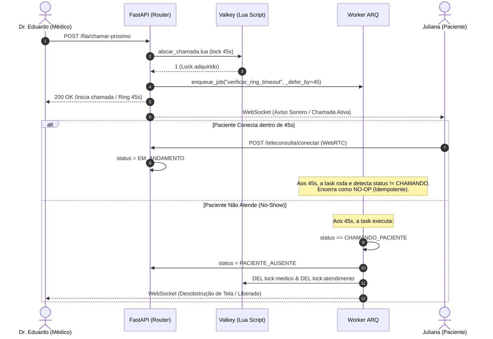

# [RFC-005] Processamento Assíncrono, Ring Timeout e Telemetria Operacional

| Metadado | Detalhe |
| :--- | :--- |
| **Status** | Aprovado |
| **Versão** | 1.0 |
| **Data** | 2026-09-13 |
| **Referência SRS** | [SRS-001 v1.0](../srs/SRS-001-MediSync-Express.md) (RF-02, RF-03, RF-10, RN02, RNF-02, RNF-10, RT-01) |
| **RFC Base** | [RFC-001](RFC-001-Fundacao-Arquitetura-Base-e-Tooling.md), [RFC-004](RFC-004-Motor-de-Fila-e-Concorrencia-Valkey.md) |
| **Decisões de Arquitetura (ADRs)** | [ADR-005: Worker ARQ](../adrs/ADR-005-Worker-Assincrono-ARQ-sobre-Valkey.md), [ADR-006: Ring Timeout Diferido](../adrs/ADR-006-Ring-Timeout-Deterministico-via-Jobs-Diferidos.md) |
| **Componentes Principais** | ARQ Worker (asyncio), Valkey 7+, Prometheus/OpenMetrics |

---

## 1. Contexto & Problema Operacional

Em um serviço de pronto-atendimento virtual, a experiência clínica e a eficiência da unidade dependem de tarefas que ocorrem nos bastidores:
1. **Deadlocks por No-Show**: Quando o médico aciona uma chamada e o paciente não atende (por distração, perda de conexão ou abandono), a interface médica não pode ficar bloqueada indefinidamente aguardando. Deve haver liberação estrita em exatamente 45 segundos (RN02).
2. **Liquidação Concorrente de Elegibilidade**: Em planos privados, a verificação de convênio não pode impor paywalls nem atrasar o acolhimento do paciente, devendo rodar em segundo plano enquanto ele aguarda na fila de triagem (RF-02). No SUS, essa etapa deve ser uma instrução nula (*no-op*) instantânea (RT-01).
3. **Telemetria em Tempo Real**: Os gestores precisam de visibilidade contínua sobre TMA, TME e taxas de abandono com defasagem inferior a 5 segundos (RNF-10).

Esta RFC especifica o motor de tarefas assíncronas em segundo plano utilizando **ARQ** sobre o Valkey, fundamentado na [ADR-005](../adrs/ADR-005-Worker-Assincrono-ARQ-sobre-Valkey.md).

---

## 2. Escolha do Motor Assíncrono: ARQ sobre Valkey

Para o ecossistema assíncrono do MediSync Express, o **ARQ** foi selecionado como padrão de worker por operar 100% nativo em `asyncio` e compartilhar as instâncias do Valkey sem exigir brokers adicionais (como RabbitMQ).

### 2.1 Vantagens Técnicas do ARQ
- **Jobs Diferidos Nativos (`_defer_by`)**: Permite agendar a verificação de no-show para exatamente 45 segundos no futuro com precisão de milissegundos.
- **Deduplicação de Tarefas (`_job_id`)**: Impede que disparos repetidos enfileirem múltiplos timers para o mesmo atendimento.
- **Compartilhamento de Recursos**: O worker utiliza as mesmas sessões do `asyncpg` e instâncias do `httpx.AsyncClient` da aplicação principal.

---

## 3. Resolução Determinística de No-Show (Ring Timeout de 45s)

Ao contrário de abordagens frágeis baseadas em eventos pub/sub de chaves expiradas do Redis, o MediSync Express utiliza agendamento determinístico.



### 3.1 Agendamento no Roteador (`src/modules/fila/router.py`)
```python
await arq_pool.enqueue_job(
    "verificar_ring_timeout_task",
    atendimento_id=atendimento.id,
    organizacao_id=usuario.organizacao_id,
    medico_id=usuario.id,
    _defer_by=45,
    _job_id=f"ring_timeout_{atendimento.id}",
)
```

### 3.2 Implementação da Tarefa no Worker (`src/worker.py`)
```python
async def verificar_ring_timeout_task(
    ctx: dict, atendimento_id: int, organizacao_id: int, medico_id: int
) -> None:
    session_factory = ctx["session_factory"]
    valkey = ctx["valkey"]

    async with session_factory() as session:
        atendimento = await session.get(
            AtendimentoModel,
            atendimento_id,
            execution_options={"ignorar_tenant": True}
        )

        # Invariante RN02: Só transiciona se o paciente não tiver atendido
        if atendimento and atendimento.status == StatusAtendimento.CHAMANDO_PACIENTE:
            atendimento.registrar_no_show()
            await session.commit()

            # Libera locks imediatamente no Valkey para desobstruir a tela médica
            async with valkey.pipeline(transaction=True) as pipe:
                pipe.delete(f"lock:{organizacao_id}:medico:{medico_id}")
                pipe.delete(f"lock:{organizacao_id}:atendimento:{atendimento_id}")
                await pipe.execute()
```

### 3.3 Worker Periódico de Reconciliação e Auto-Cura (`reconciliar_fila_orfas_task`)

Para mitigar o risco de inconsistência transacional (*Dual-Write Hazard*) entre o Valkey e o PostgreSQL (caso a API sofra um crash imediato após o script Lua mas antes do commit no banco ou enfileiramento do job), o worker ARQ agenda uma tarefa periódica a cada 60 segundos via `cron(minute='*')`:

```python
# src/worker.py
from datetime import datetime, timedelta, timezone
from sqlalchemy import select
from src.modules.fila.models import AtendimentoModel, StatusAtendimento

async def reconciliar_fila_orfas_task(ctx: dict) -> None:
    """
    Localiza atendimentos marcados como APTO_PARA_CHAMADA no PostgreSQL
    que não estejam no ZSET do Valkey nem possuam locks ativos, reinjetando-os
    automaticamente com prioridade e timestamp originais (Self-Healing).
    """
    session_factory = ctx["session_factory"]
    valkey = ctx["valkey"]
    limiar_tempo = datetime.now(timezone.utc) - timedelta(seconds=60)

    async with session_factory() as session:
        stmt = select(AtendimentoModel).where(
            AtendimentoModel.status == StatusAtendimento.APTO_PARA_CHAMADA,
            AtendimentoModel.atualizado_em < limiar_tempo
        )
        result = await session.execute(stmt, execution_options={"ignorar_tenant": True})
        atendimentos = result.scalars().all()

        for at in atendimentos:
            key_zset = f"fila:{at.organizacao_id}:aptos"
            key_lock_atend = f"lock:{at.organizacao_id}:atendimento:{at.id}"

            # Verifica se o membro está no ZSET ou em lock de chamada
            em_fila = await valkey.zscore(key_zset, str(at.id))
            com_lock = await valkey.exists(key_lock_atend)

            if em_fila is None and not com_lock:
                timestamp = int(at.data_entrada_fila.timestamp()) if at.data_entrada_fila else int(at.criado_em.timestamp())
                score = (at.prioridade_clinica * 10**12) + timestamp
                await valkey.zadd(key_zset, {str(at.id): score})
                # Registra auditoria de autocura sistêmica
                await ctx["auditoria_service"].registrar_evento_sistema(
                    organizacao_id=at.organizacao_id,
                    atendimento_id=at.id,
                    tipo_evento="AUTOCURA_RECONCILIACAO_FILA_LUA_POSTGRES",
                    payload={"motivo": "Atendimento apto ausente do ZSET e sem lock ativo"}
                )
```

---

## 4. Pipeline Assíncrono de Elegibilidade (RF-02, RT-01)

Assim que o acolhimento na triagem é finalizado, o atendimento recebe o status preliminar `TRIADO_AGUARDANDO_ELEGIBILIDADE`. Um worker em background processa a validação conforme o perfil do tenant:

### 4.1 Perfil Público SUS (`MODO_PUBLICO_SUS = True`)
Opera como uma instrução vazia (*no-op*), validando apenas a presença e integridade do CPF ou Cartão Nacional de Saúde (CNS). A transição para `APTO_PARA_CHAMADA` ocorre imediatamente, inserindo o registro no Sorted Set do Valkey (RF-02, RT-01).

### 4.2 Perfil Privado / Convênios
O worker efetua requisição externa para a operadora de saúde ou gateway de pré-autorização:
- **Timeout Operacional**: Limite estrito de 15 segundos com recuo exponencial (*exponential backoff*).
- **Tratamento de Exceções (RF-05)**: Se a verificação falhar ou esgotar o tempo limite, o paciente é notificado em tempo real em sua tela de espera para fornecer outro meio de pagamento ou solicitar contingência administrativa. A sua prioridade clínica cronológica original na fila é rigorosamente preservada.

---

## 5. Mensageria Desacoplada e Proteção Anti-Abuso (SMS vs. WhatsApp)

O envio de códigos OTP para acolhimento ágil de pacientes e o envio de links de prescrições assinadas exigem alta disponibilidade e controle rigoroso de custos operacionais:

### 5.1 Adaptador de Mensageria (`MensageriaAdapter`)
Para isolar a volatilidade de provedores externos de mensageria (Meta WhatsApp Cloud API vs. gateways SMS), o envio é encapsulado através de um contrato desacoplado:

```python
# src/modules/identidade/service.py
from typing import Protocol

class MensageriaPort(Protocol):
    """Porta para despacho de mensagens transacionais ao paciente."""
    async def enviar_otp(self, telefone: str, codigo: str, organizacao_id: int) -> bool:
        """Dispara código numérico de 6 dígitos via WhatsApp ou SMS."""
        ...

    async def enviar_link_documento(
        self, telefone: str, url_presigned: str, organizacao_id: int
    ) -> bool:
        """Envia link seguro e temporário para download de receitas e prontuários."""
        ...
```

- **Canal Primário**: WhatsApp (Meta Cloud API ou gateways como Z-API/Evolution API). Taxa de entrega $> 98\%$ no Brasil e custo significativamente menor que SMS.
- **Canal de Fallback**: SMS corporativo (Twilio, Zenvia) acionado caso o paciente não possua WhatsApp ativo.

### 5.2 Rate Limiting Anti-Abuso no Valkey
Para impedir ataques de negação de serviço e contas volumosas de disparo de mensagens, o endpoint de acolhimento aplica limitação por janela deslizante (*sliding window*) no Valkey:
1. **Por Endereço IP**: Máximo de **5 requisições de OTP a cada 10 minutos** (`ratelimit:otp:ip:{ip}`).
2. **Por Número de Telefone**: Máximo de **3 códigos a cada 15 minutos** (`ratelimit:otp:phone:{telefone}`).
3. **Validação Turnstile**: Suporte configurável por tenant a token CAPTCHA invisível (Cloudflare Turnstile) no primeiro passo do acolhimento.

---

## 6. Sinalização da Fila, Telemetria e Resiliência de Conexão (ADR-012)

A sinalização da fila dinâmica opera através de WebSockets bidirecionais suportados pelo Pub/Sub do Valkey:

### 6.1 Resiliência em Conexões Móveis (Reconexão e Sincronização)
Em redes celulares (4G/3G) sujeitas a oscilações e quedas momentâneas:
1. **Heartbeat / Ping-Pong**: Conexão WebSocket envia ping a cada 30 segundos; silêncio superior a 45 segundos aciona rotina de reconexão automática com backoff exponencial no frontend.
2. **Evento `SYNC_STATE`**: Ao restabelecer a conexão, o cliente emite `SYNC_STATE(atendimento_id)`. O backend consulta o estado consolidado no PostgreSQL/Valkey e devolve o status real da fila e se houve disparo de chamada médica durante a desconexão.

### 6.2 Telemetria Operacional e Métricas em Tempo Real (RF-10, RNF-10)
Contadores em tempo constante $\mathcal{O}(1)$ nos hashes do Valkey alimentam o painel operacional:
```redis
HINCRBY metricas:{organizacao_id}:turno:{data} chamadas_total 1
HINCRBY metricas:{organizacao_id}:turno:{data} no_shows_total 1
HINCRBY metricas:{organizacao_id}:turno:{data} soma_tma_segundos {duracao_segundos}
HINCRBY metricas:{organizacao_id}:turno:{data} concluidos_total 1
```
- **Exposição**: Endpoint `/metrics` raspado pelo Prometheus e WebSocket administrativo despachando dados a cada 3 segundos.

---

## 7. Decisões Arquiteturais Relacionadas (ADRs)

A justificativa técnica para a seleção do ARQ sobre Valkey, a resolução de no-show via jobs diferidos e a sinalização em tempo real estão formalmente detalhadas em:
- **[ADR-005: Adoção do Motor de Tarefas Assíncronas ARQ sobre Valkey](../adrs/ADR-005-Worker-Assincrono-ARQ-sobre-Valkey.md)**
- **[ADR-006: Resolução de No-Show com Ring Timeout Determinístico via Jobs Diferidos no ARQ](../adrs/ADR-006-Ring-Timeout-Deterministico-via-Jobs-Diferidos.md)**
- **[ADR-012: Sinalização em Tempo Real via WebSockets e Valkey Pub/Sub](../adrs/ADR-012-Sinalizacao-Tempo-Real-WebSockets-Valkey.md)**
