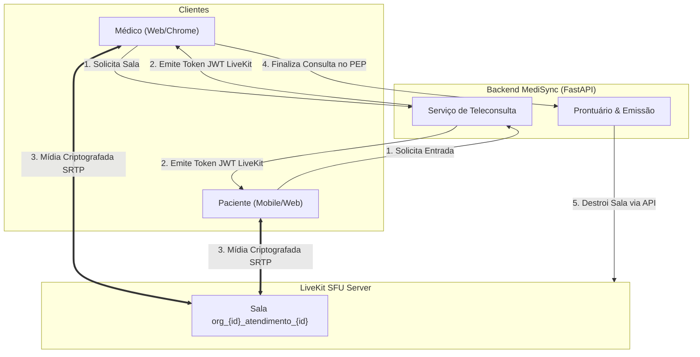
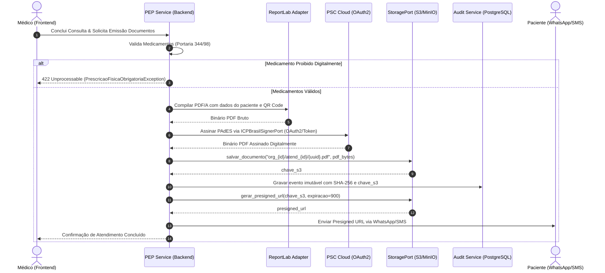

# [RFC-006] Teleconsulta WebRTC e Assinatura Digital ICP-Brasil

| Metadado | Detalhe |
| :--- | :--- |
| **Status** | Aprovado |
| **Versão** | 1.0 |
| **Data** | 2026-09-13 |
| **Referência SRS** | [SRS-001 v1.0](../srs/SRS-001-MediSync-Express.md) (RF-07, RF-08, RN-REG-01, RN06, RNF-04, RNF-06, PREM-01, PREM-02) |
| **RFC Base** | [RFC-001](RFC-001-Fundacao-Arquitetura-Base-e-Tooling.md), [RFC-002](RFC-002-Modelo-de-Dados-Agregados-e-Migracoes.md), [RFC-005](RFC-005-Processamento-Assincrono-e-Ring-Timeout.md) |
| **Decisões de Arquitetura (ADRs)** | [ADR-007: LiveKit SFU](../adrs/ADR-007-Desacoplamento-de-Midia-LiveKit-SFU.md), [ADR-008: Assinatura ICP em Nuvem](../adrs/ADR-008-Assinatura-Digital-Nuvem-PSC-OAuth2.md), [ADR-011: Storage S3/MinIO](../adrs/ADR-011-Armazenamento-de-Documentos-S3-MinIO.md) |
| **Componentes Principais** | LiveKit SFU, PyHanko, ReportLab, OAuth2/PSC, S3/MinIO, WebRTC |

---

## 1. Contexto & Diretrizes Regulatórias (CFM nº 2.314/2022)

A condução da teleconsulta médica em ambiente de pronto-atendimento virtual exige conformidade estrita com o marco ético brasileiro:
1. **Preservação Soberana do Ato Médico (RN06)**: O Código de Ética Médica e a Resolução CFM nº 2.314/2022 vedam expressamente a interferência de algoritmos no tempo da consulta. **É terminantemente proibido que o software desconecte ou encerre chamadas por critério de tempo transcorrido**. O atingimento de metas de TMA pode apenas emitir alertas visuais discretos no prontuário.
2. **Qualidade de Transmissão em Tempo Real (RNF-04)**: Comunicação de áudio e vídeo sob protocolo WebRTC seguro (SRTP) com latência de transporte $\le 150\text{ ms}$.
3. **Validade Jurídica de Documentos Médicos (RNF-06)**: Receituários, atestados e encaminhamentos emitidos durante a teleconsulta devem conter assinatura digital nos padrões da Infraestrutura de Chaves Públicas Brasileira (ICP-Brasil).

---

## 2. Topologia de Mídia WebRTC com LiveKit SFU

Para garantir desempenho e escalabilidade sem sobrecarregar o runtime Python com decodificação ou roteamento de mídia, adota-se um servidor **Selective Forwarding Unit (SFU) LiveKit** operando de forma 100% desacoplada:



### 2.1 Emissão de Tokens de Acesso à Sala
O backend atua exclusivamente como a autoridade de emissão de tokens (`AccessToken`) com permissões estritas e isoladas por organização:

- **Nome da Sala**: `org_{organizacao_id}_atendimento_{atendimento_id}`
- **Identidade do Participante**: `org_{organizacao_id}_prof_{medico_id}` (médico plantonista) e `org_{organizacao_id}_pac_{paciente_id}` (paciente)
- **Permissões**:
  - `can_publish = True`, `can_subscribe = True`
  - Paciente e médico recebem metadados clínicos básicos (nome, idade, queixa principal).

### 2.2 Resiliência em Conexões Móveis no Brasil (Fallback Gracioso)
Em regiões periféricas ou interiores com conexões 3G/4G instáveis, o frontend do MediSync monitora as estatísticas `getStats` do WebRTC. Se a perda de pacotes ultrapassar 8% ou a latência subir além de 300 ms:
1. A resolução do vídeo é reduzida dinamicamente (simulcast).
2. Se a instabilidade persistir, o canal de vídeo é pausado temporariamente, priorizando a transmissão ininterrupta de voz via codec Opus em alta definição.

### 2.3 Ciclo de Vida e Fechamento da Sala
A sala permanece aberta enquanto o médico julgar clinicamente necessário. O encerramento ocorre **única e exclusivamente** quando o médico clica no botão *"Concluir Atendimento"* no PEP, momento em que o backend invoca a API do LiveKit para destruir a sala (`delete_room`).

### 2.4 Topologia de Rede em Produção e Transposição de Firewall / NAT Simétrico

Enquanto em ambiente de desenvolvimento local (`docker-compose.yml`) o tráfego ocorre na interface local sem restrições, a implantação em produção na internet pública brasileira enfrenta dois desafios severos:
1. **CGNAT e NAT Simétrico em Redes Móveis (3G/4G/5G)**: As principais operadoras móveis brasileiras (Claro, Vivo, TIM) utilizam CGNAT com mapeamento simétrico de portas. O protocolo STUN convencional falha porque o roteador da operadora aloca portas públicas distintas para cada host de destino.
2. **Firewalls Hospitalares e Corporativos**: Redes de hospitais, clínicas e órgãos públicos bloqueiam costumeiramente tráfego de saída UDP ou restringem a poucas portas conhecidas (80/443).

#### Matriz de Portas de Rede do LiveKit em Produção:

| Porta | Protocolo | Finalidade | Escopo |
| :--- | :--- | :--- | :--- |
| **`7880`** | TCP | Sinalização HTTP / WebSocket do LiveKit | Pública / Load Balancer (com terminação TLS 443) |
| **`7881`** | TCP | WebRTC ICE over TCP (Fallback de emergência para redes sem UDP) | Pública |
| **`50000 - 60000`** | UDP | Tráfego de Mídia WebRTC ICE / SRTP de alta performance | Pública (Security Group do Host SFU) |
| **`3478`** | UDP/TCP | Servidor TURN / STUN padrão | Pública |
| **`5349` ou `443`** | TCP (TLS) | **TURNS (TURN sobre TLS)**: Cruza firewalls corporativos restritivos disfarçado de HTTPS | Pública |

#### Configuração Recomendada do LiveKit (`livekit.yaml`):
```yaml
port: 7880
rtc:
  tcp_port: 7881
  port_range_start: 50000
  port_range_end: 60000
  use_external_ip: true
turn:
  enabled: true
  domain: turn.medisync.example.com
  tls_port: 5349
  udp_port: 3478
  external_tls: false
```

- **Garantia de Conexão Clínica**: Quando o navegador do médico ou do paciente detecta bloqueio de pacotes UDP via ICE (`iceConnectionState == 'failed'`), o cliente LiveKit faz fallback automático e instantâneo para relay **TURNS via TCP porta 443/5349**, mantendo a teleconsulta ativa sem que a conexão caia.

---

## 3. Prontuário Eletrônico (PEP), Assinatura Digital e Armazenamento

Ao concluir o atendimento, o médico registra a evolução clínica no Prontuário Eletrônico (PEP) e emite os documentos pertinentes. A emissão deve obedecer rigorosamente às normas do CFM (Resolução nº 2.314/2022) e da ANVISA/Ministério da Saúde (Portaria SVS/MS nº 344/98 e RDC nº 20/2011).

### 3.1 Modelagem de Domínio dos Documentos Clínicos

O domínio define 5 tipos de documentos emitíveis via telemedicina e veda expressamente a emissão de substâncias restritas a talonário físico:

```python
# src/modules/teleconsulta/domain/models.py
from enum import StrEnum
from pydantic import BaseModel, Field

class TipoDocumentoClinico(StrEnum):
    """Documentos clínicos emitíveis digitalmente com validação ICP-Brasil."""
    RECEITA_SIMPLES = "RECEITA_SIMPLES"
    RECEITA_ANTIMICROBIANO = "RECEITA_ANTIMICROBIANO"          # RDC nº 20/2011 (validação 10 dias)
    RECEITA_CONTROLE_ESPECIAL_C1 = "RECEITA_CONTROLE_ESPECIAL_C1"  # Portaria 344/98 Lista C1 (30 dias)
    ATESTADO_MEDICO = "ATESTADO_MEDICO"
    RELATORIO_ENCAMINHAMENTO = "RELATORIO_ENCAMINHAMENTO"

class TipoReceitaProibidaDigital(StrEnum):
    """Classificações cuja emissão digital é proibida pela legislação sanitária."""
    NOTIFICACAO_RECEITA_A = "NOTIFICACAO_RECEITA_A"  # Talonário Amarelo - Entorpecentes (Morfina, Fentanil)
    NOTIFICACAO_RECEITA_B = "NOTIFICACAO_RECEITA_B"  # Talonário Azul - Psicotrópicos (Clonazepam, Diazepam)

class PrescricaoFisicaObrigatoriaException(Exception):
    """
    Exceção de Domínio disparada ao tentar prescrever digitalmente substâncias
    que exigem notificação em talonário físico impresso retirado na Vigilância Sanitária
    local (Portaria SVS/MS nº 344/98 e Resolução CFM nº 2.314/2022).
    """
    def __init__(self, tipo: TipoReceitaProibidaDigital, medicamento: str):
        super().__init__(
            f"O medicamento '{medicamento}' ({tipo.value}) requer retenção de talonário físico "
            f"impresso emitido pela Vigilância Sanitária local, sendo expressamente vedada sua "
            f"prescrição em formato puramente digital por telemedicina."
        )
        self.tipo = tipo
        self.medicamento = medicamento
```

### 3.2 Adaptadores Defensivos de Integração Externa (`PSCSignerAdapter` e `StorageAdapter`)

Para isolar componentes externos de alta volatilidade (provedores de certificação digital e serviços de nuvem), as integrações residem em adaptadores desacoplados em `src/modules/teleconsulta/adapters/`:

```python
# src/modules/teleconsulta/adapters/protocols.py
from typing import Protocol

class ICPBrasilSignerPort(Protocol):
    """Porta para assinatura de documentos PDF no padrão PAdES ICP-Brasil."""
    async def assinar_pades(
        self,
        pdf_bytes: bytes,
        credenciais_psc: dict[str, str]
    ) -> bytes:
        """
        Recebe o binário do PDF e credenciais/token OAuth2 do médico no PSC,
        retornando o PDF assinado com carimbo do tempo e certificado ICP-Brasil.
        """
        ...

class StoragePort(Protocol):
    """Porta para persistência e geração de URLs de documentos em Object Storage (S3 / MinIO)."""
    async def salvar_documento(
        self,
        caminho_chave: str,
        conteudo_bytes: bytes,
        content_type: str = "application/pdf"
    ) -> str:
        """
        Faz upload do binário para o bucket de armazenamento de objetos.
        Retorna a chave ou URI de referência do arquivo.
        """
        ...

    async def gerar_presigned_url(
        self,
        caminho_chave: str,
        expiracao_segundos: int = 900
    ) -> str:
        """
        Gera URL pré-assinada temporária para download seguro direto pelo cliente.
        Padrão: 15 minutos (900s).
        """
        ...
```

### 3.3 Pipeline de Emissão, Assinatura e Armazenamento (S3 / MinIO)



1. **Geração do PDF/A**: O backend compila os dados clínicos através do `ReportLab`, gerando layout padronizado com cabeçalho da unidade de saúde, dados do paciente, CRM/UF do médico e QR Code apontando para o verificador de conformidade.
2. **Assinatura Digital**: O adaptador invoca a API REST/OAuth2 do PSC do médico via `httpx.AsyncClient` com timeout estrito de 10 segundos. O `PyHanko` aplica a assinatura PAdES em conformidade estrita com o padrão ICP-Brasil e carimbo do tempo.
3. **Persistência em Object Storage ([ADR-011](../adrs/ADR-011-Armazenamento-de-Documentos-S3-MinIO.md))**: O binário assinado é enviado para o bucket S3/MinIO (`s3://medisync-docs/{org_id}/atendimentos/{atendimento_id}/{uuid}.pdf`). O banco relacional grava apenas a chave S3 e o hash SHA-256 anexado à tabela imutável `audit_events`.
4. **Entrega Segura via Portal de Validação e Presigned URL Fresca**: O paciente recebe via SMS/WhatsApp um link seguro de validação pública (`https://medisync.app/receita/{token_curto}`). Ao ser acessada pelo paciente ou pela farmácia, a página valida a autenticidade e emite uma *Presigned URL* fresca com expiração de 15 minutos para download direto do bucket, garantindo perenidade de acesso sem expor links quebrados aos pacientes.

---

## 4. Decisões Arquiteturais Relacionadas (ADRs)

A fundamentação da escolha de um SFU LiveKit desacoplado, a adoção de certificados digitais em nuvem via PSC (OAuth2) e o armazenamento de arquivos em Object Storage estão formalmente registradas em:
- **[ADR-007: Desacoplamento do Servidor de Mídia WebRTC via LiveKit SFU](../adrs/ADR-007-Desacoplamento-de-Midia-LiveKit-SFU.md)**
- **[ADR-008: Assinatura Digital ICP-Brasil em Nuvem via PSCs e Porta Desacoplada](../adrs/ADR-008-Assinatura-Digital-Nuvem-PSC-OAuth2.md)**
- **[ADR-011: Armazenamento de Documentos Clínicos via Object Storage (S3 / MinIO) e Presigned URLs](../adrs/ADR-011-Armazenamento-de-Documentos-S3-MinIO.md)**
