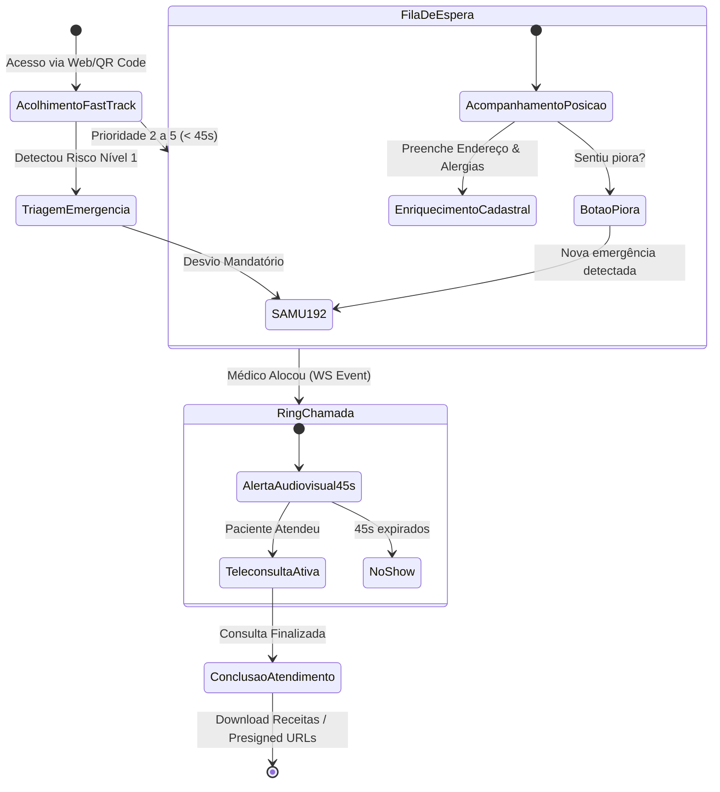

# [RFC-007] Frontend, Experiência do Paciente e Painel Clínico Unificado

| Metadado | Detalhe |
| :--- | :--- |
| **Status** | Planejado / Fase 2 (Pós-Maturidade do Backend) |
| **Versão** | 1.0 |
| **Data** | 2026-09-13 |
| **Referência SRS** | [SRS-001 v1.0](../srs/SRS-001-MediSync-Express.md) (NEC-01 a NEC-05, RF-01, RF-03, RF-06, RF-07, RNF-07) |
| **RFC Base** | [RFC-001](RFC-001-Fundacao-Arquitetura-Base-e-Tooling.md) |
| **Decisões de Arquitetura (ADRs)** | [ADR-001](../adrs/ADR-001-Monolito-Modular-com-Modelos-Ricos.md), [ADR-007](../adrs/ADR-007-Desacoplamento-de-Midia-LiveKit-SFU.md), [ADR-010](../adrs/ADR-010-Cadastro-Progressivo-e-Identidade-Clinica.md), [ADR-012](../adrs/ADR-012-Sinalizacao-Tempo-Real-WebSockets-Valkey.md) |
| **Stack de Interface** | React 19, Vite, TypeScript, Tailwind CSS, `shadcn/ui`, `lucide-react` |

---

## 1. Contexto & Metas de Experiência do Usuário (UX)

> **Nota Metodológica (Estratégia API-First / Contract-First)**:  
> Em conformidade com a decisão estratégica de desenvolvimento, a implementação do Frontend será iniciada estritamente após a maturidade e estabilização do Backend (domínio, concorrência, testes de fila e OpenAPI). Esta RFC serve como especificação viva dos contratos de experiência que o backend deve suportar.

O sucesso de uma plataforma de pronto-atendimento virtual depende da erradicação da fricção na ponta do paciente e da máxima eficiência na estação de trabalho do médico plantonista:
1. **Juliana (Paciente / Celular)**: Foco total em acolhimento imediato, sem obrigação de baixar aplicativos em lojas de apps (Web/PWA puro), com acessibilidade inclusiva (WCAG 2.1 AA - RNF-07) e clareza absoluta de posicionamento na fila.
2. **Dr. Eduardo (Médico Plantonista)**: Foco em ambiente unificado (*Single-Pane of Glass*), integrando vídeo WebRTC, evolução clínica SOAP, dados de triagem, histórico de alergias e prescrição digital assinada em uma única tela, eliminando a alternância caótica entre abas de navegador (NEC-04, NEC-05).

---

## 2. Stack Tecnológica e Padrões Visuais

| Componente | Tecnologia | Papel no Frontend |
| :--- | :--- | :--- |
| **Framework & Build** | React 19 + Vite + TypeScript | Renderização ultrarrápida, tipagem estrita de contratos de API e menor bundle final. |
| **Design System** | `shadcn/ui` + Radix UI | Componentes acessíveis por padrão (WAI-ARIA), foco navegável por teclado e total flexibilidade de customização. |
| **Estilização** | Tailwind CSS | Design responsivo utilitário com suporte a modo claro/escuro e temas personalizáveis para prefeituras e operadoras. |
| **Iconografia** | `lucide-react` | Ícones SVG limpos e semânticos em toda a aplicação. |
| **Comunicação em Tempo Real** | WebSockets Nativo + LiveKit Client SDK | Sinalização da fila e transmissão de áudio/vídeo sob protocolo WebRTC. |
| **Gerenciamento de Estado** | TanStack Query v5 + Zustand | Cache reativo de dados de servidor (REST) e estado efêmero de UI/áudio/vídeo. |

---

## 3. Jornada do Paciente (Mobile-First / PWA)

A jornada do paciente é desenhada para operar com excelência em smartphones sob redes móveis oscilantes:



### 3.1 Tela 1: Fast-Track de Acolhimento e Triagem (< 45s)
- **Seleção de Titular vs. Dependente**: Alternância com um clique (`[x] Atendimento para mim` / `[ ] Atendimento para meu filho/dependente`).
- **Validação Anti-Fraude**: Campos de `CPF`, `Data de Nascimento` e `Telefone Celular`.
- **Triagem Rápida**: Queixa principal (campo de busca de sintomas comuns), tempo de evolução e escala analógica de dor (EVA 0 a 10 com alvos de toque $\ge 48\times 48\text{ dp}$).
- **Aceite do TCLE**: Modal acessível com resumo humanizado em tópicos e link para o termo completo. Ao clicar em *"Concordar e Entrar na Fila"*, o backend calcula o hash SHA-256 e o paciente ingressa na fila com status `TRIADO_AGUARDANDO_ELEGIBILIDADE`.

### 3.2 Tela 2: Sala de Espera Virtual com Assistente Progressivo
- **Barra de Progresso da Fila**: Informa a posição atual (*"2º na fila"*) e tempo estimado baseado no TMA atualizado via WebSocket (`ADR-012`).
- **Assistente de Enriquecimento Obrigatório**: Card interativo que convida o paciente a completar os dados exigidos pelo CFM enquanto aguarda:
  - *Endereço para Socorro*: Digitação de CEP com autopreenchimento de logradouro, bairro e cidade.
  - *Segurança do Paciente*: Seleção de alergias medicamentosas em chips clicáveis (`Dipirona`, `Penicilina`, `Anti-inflamatórios`, `Nenhuma`).
- **Botão de Alerta de Piora Clínica (RF-06)**: Botão vermelho fixo em destaque no rodapé: *"Sentiu piora nos sintomas?"*. O acionamento dispara checagem rápida de sintomas críticos (dor no peito, falta de ar severa, desmaio); constatado perigo, a tela bloqueia a teleconsulta e exibe discagem direta para o SAMU 192 e alerta a central.

### 3.3 Tela 3: Ring de Chamada Ativa (Janela de 45 segundos)
Ao receber o evento `CHAMADA_RECEBIDA` via WebSocket:
- O smartphone aciona vibração contínua e toque sonoro de chamada médica.
- Contagem regressiva visual em destaque (de 45 até 0 segundos).
- Botão amplo verde: *"Atender Teleconsulta Agora"*. Ao clicar, estabelece o handshake WebRTC com a sala LiveKit e transiciona para `EM_ANDAMENTO`.

---

## 4. Estação de Trabalho do Médico (Single-Pane Dashboard)

O médico plantonista opera em um layout de tela única otimizado para monitores de mesa e laptops, garantindo visão simultânea do paciente e do prontuário:

```
+------------------------------------------+------------------------------------------+
|          PAINEL DE VÍDEO (WebRTC)        |       PRONTUÁRIO ELETRÔNICO (PEP)        |
|                                          |                                          |
|  +------------------------------------+  | [ Aba 1: Triagem ] [ Aba 2: Evolução ]   |
|  |                                    |  | [ Aba 3: Prescrição & Documentos ]       |
|  |     VÍDEO DO PACIENTE (LiveKit)    |  +------------------------------------------+
|  |                                    |  | ALERTA VERMELHO: Alergia a DIPIRONA      |
|  |                                    |  | Endereço Resgate: Rua das Flores, 123... |
|  +------------------------------------+  +------------------------------------------+
|  | Minha Câmera | [Mudo] [Vídeo] [Tela]| | EVOLUÇÃO CLÍNICA (SOAP):                 |
|  +------------------------------------+  | S: Paciente relata febre de 39°C...      |
|                                          | O: BEG, corada, eupneica...              |
|  Métricas: Latência: 45ms | Perda: 0%    | A: Faringoamigdalite aguda (J03.9)       |
|                                          | P: Amoxicilina 500mg por 7 dias...       |
|  [ CHAMAR PRÓXIMO ] (Próx: Fila Nível 2) |                                          |
|                                          | [ EMITIR RECEITA E ASSINAR COM ICP ]     |
|                                          | [ CONCLUIR ATENDIMENTO ]                 |
+------------------------------------------+------------------------------------------+
```

### 4.1 Painel de Vídeo (Esquerda)
- Renderização do vídeo do paciente em alta definição com suporte a simulcast adaptativo.
- Indicador em tempo real de estabilidade da conexão do paciente (latência e jitter).
- Botões de controle de mídia: microfone, câmera e compartilhamento de tela para visualização de exames.
- **Botão "Chamar Próximo"**: Exibe a contagem regressiva de 45 segundos durante o toque de chamada. Se o paciente não atender, a tela limpa automaticamente e habilita o botão para o próximo da fila.

### 4.2 Prontuário Eletrônico (Direita)
- **Card Superior de Segurança**:
  - Exibição em caixa vermelha destacada das **alergias medicamentosas** declaradas na triagem.
  - Endereço completo e telefone para acionamento imediato do SAMU 192 caso o paciente passe mal durante a consulta.
- **Aba de Evolução Clínica (SOAP)**:
  - Campos estruturados para Subjetivo, Objetivo, Avaliação (com busca integrada de CID-10 e CIAP-2) e Plano Terapêutico.
- **Aba de Prescritor com Salvaguardas Farmacêuticas**:
  - Emissão de receitas digitais simples, antimicrobianos e atestados médicos.
  - **Trava Regulatória (Portaria SVS/MS nº 344/98)**: Bloqueio e aviso informativo caso o médico selecione medicamentos sujeitos a Notificação de Receita A (Amarela) ou B (Azul), alertando que a legislação brasileira exige emissão em talonário físico presencial.
  - Botão de envio para assinatura digital em nuvem via PSC (OAuth2) integrada ao `PyHanko`.

---

## 5. Diretrizes de Acessibilidade Digital (WCAG 2.1 AA - RNF-07)

1. **Contraste Mínimo**: Taxa de contraste de texto e elementos interativos rigorosamente superior a 4,5:1.
2. **Alvos de Toque**: Todas as áreas interativas no mobile possuem dimensões mínimas de $48 \times 48\text{ dp}$.
3. **Leitores de Tela**: Todos os inputs possuem tags `<label>` semânticas, botões de ação contêm `aria-label` descritivos e avisos sonoros de chamada possuem correspondente visual via `aria-live="assertive"`.
4. **Navegação por Teclado**: Todo o fluxo do médico e do paciente é completamente operável através das teclas `Tab`, `Enter` e `Espaço`.
